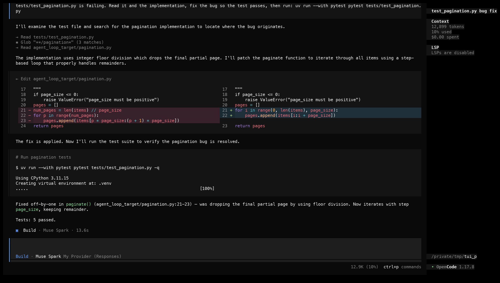
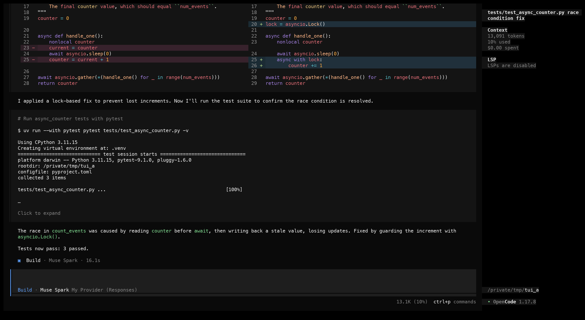

# The basic agent loop

|  |  |
|---|---|
| **Section** | [Agent patterns](https://dev.meta.ai/docs/getting-started/cookbook#agent-patterns) |
| **Time to complete** | ~15 min |
| **Model** | `muse-spark-1.1` |
| **Harness** | OpenCode |

## Summary

This recipe shows how OpenCode runs the agent loop with Muse Spark to fix failing
tests in a Python sample project. The core rule of the loop: each turn the model
reads context, reasons, calls one tool, reads the result, and decides whether the
task is done or needs another turn. `pytest` is the oracle for whether a fix
worked.

## When does the CLI enter an agent loop?

- Completing the task takes more than one turn against the codebase.
- It has to act, read the result, then decide the next step from what it observed.
- An objective check (a test or a build) defines "done", so it can tell when to stop.

It stays out of the loop when none of these hold: a one-shot edit with nothing to
observe is a single completion, and a fixed sequence that never branches is just a
script. The loop is what the CLI falls into whenever "done" depends on what each
step reveals.

## The agent loop contract

Each turn the model gathers context, reasons, calls one tool, reads the result,
and decides whether the task is done or another turn is needed. Guards bound the
loop so a stuck run cannot continue without limit.

```
┌───────────────────────────────────────────────────────┐
│                 AGENT LOOP                            │
│  1. RECEIVE — task description + initial context      │
│  2. READ — gather information (read files, search)    │
│  3. THINK — reason about what to do next              │
│  4. ACT — call a tool (edit, run, search)             │
│  5. OBSERVE — read tool result                        │
│  6. EVALUATE — done? YES → respond, NO → back to 2    │
│  GUARDS: max iterations · token budget ·              │
│          stuck detection · user interrupt             │
└───────────────────────────────────────────────────────┘
```

The loop ends in one of five ways: the task is complete, the iteration cap is
reached, the token budget is spent, the model reports it cannot solve the task, or
the user cancels. Only the first is success. The guards, the termination
conditions, and the trace format are shown in the worked examples below.

## How OpenCode implements the pattern

OpenCode runs this loop and maps each step onto its own tools:

| Loop step | OpenCode mechanism |
|---|---|
| RECEIVE | the prompt you pass to `opencode` or `opencode run` |
| READ | the `Read` and `Glob` tools |
| THINK | the reasoning Muse Spark emits before a tool call, shown when `reasoning: true` |
| ACT | the `Edit` tool or a `bash` command |
| OBSERVE | the tool result fed back to the model |
| EVALUATE | the loop continues until Muse Spark returns a final message or a guard fires |

## Configure OpenCode for Muse Spark

Install OpenCode if you haven't already (`npm i -g opencode-ai`).

### Step 1 — Connect the Meta provider

OpenCode has built-in support for the **Meta** provider.

First, get an API key from the **[Model API dashboard](https://dev.meta.ai)** under **API keys → Create API key**.

Launch OpenCode, then run the connect command:

```
/connect
```

A searchable **"Connect provider"** list appears. Type to filter, select **Meta**, and confirm. Then paste the key from the dashboard into the **"API key"** prompt.

### Step 2 — Select Muse Spark 1.1

After connecting the provider, choose **Muse Spark 1.1**. The status bar should read **Muse Spark 1.1 · Meta**, confirming it's live.

## Try it on the sample project

The [`agent-loop-target/`](agent-loop-target/) sample project is a small Python
project. It starts green except for five planted bugs, each with one failing test
that defines "done", so `pytest` is the oracle for whether a fix worked. Confirm
the starting state:

```bash
cd agent-loop-target
pip install pytest
pytest          # 8 failures across the 5 bug files
```

The bugs climb in difficulty:

| # | Module | Category |
|---|--------|----------|
| 1 | `pagination.py` | off-by-one in a list operation |
| 2 | `grades.py` | wrong comparison operator |
| 3 | `normalize.py` | missing edge case |
| 4 | `weather.py` | incorrect API response parsing |
| 5 | `async_counter.py` | race condition in async code |

A full Go mirror of the same five bugs lives in `agent-loop-target/go-example/`.
Each worked example below shows the prompt, a screenshot, the trace, and the diff.

### Fix the off-by-one

Give OpenCode the failing test and let the loop run. From inside the sample
project:

```bash
opencode run -m meta/muse-spark-1.1 \
  "tests/test_pagination.py is failing. Read it and the implementation, fix the
   bug so the test passes, then run: uv run --with pytest pytest tests/test_pagination.py"
```

The run reads the test, finds and reads the implementation, edits the file, runs
the test, sees `5 passed`, and stops.



The same run reads as one block per turn:

```
[Turn 1] THINK: I'll start by reading the pagination test file to understand the expected API behavior and failure mode.
         ACT:   read(tests/test_pagination.py)
         RESULT: (file read)
         EVAL:  continue

[Turn 2] ACT:   search("**/pagination*")
         RESULT: 3 matches
         EVAL:  continue

[Turn 3] ACT:   read(agent_loop_target/pagination.py)
         RESULT: (file read)
         EVAL:  continue

[Turn 4] THINK: The implementation at line 21 uses floor division for num_pages, dropping the final partial page. I'll patch in a loop-based solution that captures remaining elements.
         ACT:   edit(agent_loop_target/pagination.py)
         RESULT: +2 / -3 lines
         EVAL:  continue

[Turn 5] ACT:   bash(uv run --with pytest pytest tests/test_pagination.py -q)
         RESULT: .....                                                                    [100%]
         EVAL:  done

DONE: Fixed off-by-one in `paginate` (pagination.py:21) – now includes the final partial page. Tests pass (5 passed).
```

Turn 1 reads the test, turns 2 and 3 find and read the implementation, turn 4
reasons and edits, and the final `bash` turn runs the test, sees `5 passed`, and
ends the loop. The change Muse Spark made:

```diff
--- a/agent_loop_target/pagination.py
+++ b/agent_loop_target/pagination.py
@@ -18,7 +18,6 @@
     if page_size <= 0:
         raise ValueError("page_size must be positive")
     pages = []
-    num_pages = len(items) // page_size
-    for p in range(num_pages):
-        pages.append(items[p * page_size:(p + 1) * page_size])
+    for i in range(0, len(items), page_size):
+        pages.append(items[i:i + page_size])
     return pages
```

### Fix the async race

The async race fails deterministically: concurrent increments lose updates and the
count comes out too low. Muse Spark fixes it by guarding the read-modify-write.

```bash
opencode run -m meta/muse-spark-1.1 \
  "tests/test_async_counter.py is failing. Read it and the implementation, fix the
   race condition so the test passes, then run: uv run --with pytest pytest tests/test_async_counter.py"
```



## Validate every run

`pytest` is the oracle: run the loop, then run the test suite to score it. Running
all five bugs with the same one-line prompt gives these results (turns and tokens
are reconstructed from the model-call log):

| bug | category | fixed | turns | mode |
|---|---|---|---|---|
| `bug1_pagination` | off-by-one in a list operation | yes | 6 | headless (opencode run) |
| `bug2_grades` | wrong comparison operator | yes | 6 | headless (opencode run) |
| `bug3_normalize` | missing edge case | yes | 5 | tui (headless Responses hung) |
| `bug4_weather` | incorrect API response parsing | yes | 7 | headless (opencode run) |
| `bug5_async_counter` | race condition in async code | yes | 14 | headless (opencode run) |

Result: 5/5 fixed, average 7.6 turns (max 14), 0 doom loops. The target was at least
4 of 5 fixed in under 15 turns each.

## OpenCode profile

The loop enforces one contract: one tool per turn, an observed result, and an
objective oracle for "done". How that looks in OpenCode:

- **OpenCode**: `opencode -m meta/muse-spark-1.1`. Reasoning shows as a dimmed `Thought` block; tools render as `Read`, `Edit`, and `bash` lines.

## Common failure modes

### Permission prompts for actions outside the project

OpenCode guards actions that reach outside the project directory: reading or
writing files elsewhere on the filesystem, or running shell commands. When the
model attempts one, OpenCode asks for permission. In the interactive TUI you
approve or deny each prompt. In headless `opencode run` there is no one to
approve, so the guarded action is auto-rejected and the run continues without it,
or stalls if it depended on that action. A run that tries to read the filesystem
root is rejected like this:

```
! permission requested: external_directory (/*); auto-rejecting
✗ Read / failed
```

Expect these prompts whenever a task touches paths or commands outside the
project. Keep prompts scoped to the project, run interactively and approve when an
action genuinely needs broader access, or set OpenCode's permission config to
allow the paths you expect.

### Doom loops

If the model edits, runs the test, sees the same failure, and repeats the same
edit, stuck detection should catch it: hash `(tool_name, args)` and stop after the
same call repeats three times.
