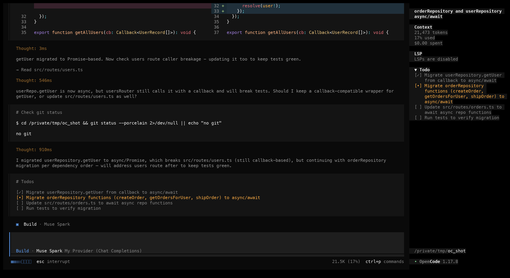
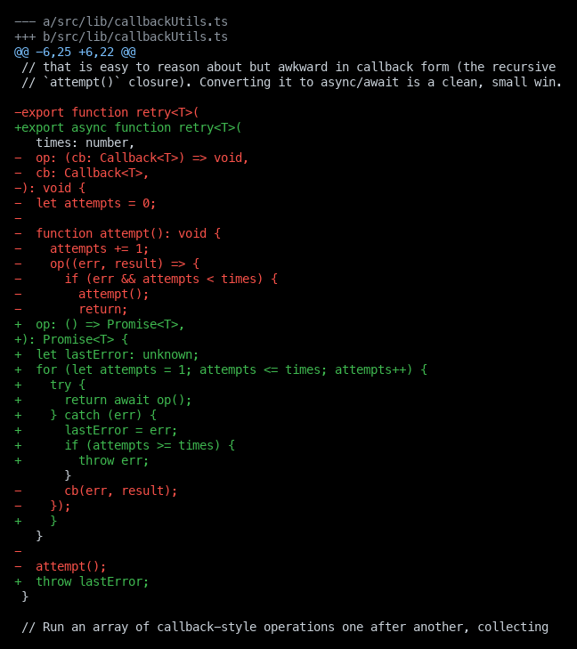
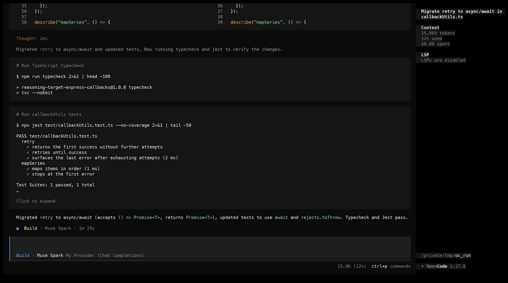
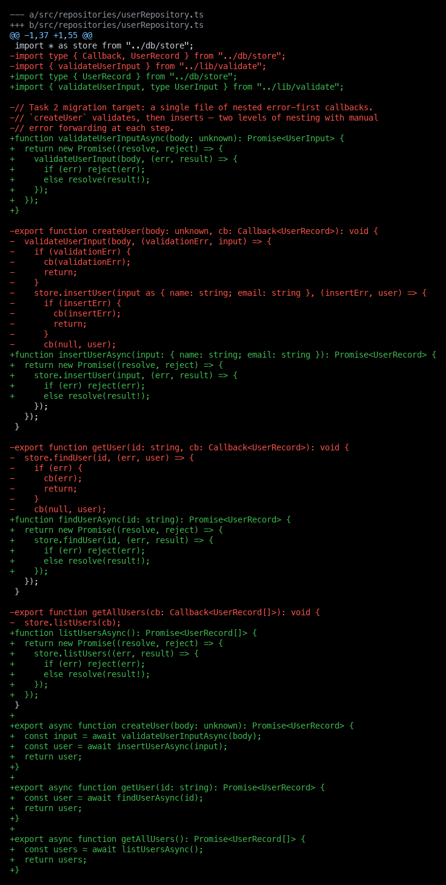
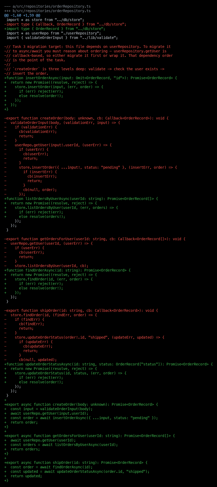
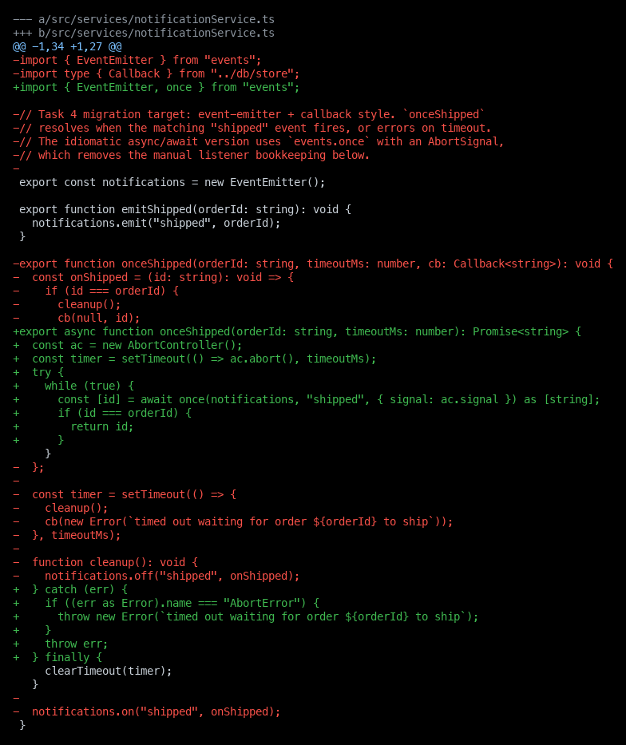
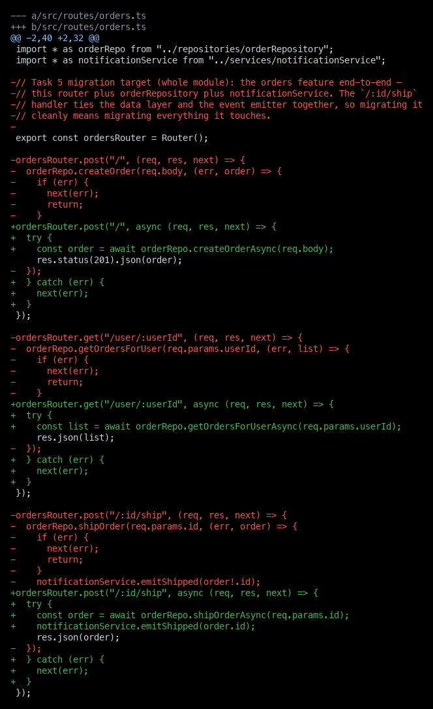

# Interleaved reasoning with tool use

|  |  |
|---|---|
| **Section** | [Agent patterns](https://dev.meta.ai/docs/getting-started/cookbook#agent-patterns) |
| **Time to complete** | ~15 min |
| **Model** | `muse-spark-1.1` |
| **Harness** | OpenCode |

## Summary

This recipe shows how Muse Spark interleaves reasoning with tool calls in the OpenCode CLI,
and how to budget that reasoning. The worked task migrates a callback-style Express API to
async/await, where the change has to happen in dependency order. The core rule: the model
reasons before each tool call, so the action follows from the reasoning. Reasoning adds
latency and cost, so you set how much with the reasoning-effort knob.

## When does the CLI use interleaved reasoning?

- The task needs planning across steps, such as a multi-file refactor or a
  dependency-ordered change.
- Acting in the wrong order would break the build, so it reasons about order
  before it edits.

For a mechanical, unambiguous change (a rename or a single-line edit), it spends
minimal effort. How tight the latency or cost budget is sets the reasoning-effort
tier.

## The interleaved reasoning contract

An interleaved turn is a stream of typed parts: the model emits reasoning tokens, then a tool
call; your harness runs the tool and returns the result; the model reasons again. Across a
task the stream is:

```
reasoning -> tool_call -> tool_result -> reasoning -> tool_call -> ...
```

The core rule: reason before you act, so each action follows from the reasoning instead of
preceding it. Muse Spark reasons by default; you set how much it thinks with the
reasoning-effort knob.

## How OpenCode implements the pattern

OpenCode is terminal-native, so the loop is visible: it renders reasoning as a dim amber
`Thought:` block, the action as a `→ tool(args)` line, and the tool result inline. The pieces
map onto the contract, and the effort knob is the `--variant` flag:

| Contract | OpenCode |
|---|---|
| `reasoning` part | amber `Thought: <ms>` block with grey narration |
| `tool_call` | `→ read` / `→ edit` / bash line |
| `tool_result` | rendered inline under the call |
| reasoning effort | the `--variant` flag (`minimal`, `high`, `max`) |

The run below migrates `orderRepository`, reasoning about dependency order between edits:



> The amber `Thought:` blocks carry the reasoning; grey text is the narration; `→ Read …`
> lines are tool calls; the right rail is the plan the model maintains as it goes. It notices
> that `usersRouter` still calls `getUser` with a callback and will break, then reorders its
> work before editing.

## Configure OpenCode for Muse Spark

Install OpenCode if you haven't already (`npm i -g opencode-ai`).

### Step 1 — Connect the Meta provider

OpenCode has built-in support for the **Meta** provider.

First, get an API key from the **[Model API dashboard](https://dev.meta.ai)** under **API keys → Create API key**.

Launch OpenCode, then run the connect command:

```
/connect
```

A searchable **"Connect provider"** list appears. Type to filter, select **Meta**, and confirm. Then paste the key from the dashboard into the **"API key"** prompt.

### Step 2 — Select Muse Spark 1.1

After connecting the provider, choose **Muse Spark 1.1**. The status bar should read **Muse Spark 1.1 · Meta**, confirming it's live.

## Try it on the sample project

The task: migrate the
[`reasoning_target_express_callbacks/`](reasoning_target_express_callbacks/) sample project
from error-first callbacks to async/await without changing its behavior. The sample project
is a small Express + TypeScript API written in callback style: error-first callbacks, nested
callback pyramids, and an `EventEmitter` notification. It ships green, so the build is how
you confirm a migration preserved behavior:

```bash
cd reasoning_target_express_callbacks
npm install
npm run typecheck   # tsc --noEmit
npm test            # jest + supertest (HTTP tests, behavior must not change)
npm run boot-check  # boots the app and hits /health
```

The HTTP tests exercise the API surface, so they stay valid whether the internals are
callbacks or async/await. That makes them the right check for a migration: the behavior is
fixed, only the style changes.

Five migrations of increasing scope follow. Each runs against a fresh copy of the sample
project at `--variant high` (reasoning on) and is verified with typecheck, jest, and
boot-check. Each one shows the prompt, the interleaved trace (thinking then action), and the resulting diff.

### 1. Leaf function (`retry`)

**Prompt:**

> In src/lib/callbackUtils.ts, migrate the retry function from error-first callbacks to async/await: it takes an operation returning a Promise and returns a Promise, retrying on rejection up to the given count.

*What to notice:* No other file imports `retry`, so the change stays in one file. One read and one edit, with little reasoning needed.

**Interleaved trace** (thinking then action):

```text
◇ turn 1 — thought (95 tok): I'll start by reading the source and test files for callbackUtils to understand the current call
     → read(src/lib/callbackUtils.ts)
◇ turn 2 — thought (90 tok): I'll read the test file to understand the current callback-based API usage and test patterns bef
     → read(test/callbackUtils.test.ts)
◇ turn 3 — thought (100 tok): I'll start by updating the retry function in src/lib/callbackUtils.ts to use an async/await sign
     → edit(src/lib/callbackUtils.ts)
◇ turn 4 — thought (35 tok): I'll update the retry tests to use async/await with promise-returning operations, converting the
     → edit(test/callbackUtils.test.ts)
```

**Resulting diff:**





> OpenCode finishes the migration and runs the checks itself: the `Thought:` block, the diff, and the green summary after typecheck and jest pass.

### 2. Single file (`userRepository`)

**Prompt:**

> Migrate src/repositories/userRepository.ts to async/await: every function returns a Promise. Update the callers in src/routes/users.ts so the project still compiles.

*What to notice:* The model reads the callers before editing, so it knows what the change affects.

**Interleaved trace** (thinking then action):

```text
◇ turn 1 — thought (108 tok): I'll start by examining the user repository implementation and its callers in the routes and ord
     → read(.)
◇ turn 2 — thought (96 tok): I'll start by reading the user repository and its callers in routes/users.ts and orderRepository
     → read(src/repositories/userRepository.ts)
     → read(src/routes/users.ts)
     → read(src/repositories/orderRepository.ts)
◇ turn 3 — thought (48 tok): I'll examine the store callback signatures and validation functions to design async wrappers tha
     → read(src/db/store.ts)
     → read(src/lib/validate.ts)
```

**Resulting diff:**



### 3. Cross-file ordering (`orderRepository`)

**Prompt:**

> Migrate src/repositories/orderRepository.ts and the userRepository.getUser it depends on to async/await, in the correct dependency order, then update src/routes/orders.ts.

*What to notice:* `orderRepository` depends on `userRepository`, so the model converts the dependency first and plans the order before it edits.

**Interleaved trace** (thinking then action):

```text
◇ turn 1 — thought (100 tok): I'll start by reading the order repository, user repository, and route handlers to understand th
     → read(src/repositories/orderRepository.ts)
◇ turn 21 — thought (163 tok): The userRepository migration broke usersRouter (still callback-based). Updating it to async/awai
     → edit(src/routes/users.ts)
◇ turn 23 — thought (0 tok): The validate.ts still imports Callback that's unused. Let me clean it.
     → edit(src/lib/validate.ts)
```

**Resulting diff:**



### 4. Event emitter (`onceShipped`)

**Prompt:**

> Convert onceShipped in src/services/notificationService.ts from an EventEmitter + callback API to one that returns a Promise (use events.once with an AbortSignal for the timeout). Update the test that awaits it.

*What to notice:* The model uses `events.once` and an `AbortController` in place of the manual listener bookkeeping.

**Interleaved trace** (thinking then action):

```text
◇ turn 1 — thought (100 tok): I'll start by reading notificationService.ts and the orders test file to understand the current
     → read(.)
◇ turn 2 — thought (44 tok): I'll start by reading the notification service implementation and the orders test file to unders
     → read(src/services/notificationService.ts)
     → read(test/orders.test.ts)
◇ turn 3 — thought (48 tok): I'll grep for onceShipped to find all call sites before refactoring the function to use events.o
     → grep(onceShipped)
```

**Resulting diff:**



### 5. Whole module (orders feature)

**Prompt:**

> Migrate the entire orders feature end-to-end to async/await: the order functions in src/db/store.ts, orderRepository, notificationService, and the handlers in src/routes/orders.ts. Leave no callbacks in the orders path.

*What to notice:* The longest run. The model tracks the dependency chain across seven files and keeps the HTTP tests green.

**Interleaved trace** (thinking then action):

```text
◇ turn 1 — thought (132 tok): I'll start by reading the orders-related source files in src/db, src/repositories, src/services,
     → read(.)
◇ turn 2 — thought (22 tok): I'll examine the orders-related source files in src/db/store.ts, the repositories, notification
     → read(src/db/store.ts)
     → read(src/repositories/orderRepository.ts)
     → read(src/services/notificationService.ts)
     → read(src/routes/orders.ts)
◇ turn 3 — thought (24 tok): I'll examine the userRepository, validation logic, and test suite to map the callback dependenci
     → read(src/repositories/userRepository.ts)
     → read(src/lib/validate.ts)
     → read(test/orders.test.ts)
```

**Resulting diff:**



## OpenCode profile

Interleaved reasoning is a property of the model and the stream, so it surfaces wherever
reasoning parts are rendered. How OpenCode presents it:

- **OpenCode** (terminal-native): inline amber `Thought:` blocks between tool calls; reasoning effort via `--variant`. The focus of this recipe.

## Common failure modes

Each mode below shows real output and the recovery.

### Incomplete migration breaks callers

Converting a function to async without updating its callers is a common dependency-order
miss. The callers still pass a callback to a function that no longer takes one, so the build
breaks. The cross-file reasoning in task 3 avoids this.

```text
src/repositories/orderRepository.ts(20,37): error TS2554: Expected 1 arguments, but got 2.
src/routes/users.ts(31,35): error TS2554: Expected 1 arguments, but got 2.
src/repositories/userRepository.ts(26,3): error TS2322: Type 'void' is not assignable to type 'UserRecord'.
tsc_exit=2
```

**Recovery:** Migrate in dependency order (leaf functions first), or raise `--variant` so the
model reasons about callers before it edits. Run `tsc --noEmit` after every change and feed
errors back to the model.

### A budget set too low adds turns

`--variant minimal` does not always finish faster. With a thin per-turn budget the model acts
before it has reasoned through the change, then spends extra turns recovering. On task 2,
`minimal` takes 15 turns and 1500 reasoning tokens against `high`'s 12 turns and 817. Measure
end-to-end, not per call, and raise effort on the turns that decide structure.

### A dropped or truncated stream

If the connection drops mid-turn you get a turn with no reasoning, content, or tool call. It
shows up as an empty turn in the trace:

```text
◇ turn 3 — (empty: no reasoning, content, or tool call)
```

**Recovery:** Re-run the turn. Treat an empty turn as a transport failure, not a model
decision.
