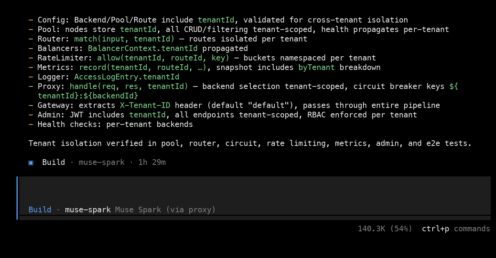
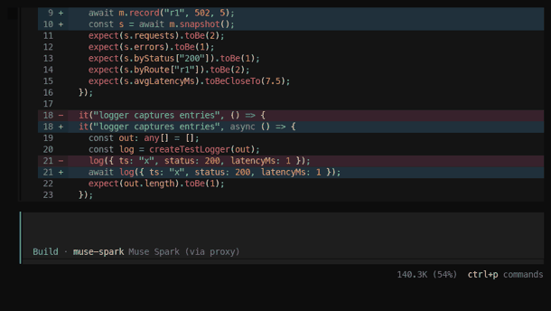

# Managing Context As A Task Grows With Muse Spark

|  |  |
|---|---|
| **Section** | [Agent patterns](https://dev.meta.ai/docs/getting-started/cookbook#agent-patterns) |
| **Time to complete** | ~30 min |
| **Model** | `muse-spark-1.1` |
| **Harness** | OpenCode |
| **Prerequisites** | macOS or Linux, Node.js, OpenCode, and a Model API key |

## Summary

When you build something real with a coding agent, the task grows: you ship a first
version, then requirements change, and the model has to extend and refactor across
the whole codebase, call after call. Staying coherent that long, without the context
window filling up, is a model capability you can prompt for, and this recipe shows
Muse Spark doing it.

We prompt the model to keep a `STATE.md` running state and to re-read a file before
it changes it. From there Muse Spark manages its own context, and it reached for one
more technique on its own. We show this on a real run in
[OpenCode](https://opencode.ai): building an HTTP reverse proxy and load balancer,
then growing it through three requirement changes (backends become hierarchical,
then all I/O becomes async, then the whole thing becomes multi-tenant). Working from
its running state, re-reading only what each change touched, and delegating the
heaviest refactors to subagents, the model kept one coherent codebase across roughly
300 agent calls and never went over the compaction window (it peaked near 54%).
Everything here is shown through the OpenCode TUI and the `STATE.md` the model kept.

## When To Use This

Reach for these strategies when a task grows across many agent calls and the model
has to keep extending and refactoring one codebase:

- The work runs for dozens to hundreds of agent calls: a build plus later changes, rather than a one-shot edit.
- Requirements change partway through, so the model must revisit and refactor decisions it already made.
- The model starts to forget earlier decisions, miss call sites when something changes, or contradict itself.
- You want it to keep going in one session instead of losing the thread.

If a task is a handful of calls and never revisits earlier work, the model does not
need to manage context and you can skip this.

## Configure OpenCode For Muse Spark

OpenCode has built-in support for the **Meta** provider. First, get an API key from the **[Model API dashboard](https://dev.meta.ai)** under **API keys → Create API key**.

Launch OpenCode, then run the connect command:

```
/connect
```

A searchable **"Connect provider"** list appears. Type to filter, select **Meta**, and confirm. Then paste the key from the dashboard into the **"API key"** prompt.

After connecting the provider, choose **Muse Spark 1.1**. The status bar should read **Muse Spark 1.1 · Meta**, confirming it's live. Then launch the TUI in the project you want to work in:

```bash
cd proxy_build
opencode
```

The built-in Meta provider ships Muse Spark's context window, so OpenCode has a compaction threshold to manage against without declaring `limit.context` by hand. On this task the context stayed well under it, so it never needed to.

## Try It Yourself

The exact prompts are in [`prompt.md`](./prompt.md): an **initial spec** plus **three requirement changes**. Give them in order — the initial spec first, then each change only after the previous one is done and green — so the model has to refactor rather than pre-plan (if it saw the changes up front it would design for them and there would be no real refactoring).

1. **Build the first version.** Start OpenCode (see [Configure](#configure-opencode-for-muse-spark-1.1)) in an empty project and paste the **initial prompt** from `prompt.md`. Let it run.
   *Watch:* it creates a `STATE.md` (goal, decisions, task graph, file map) and keeps the test suite green as it builds. The context meter stays low.

2. **Inject requirement change 1** (hierarchical backends) from `prompt.md`, only after the build is green.
   *Watch:* it re-reads just the files the change touches — guided by the file map in `STATE.md` — updates `STATE.md`, and re-runs the suite, instead of re-scanning the whole repo.

3. **Inject changes 2 and 3** (async I/O, then multi-tenant), one at a time, each only after the previous is green.
   *Watch:* on the heaviest refactors the model may spin up subagents on its own to hold the churn, keeping the main thread small. Whether it delegates depends on how full the window is getting.

**What we saw:** across ~301 agent calls (168 on the main thread + 133 across three subagent sessions) the model kept one coherent codebase, the suite green after each change, and the context peaked near 54% — no compaction. The `STATE.md` it maintained and the finished code are in [`proxy_build/`](./proxy_build/), as a reference to compare your run against. The sections below break down each behavior in detail.

## What We Built And Grew

The run is one growing task, measured in agent calls rather than wall-clock. Muse
Spark first built a reverse proxy and load balancer from scratch (config validation,
a backend pool, a streaming proxy, several selection strategies, health checks, a
circuit breaker, retries, routing, rate limiting, an admin API with JWT and RBAC,
metrics, logging, and end-to-end tests). Then we grew it with three requirement
changes, each given only after the previous one was done and green, so the model had
to genuinely refactor rather than pre-plan:

1. backends become hierarchical (pools can contain sub-pools)
2. all backend I/O and health checks become fully async and cancellable
3. the proxy becomes multi-tenant (a tenant context threads through every module)

The initial prompt sets up the working style the rest depends on:

```text
You are the engineer on a new HTTP reverse proxy + load balancer. Build it in
TypeScript using only Node.js built-in modules plus the existing vitest tooling.
Work one task at a time and keep the full test suite green.

- Maintain and actively leverage STATE.md as your working memory: the goal, key
  decisions, a task graph with status, the files each task touches, the current
  step, and open questions. Update it after every task and consult it before each.
- Before editing a file you last read more than a couple of turns ago, re-read it
  in full from disk.
- When a change ripples, update every affected module and its tests.
```

The full prompting — this initial spec plus the three requirement changes, each injected one at a time (never revealed in advance) — is in [`prompt.md`](./prompt.md); [Try It Yourself](#try-it-yourself) above walks through running it step by step.

By the end this run was about 301 agent calls: 168 on the main thread, plus 133
across three subagent sessions the model spun up for the heavy refactors. No
compaction occurred.

## The Strategies We Leveraged

Three behaviors keep the model coherent as the task grows. We prompt for the first
two; the third the model reached for on its own. Each is shown below.

1. **It keeps and leverages a running state (`STATE.md`).** Prompted to maintain a `STATE.md`, the model keeps a durable memory of the goal, decisions, task graph, and a file map, updates it as the codebase evolves, and works from it to find what a change affects instead of re-scanning the repo.
2. **It re-retrieves selectively.** Prompted to re-read a file before it changes it, the model pulls back only the files a change touches, guided by the file map, rather than carrying the whole codebase in context.
3. **It may delegate heavy refactors when context gets tight.** On the two heaviest cross-cutting changes (the async conversion and the multi-tenant refactor), the model offloaded most of the edits to subagents without being asked, so their separate contexts held the churn and the main thread stayed small. This behavior is emergent: we did not prompt it, and it depends on how full the window is getting. When the model has more headroom, it can make the same edits inline and may not delegate at all.

## Structured Running State

Prompt the model to keep an explicit running state and update it as the task grows.
Muse Spark maintained this `STATE.md` throughout,
including a File Map of what lives where and a "Current Step" it kept honest as each
requirement change reshaped the system. Verbatim from the run, trimmed with `...`:

```text
# HTTP Reverse Proxy + Load Balancer — Working Memory

## Goal
Build a production-grade HTTP reverse proxy / load balancer in TypeScript using only
Node.js built-ins (+ vitest). Features: config validation, backend pool, streaming
reverse proxy, multiple LB strategies (RR, least-connections, weighted,
consistent-hash), ...

## Key Decisions
- Node built-in `http`/`https` only, no Express.
- LB strategies pluggable; selector consults circuit breaker + health.
- CircuitBreaker: CLOSED/OPEN/HALF_OPEN, failure threshold, cooldown.
- Router: host + path prefix matching, longest-prefix wins.
- Admin API: HTTP JSON, JWT HS256 (Node crypto), RBAC roles: admin, operator, viewer.
...

## Task Graph
...
2. [completed] BackendPool: add/remove/list + health state + tests
3. [completed] Load balancer strategies: RR, least-connections, weighted, consistent-hash + tests
...
12. [completed] End-to-end tests (real backends, full stack) + docs polish

## File Map (evolving)
- `src/config.ts` – Config load/validate (Task 1)
- `src/pool.ts` – BackendPool (Task 2)
- `src/proxy.ts` – Reverse proxy core (Task 5)
- `src/health.ts` – Health checks (Task 6)
...

## Current Step
Hierarchical pools + fully async/cancellable refactor complete – 51 tests green.

Key components delivered (v2):
- pool.ts – async BackendPool with BackendNode/PoolNode, hierarchical resolution, health propagation, all methods async + cancellable
- proxy.ts – fully async streaming reverse proxy, AbortSignal throughout, hierarchical pool resolution, cancellable I/O
- health.ts – async cancellable health checker, leaf-only probes, health propagates up pool tree
- gateway.ts – async Gateway.create(), per-pool balancers, full async pipeline
- 51 tests passing, e2e with real backends, hierarchical pools validated
...

## Open Questions
None
```

The model leans on this running state for everything that follows: because the File
Map lists the files each part touches, the model knows exactly what a requirement
change ripples into, and can re-read just those files rather than re-scanning the repo.

## Selective Re-Retrieval

Rather than carry the whole codebase forever, the model re-reads only what a change
touches, when it touches it. When a requirement change lands, it consults the file
map in `STATE.md`, re-reads those specific modules in full from disk, and edits from
the current bytes instead of a stale paraphrase. The verbose file contents never
have to live in the context permanently, which is a large part of why the window
stays lean across hundreds of calls.

The pattern to prompt for is explicit: "before you change a file you last saw many
turns ago, re-read it."

## Subagent Delegation

When a change touched nearly every file at once, the model did not do the sweep on
the main thread. On both the async conversion and the multi-tenant refactor it spun
up a subagent with the Task tool to do the bulk edits, in its own words:

```text
This is going to be a massive refactor across many files. ... let me use the Task
tool to do bulk updates for the remaining modules, similar to before.
```

The "similar to before" shows the model reached for this more than once. Each
subagent does the sweeping work in its own separate context and returns a
result, so the main thread absorbs the outcome rather than the entire churn. Across
three such sessions the subagents made 133 of the run's roughly 301 agent calls,
which is a large part of why the main thread's context stayed near 54% rather than
ballooning during changes that touched the whole codebase.

This behavior is emergent: we did not prompt it, and it depends on how full the window
is getting. It showed up here because these refactors touched nearly every file at
once, and the edits were competing for room in the context. When the model has more
headroom, it can make the same edits inline without spinning up subagents. Treat
delegation as an option the model may use when context gets tight. It is not
guaranteed on every model or run.

## The Result

Each requirement change landed across the whole system and stayed green. Here the
multi-tenant change is applied end to end. A tenant context flows through the config,
pool, router, balancers, rate limiter, metrics, logger, proxy, gateway, and admin
API, and it is verified in the tests. The context meter (top right) sits at 54%,
still under the window:

*Screenshots throughout are from an actual run; because the model is non-deterministic, your results may differ.*



Scrolling back through the same run in the OpenCode TUI, ending on that final
multi-tenant result, with the footer holding at 54% throughout:



Measured results from the run:

| Measure | This run |
| --- | --- |
| Work | reverse proxy + load balancer, grown through 3 requirement changes |
| Size | about 301 agent calls (168 main thread, 133 across 3 subagent sessions) |
| Peak context | about 54% of the 1,048,576-token window |
| Compaction | none; the model never went over the window |
| Coherence | one codebase, green suite after each change |

The checked-in `proxy_build/` is that final state, and its suite is green: `cd proxy_build && npm install && npm test` runs 58 tests across 12 files. (The "51 tests" in the `STATE.md` excerpt above is a mid-run snapshot, taken before the multi-tenant change added the rest.) Run `npm test`, not `npm run build`: the model's `tsconfig` has a `rootDir` setting, a stale `server.ts` entry point, and one type annotation that vitest tolerates but strict `tsc` rejects.

## When Compaction Does Kick In

Compaction is the fallback for when the context does overflow, which good context
management makes rare. It happens on a genuinely enormous session, or when you
declare a smaller `limit.context` than the work needs. OpenCode compacts only
against a declared window: it replaces the old middle of the session with a summary
note that carries the goal, files, and plan, and keeps the recent turns and the
system prompt intact, so the model can continue.
