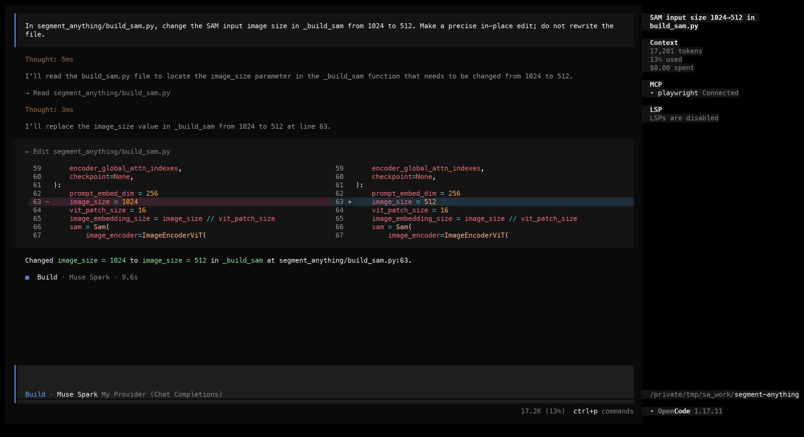
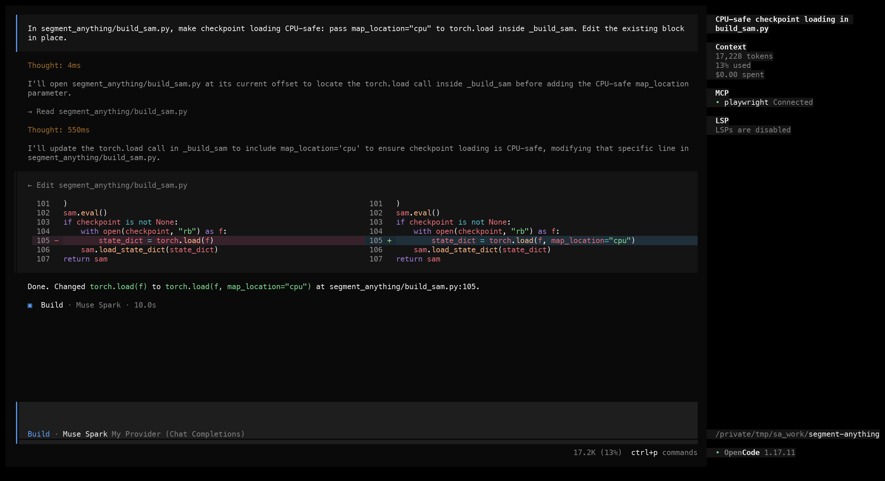
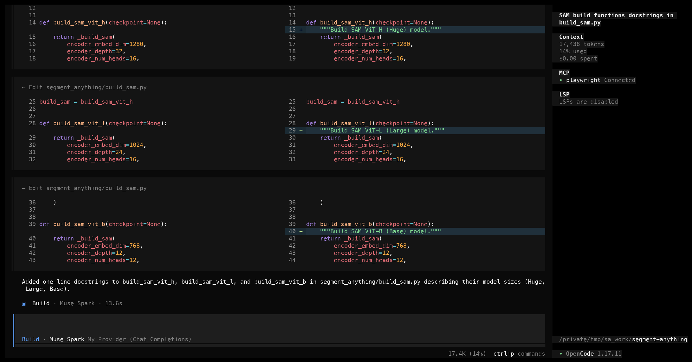
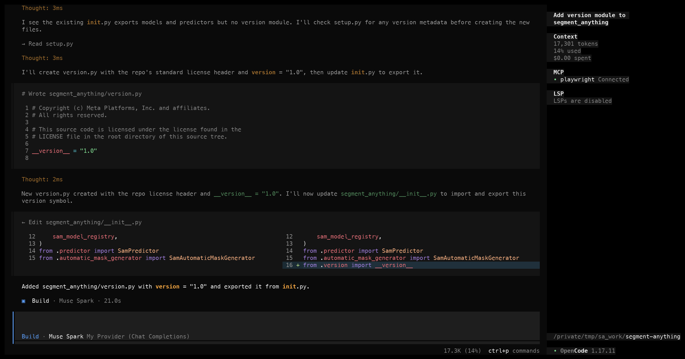
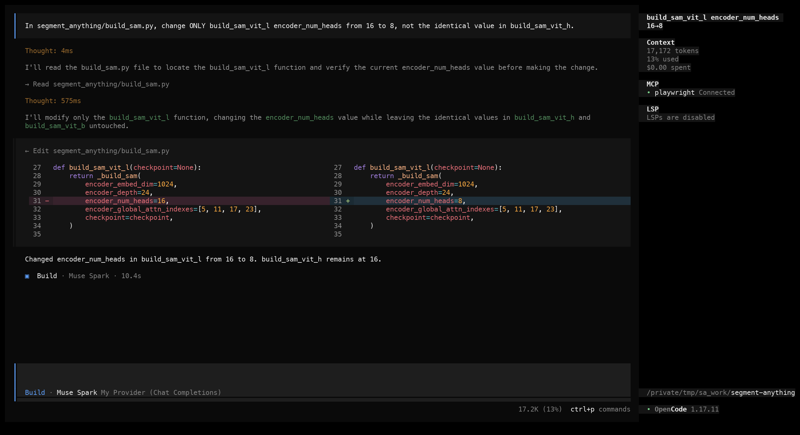
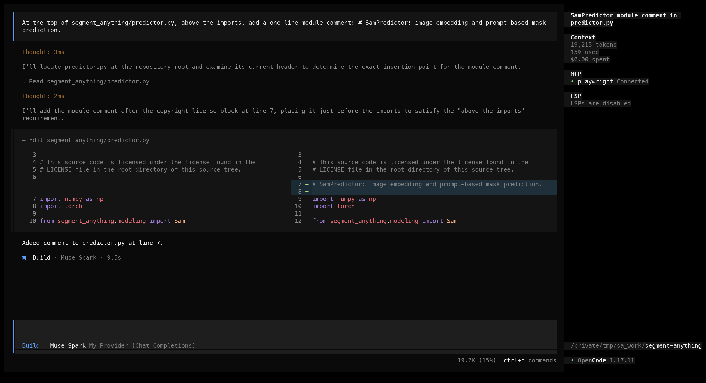

# Validated in-place edits for coding CLIs

|  |  |
|---|---|
| **Section** | [Agent patterns](https://dev.meta.ai/docs/getting-started/cookbook#agent-patterns) |
| **Time to complete** | ~15 min |
| **Model** | `muse-spark-1.1` |
| **Harness** | OpenCode |

## Summary
A model's first job inside a coding CLI is changing code without degrading quality.

Search-and-replace edits give the model a constrained way to modify existing files: provide the exact text currently in the file, provide the replacement text, and apply the change only when the existing text matches exactly once. This keeps edits reviewable, prevents accidental rewrites, and gives the harness a simple validation rule.

This recipe teaches the pattern, shows how OpenCode implements it, and walks through six real edits — with the tool-call payloads Muse Spark emitted and the diffs they produce. The sample project is [segment-anything](https://github.com/facebookresearch/segment-anything), a real Python codebase.

## When does the CLI use search-and-replace edits?
The CLI reaches for a search-and-replace edit when it is modifying an existing file and the change can be anchored to exact current text. It uses one when:

- It is changing an existing file rather than creating a new one.
- It can quote the exact current text, and that text appears exactly once (or it includes surrounding lines to make the target unique).
- The change can be expressed as one or more focused replacements rather than a full rewrite, which would risk unrelated changes.

It falls back to a whole-file write only for new files. Everything else, including beginning-of-file or end-of-file additions, is a search-and-replace edit anchored on the adjacent lines.

## The edit contract
The model emits a **search/replace edit**: the exact existing text to find, and the new text to swap in. Your harness locates the search text and replaces it, leaving the rest of the file untouched. One rule keeps this safe: the search text must match **exactly once**. Zero matches means the model hallucinated the original, so reject it; more than one match is ambiguous, so add surrounding context.

## How OpenCode implements the pattern
OpenCode applies this through a structured `edit` tool call. The model names the file with an absolute path and supplies the exact text to replace; OpenCode applies it and shows the diff inline. A separate `write` tool creates whole files. The fields map onto the pattern, and OpenCode enforces the same exactly-once rule: an `edit` fails if `oldString` is missing or appears more than once.

| Pattern | OpenCode tool |
|---|---|
| search text | `edit` `oldString` (must match exactly once) |
| replacement | `edit` `newString` (must differ from `oldString`) |
| add context to disambiguate | extra lines inside `oldString` |
| change every occurrence | `edit` `replaceAll: true` |
| create a new file | `write` `{ filePath, content }` |

OpenCode requires a `read` of a file before it will `edit` or overwrite it, so the model works from the current bytes rather than a guess.

## Configure OpenCode for Muse Spark

Install OpenCode if you haven't already (`npm i -g opencode-ai`).

### Step 1 — Connect the Meta provider

OpenCode has built-in support for the **Meta** provider.

First, get an API key from the **[Model API dashboard](https://dev.meta.ai)** under **API keys → Create API key**.

Launch OpenCode, then run the connect command:

```
/connect
```

A searchable **"Connect provider"** list appears. Type to filter, select **Meta**, and confirm. Then paste the key from the dashboard into the **"API key"** prompt.

### Step 2 — Select Muse Spark 1.1

After connecting the provider, choose **Muse Spark 1.1**. The status bar should read **Muse Spark 1.1 · Meta**, confirming it's live.

## Try it on the sample project
The sample project is [segment-anything](https://github.com/facebookresearch/segment-anything), Meta's image-segmentation library. Clone it at a pinned commit so the text and line numbers in this recipe match what you edit:

```bash
git clone https://github.com/facebookresearch/segment-anything
cd segment-anything
git checkout dca509fe793f601edb92606367a655c15ac00fdf
```

The package is plain Python, so a lightweight check tells you whether an edit broke anything, with no model weights or GPU needed:

```bash
python -m py_compile segment_anything/*.py   # syntax check
flake8 segment_anything                       # lint (matches the repo's linter.sh)
```

Each example below shows the prompt typed into OpenCode, a screenshot of the run, the tool-call payload Muse Spark produced, and the resulting diff.

> [!NOTE]
> The screenshots are real OpenCode runs against segment-anything at the pinned commit. Each payload is the exact `edit` or `write` tool-call arguments Muse Spark emitted, read from the proxied API traffic; each diff is that payload applied to the pinned checkout.

### 1. Single-line change
**Prompt:**

> In segment_anything/build_sam.py, change the SAM input image size in _build_sam from 1024 to 512. Make a precise in-place edit; do not rewrite the file.

*What to notice:* One `edit` call. Muse Spark changes a single line but quotes a few surrounding lines in `oldString` so the match is unambiguous. The diff is still one line.




**Edit payload** (1 `edit` call):

```json
[
  {
    "filePath": "segment_anything/build_sam.py",
    "oldString": "def _build_sam(\n    encoder_embed_dim,\n    encoder_depth,\n    encoder_num_heads,\n    encoder_global_attn_indexes,\n    checkpoint=None,\n):\n    prompt_embed_dim = 256\n    image_size = 1024\n    vit_patch_size = 16",
    "newString": "def _build_sam(\n    encoder_embed_dim,\n    encoder_depth,\n    encoder_num_heads,\n    encoder_global_attn_indexes,\n    checkpoint=None,\n):\n    prompt_embed_dim = 256\n    image_size = 512\n    vit_patch_size = 16"
  }
]
```

**Resulting diff:**

```diff
--- a/segment_anything/build_sam.py
+++ b/segment_anything/build_sam.py
@@ -60,7 +60,7 @@
     checkpoint=None,
 ):
     prompt_embed_dim = 256
-    image_size = 1024
+    image_size = 512
     vit_patch_size = 16
     image_embedding_size = image_size // vit_patch_size
     sam = Sam(
```

### 2. Multi-line rewrite
**Prompt:**

> In segment_anything/build_sam.py, make checkpoint loading CPU-safe: pass map_location="cpu" to torch.load inside _build_sam. Edit the existing block in place.

*What to notice:* One `edit` call replacing the checkpoint-load block. `oldString` spans the whole `if` block, so the match is unique and the indentation is preserved exactly.




**Edit payload** (1 `edit` call):

```json
[
  {
    "filePath": "segment_anything/build_sam.py",
    "oldString": "    sam.eval()\n    if checkpoint is not None:\n        with open(checkpoint, \"rb\") as f:\n            state_dict = torch.load(f)\n        sam.load_state_dict(state_dict)\n    return sam",
    "newString": "    sam.eval()\n    if checkpoint is not None:\n        with open(checkpoint, \"rb\") as f:\n            state_dict = torch.load(f, map_location=\"cpu\")\n        sam.load_state_dict(state_dict)\n    return sam"
  }
]
```

**Resulting diff:**

```diff
--- a/segment_anything/build_sam.py
+++ b/segment_anything/build_sam.py
@@ -102,7 +102,7 @@
     sam.eval()
     if checkpoint is not None:
         with open(checkpoint, "rb") as f:
-            state_dict = torch.load(f)
+            state_dict = torch.load(f, map_location="cpu")
         sam.load_state_dict(state_dict)
     return sam

```

### 3. Multiple edits in one file
**Prompt:**

> In segment_anything/build_sam.py, add a one-line docstring to each of the three public build functions (build_sam_vit_h, build_sam_vit_l, build_sam_vit_b) describing the model size.

*What to notice:* Three `edit` calls against one file. Muse Spark anchors each one on its unique `def` line, so the three matches do not collide.




**Edit payload** (3 `edit` calls):

```json
[
  {
    "filePath": "segment_anything/build_sam.py",
    "oldString": "def build_sam_vit_h(checkpoint=None):\n    return _build_sam(",
    "newString": "def build_sam_vit_h(checkpoint=None):\n    \"\"\"Build SAM ViT-H (Huge) model.\"\"\"\n    return _build_sam("
  },
  {
    "filePath": "segment_anything/build_sam.py",
    "oldString": "def build_sam_vit_l(checkpoint=None):\n    return _build_sam(",
    "newString": "def build_sam_vit_l(checkpoint=None):\n    \"\"\"Build SAM ViT-L (Large) model.\"\"\"\n    return _build_sam("
  },
  {
    "filePath": "segment_anything/build_sam.py",
    "oldString": "def build_sam_vit_b(checkpoint=None):\n    return _build_sam(",
    "newString": "def build_sam_vit_b(checkpoint=None):\n    \"\"\"Build SAM ViT-B (Base) model.\"\"\"\n    return _build_sam("
  }
]
```

**Resulting diff:**

```diff
--- a/segment_anything/build_sam.py
+++ b/segment_anything/build_sam.py
@@ -12,6 +12,7 @@


 def build_sam_vit_h(checkpoint=None):
+    """Build SAM ViT-H (Huge) model."""
     return _build_sam(
         encoder_embed_dim=1280,
         encoder_depth=32,
@@ -25,6 +26,7 @@


 def build_sam_vit_l(checkpoint=None):
+    """Build SAM ViT-L (Large) model."""
     return _build_sam(
         encoder_embed_dim=1024,
         encoder_depth=24,
@@ -35,6 +37,7 @@


 def build_sam_vit_b(checkpoint=None):
+    """Build SAM ViT-B (Base) model."""
     return _build_sam(
         encoder_embed_dim=768,
         encoder_depth=12,
```

### 4. New file plus existing-file edits
**Prompt:**

> Add a version module: create `segment_anything/version.py` defining `__version__ = "1.0"` with the repo license header, then export `__version__` from `segment_anything/__init__.py`.

*What to notice:* A `write` for `version.py` plus an `edit` in `__init__.py`. The new file goes through `write` (whole content, no `oldString`); the export is an anchored `edit` on the existing import block.




**Edit payload** (1 `write` + 1 `edit` call):

```json
[
  {
    "filePath": "segment_anything/version.py",
    "content": "# Copyright (c) Meta Platforms, Inc. and affiliates.\n# All rights reserved.\n\n# This source code is licensed under the license found in the\n# LICENSE file in the root directory of this source tree.\n\n__version__ = \"1.0\"\n"
  },
  {
    "filePath": "segment_anything/__init__.py",
    "oldString": "from .build_sam import (\n    build_sam,\n    build_sam_vit_h,\n    build_sam_vit_l,\n    build_sam_vit_b,\n    sam_model_registry,\n)\nfrom .predictor import SamPredictor\nfrom .automatic_mask_generator import SamAutomaticMaskGenerator",
    "newString": "from .build_sam import (\n    build_sam,\n    build_sam_vit_h,\n    build_sam_vit_l,\n    build_sam_vit_b,\n    sam_model_registry,\n)\nfrom .predictor import SamPredictor\nfrom .automatic_mask_generator import SamAutomaticMaskGenerator\nfrom .version import __version__"
  }
]
```

**Resulting diff** (new file):

```diff
--- a/segment_anything/version.py
+++ b/segment_anything/version.py
@@ -1 +1,8 @@
+# Copyright (c) Meta Platforms, Inc. and affiliates.
+# All rights reserved.

+# This source code is licensed under the license found in the
+# LICENSE file in the root directory of this source tree.
+
+__version__ = "1.0"
+
```

**Resulting diff** (`__init__.py`):

```diff
--- a/segment_anything/__init__.py
+++ b/segment_anything/__init__.py
@@ -13,4 +13,5 @@
 )
 from .predictor import SamPredictor
 from .automatic_mask_generator import SamAutomaticMaskGenerator
+from .version import __version__

```

### 5. Disambiguating repeated code
**Prompt:**

> In segment_anything/build_sam.py, change ONLY build_sam_vit_l encoder_num_heads from 16 to 8, not the identical value in build_sam_vit_h.

*What to notice:* `encoder_num_heads=16` appears in both `build_sam_vit_h` and `build_sam_vit_l`. Muse Spark pulls vit_l's unique lines (`encoder_embed_dim=1024`, `encoder_depth=24`) into `oldString` so only vit_l changes.




**Edit payload** (1 `edit` call):

```json
[
  {
    "filePath": "segment_anything/build_sam.py",
    "oldString": "def build_sam_vit_l(checkpoint=None):\n    return _build_sam(\n        encoder_embed_dim=1024,\n        encoder_depth=24,\n        encoder_num_heads=16,\n        encoder_global_attn_indexes=[5, 11, 17, 23],\n        checkpoint=checkpoint,\n    )",
    "newString": "def build_sam_vit_l(checkpoint=None):\n    return _build_sam(\n        encoder_embed_dim=1024,\n        encoder_depth=24,\n        encoder_num_heads=8,\n        encoder_global_attn_indexes=[5, 11, 17, 23],\n        checkpoint=checkpoint,\n    )"
  }
]
```

**Resulting diff:**

```diff
--- a/segment_anything/build_sam.py
+++ b/segment_anything/build_sam.py
@@ -28,7 +28,7 @@
     return _build_sam(
         encoder_embed_dim=1024,
         encoder_depth=24,
-        encoder_num_heads=16,
+        encoder_num_heads=8,
         encoder_global_attn_indexes=[5, 11, 17, 23],
         checkpoint=checkpoint,
     )
```

### 6. Beginning-of-file insertion
**Prompt:**

> At the top of segment_anything/predictor.py, above the imports, add a one-line module comment: # SamPredictor: image embedding and prompt-based mask prediction.

*What to notice:* OpenCode has no insert mode. Muse Spark expresses the insertion as a normal `edit`: it quotes the license block and the first import in `oldString`, then re-emits them with the comment between.




**Edit payload** (1 `edit` call):

```json
[
  {
    "filePath": "segment_anything/predictor.py",
    "oldString": "# This source code is licensed under the license found in the\n# LICENSE file in the root directory of this source tree.\n\nimport numpy as np",
    "newString": "# This source code is licensed under the license found in the\n# LICENSE file in the root directory of this source tree.\n\n# SamPredictor: image embedding and prompt-based mask prediction.\n\nimport numpy as np"
  }
]
```

**Resulting diff:**

```diff
--- a/segment_anything/predictor.py
+++ b/segment_anything/predictor.py
@@ -3,6 +3,8 @@

 # This source code is licensed under the license found in the
 # LICENSE file in the root directory of this source tree.
+
+# SamPredictor: image embedding and prompt-based mask prediction.

 import numpy as np
 import torch
```

## OpenCode profile

The safety contract holds whatever the tool shape: identify the existing text, make the replacement explicit, and reject ambiguous matches. How OpenCode expresses it:

- **OpenCode**: structured `edit` (`{ filePath, oldString, newString, replaceAll? }`) and `write` (`{ filePath, content }`) tool calls. The focus of this recipe.

## Common failure modes
The exactly-once contract is what keeps these edits safe. Here are the ways an edit
goes wrong, and how to recover.

### Whitespace mismatch
`oldString` differs from the file by a space or an indent, so it matches zero times and the edit is rejected. Copy the bytes exactly; don't normalize or re-indent.

**Recovery:** Re-read the file and copy `oldString` verbatim, or ask OpenCode to read the file again and retry.

### Ambiguous match
`oldString` appears more than once, so the edit is ambiguous and gets rejected. This is the case in task 5: a bare `encoder_num_heads=16` matches both build functions.

**Recovery:** Add surrounding lines so the match is unique, or set `replaceAll` when you really do mean every occurrence.

### Whole-file rewrite
The model puts the entire file in one `edit` call instead of a targeted edit. It still applies (the `oldString` matches once), but it re-emits every line, which is slower and can introduce unrelated changes.

**Recovery:** Prompt for precision: make the smallest possible edit, changing only the affected lines.

### Overwriting a file with `write`
The model reaches for `write` on a file that already exists. `write` replaces the whole file, so this discards the current contents instead of editing in place. Reserve `write` for files that do not exist yet.

**Recovery:** Use `edit` for in-place changes; reserve `write` for files that do not exist yet.

### Applies cleanly but breaks the build
The edit matched and applied, but it introduced an undefined name (`imag_size` instead of `image_size`). Applying cleanly is not the same as being correct — a compile or lint check is what catches this:

```text
segment_anything/build_sam.py:65:28: F821 undefined name 'image_size'
```

**Recovery:** Run `py_compile` and `flake8` after every edit, then feed any error back to the model to fix.

## Files in this recipe

```
04_validated_in_place_edits/
├── README.md                 ← this recipe
└── assets/                   ← OpenCode run screenshots referenced above
    ├── task1.png
    ├── task2.png
    ├── task3.png
    ├── task4.png
    ├── task5.png
    └── task6.png
```
