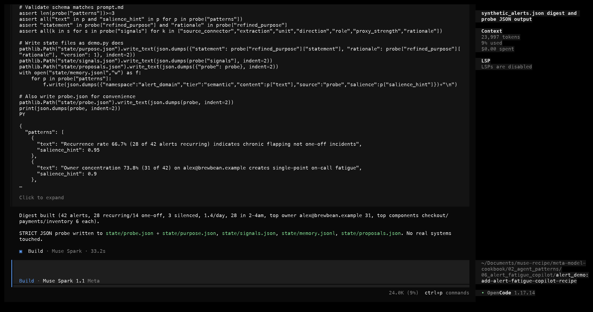
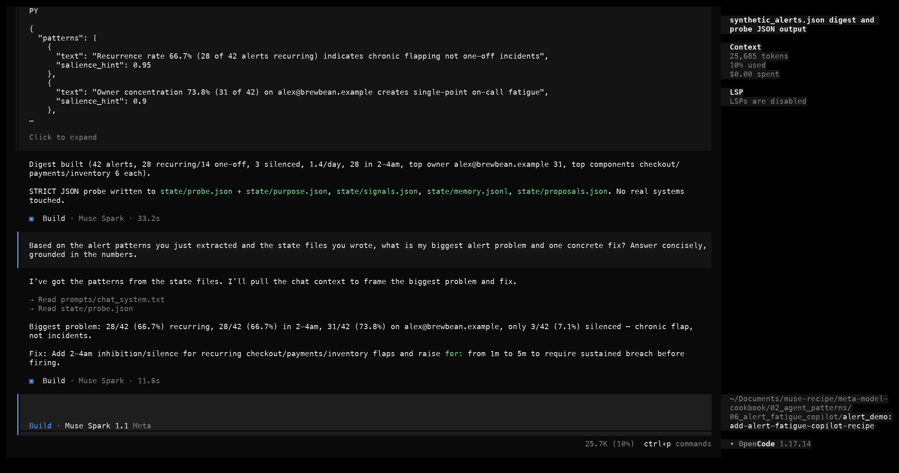
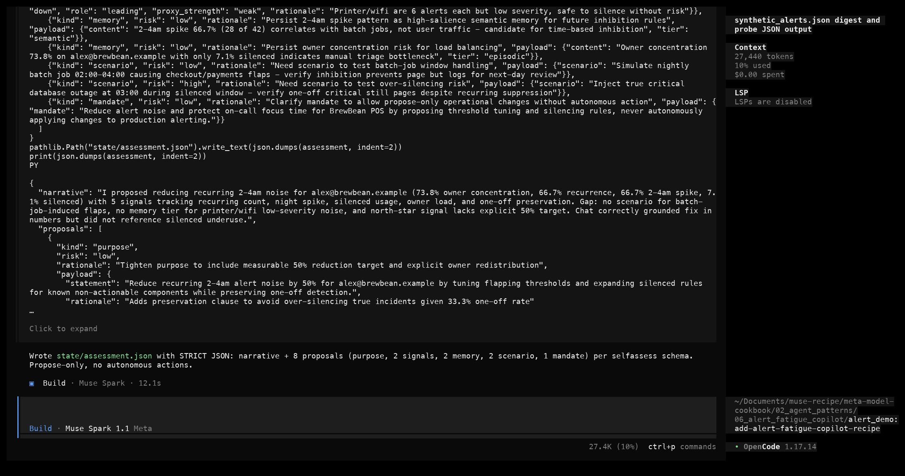
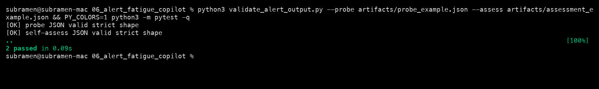

# Alert fatigue copilot with Muse Spark

|  |  |
|---|---|
| **Section** | [Agent patterns](https://dev.meta.ai/docs/getting-started/cookbook#agent-patterns) |
| **Time to complete** | ~20 min |
| **Model** | `muse-spark-1.1` |
| **Harness** | OpenCode (also direct API via the OpenAI SDK) |
| **Language** | Python |

## Summary

This recipe shows how Muse Spark extracts grounded patterns from a noisy alert feed, proposes a sharper triage purpose and signal basket, answers a question from memory, then self-assesses and proposes improvements to itself. The core rule of the loop: each turn the model reads context, reasons, emits strict JSON, writes state files, and decides whether the task is done. `validate_alert_output.py` is the oracle for whether that JSON matches the schema.

*Screenshots and captured output throughout are from an actual run; because the model is non-deterministic, your results may differ.*

## When does the CLI use alert triage?

- Completing triage takes more than one turn — the model probes, then chats, then self-assesses.
- It has to read structured data, extract patterns, and then decide what to propose.
- An objective JSON schema defines "done" for each step, so the harness can tell when a turn succeeded.

## The alert triage contract

```
┌────────────────────────────────────────────────────────┐
│              ALERT FATIGUE AGENT LOOP                  │
│  1. RECEIVE — task + alert feed path                   │
│  2. READ — load synthetic_alerts.json, build digest    │
│  3. THINK — reason about patterns vs purpose           │
│  4. ACT — emit STRICT JSON probe result                │
│  5. OBSERVE — write state files                        │
│  6. CHAT — answer grounded question                    │
│  7. SELF-ASSESS — reflect on the gap, propose changes  │
│  8. EVALUATE — done? YES respond, NO back to 2         │
│  GUARDS: max 3 turns · token budget · strict JSON      │
└────────────────────────────────────────────────────────┘
```

The loop ends when the probe JSON and self-assess JSON both parse against the schema, or a guard fires (max turns hit, parse fails repeatedly, or the user interrupts). See [`alert_fatigue_spec.md`](alert_fatigue_spec.md) for the full guards and termination table.

## How OpenCode implements the pattern

OpenCode runs this loop and maps each step onto its own tools:

| Loop step | OpenCode mechanism |
|---|---|
| RECEIVE | the prompt you pass to `opencode` or `opencode run` |
| READ | the `Read` tool on `data/synthetic_alerts.json` |
| THINK | the reasoning Muse Spark emits before a tool call, shown when reasoning is on |
| ACT | the `Write`/`Edit` tools that record state files, or a `bash` command running `demo.py` |
| OBSERVE | the tool result or state-file content fed back to the model |
| EVALUATE | the loop continues until a final message or a guard fires |

For a dependency-free path, the same loop runs via [`alert_demo/demo.py`](alert_demo/demo.py), which calls the Model API directly through the OpenAI SDK against `https://api.meta.ai/v1` — no OpenCode required. This recipe leads with the OpenCode path per cookbook convention; the Quick Start below documents both.

## Configure OpenCode for Muse Spark

Install OpenCode if you haven't already (`npm i -g opencode-ai`).

### Step 1 — Connect the Meta provider

OpenCode has built-in support for the **Meta** provider.

First, get an API key from the **[Model API dashboard](https://dev.meta.ai)** under **API keys → Create API key**.

Launch OpenCode, then run the connect command:

```
/connect
```

A searchable **"Connect provider"** list appears. Type to filter, select **Meta**, and confirm. Then paste the key from the dashboard into the **"API key"** prompt.

### Step 2 — Select Muse Spark 1.1

After connecting the provider, choose **Muse Spark 1.1**. The status bar should read **Muse Spark 1.1 · Meta**, confirming it's live.

Launch OpenCode with Muse Spark from the sample project:

```bash
cd alert_demo
opencode -m meta/muse-spark-1.1
```

For the direct-API path without OpenCode, export your key (the same one from the dashboard) and run the sample project directly:

```bash
export MODEL_API_KEY="<your-key-here>"
# or copy .env.example to .env and edit
```

## Try it on the sample project

[`alert_demo/`](alert_demo/) is a Python CLI that calls the Muse API directly, with a synthetic alert feed at `data/synthetic_alerts.json`: 42 alerts for the fictional BrewBean POS SRE team, `.example` domains only, no PII. The patterns are baked in: 28 recurring (67%), 31 owned by alex (74%), 28 in the 2–4am window, 3 silenced, ~1.4 alerts per day.

Run and validate it from the recipe root:

```bash
pip install openai
python3 -m py_compile validate_alert_output.py alert_demo/demo.py
pytest -q                       # 2 passed
cd alert_demo && ./run.sh       # live run against Muse Spark (needs MODEL_API_KEY)
```

The recipe is self-validating from the recipe directory. Each task below shows the prompt typed into OpenCode and a screenshot of the real run.

## Task 1 — probe the alert feed

> **Prompt:** "Read `data/synthetic_alerts.json` in alert_demo and build a digest with total alerts, recurring/one-off/silenced counts, alerts per day, the 2–4am spike, top owners, and top components. Then emit a STRICT JSON probe result with `patterns`, `refined_purpose`, and `signals` matching the schema in `prompt.md`. Write state files under `state/`. Do not act on real systems."

*What to notice.* The model calls the `Read` tool on the data file, computes the digest in its reasoning trace, then emits a single JSON object with no markdown fences: five patterns with salience hints, a one-sentence refined purpose, and five signals labelled north-star or leading.

The model then writes its state files. For example, `state/purpose.json`:

```json
{
  "statement": "Reduce recurring 2-4am checkout/payments/inventory alert noise and rebalance owner load away from alex to protect on-call focus time for BrewBean POS.",
  "rationale": "66.7% of alerts are recurring and 66.7% fire 2-4am...",
  "version": 1
}
```

The result is new files created under `state/` with no existing code modified, and a probe JSON that matches the schema `validate_alert_output.py` enforces.

*You know it worked when:* `state/purpose.json`, `state/signals.json`, and `state/memory.jsonl` exist, and `validate_alert_output.py --probe artifacts/probe_example.json` prints `[OK] probe JSON valid strict shape`.



## Task 2 — answer from memory

> **Prompt:** "Based on the alert patterns you just extracted and the state files you wrote, what is my biggest alert problem and one concrete fix? Answer concisely, grounded in the numbers."

*What to notice.* The model re-reads `state/memory.jsonl` and cites the verifiable counts: 28/42 recurring (66.7%), 28/42 in the 2–4am window, alex owning 31/42 (73.8%), and the top components (checkout, payments, inventory) at 6 each. It invents no new numbers.

The result is a plain-text answer — no JSON needed here — grounded in the prior probe output.

*You know it worked when:* every number in the answer traces back to the digest, and the proposed fix is operational (debounce, routing, ownership rotation) rather than financial or safety advice.



## Task 3 — self-assess and propose improvements

> **Prompt:** "Now self-assess against the purpose and signal basket in `state/`. Return STRICT JSON with a narrative and proposals per the self-assess system in `prompt.md`. Write it to `state/assessment.json`."

*What to notice.* The model reads `purpose.json`, `signals.json`, and `memory.jsonl`, writes a first-person gap analysis, and proposes eight items spanning the `purpose`, `signal`, `memory`, and `scenario` kinds, each tagged with a low or high risk.

The result is `state/assessment.json` created, with the proposals also appended to `state/proposals.json`.

*You know it worked when:* `validate_alert_output.py --assess artifacts/assessment_example.json` prints `[OK] self-assess JSON valid strict shape`, and every proposal's `kind` is in the allowlist with a `low`/`high` risk.



## Validate every run

```bash
# from the recipe root:
python3 validate_alert_output.py --probe artifacts/probe_example.json --assess artifacts/assessment_example.json
```

| check | result |
|---|---|
| probe JSON has a `patterns` array with `text` and `salience` | ✅ |
| `refined_purpose.statement` non-empty | ✅ |
| `signals` has items with the required `direction`/`role`/`proxy_strength` fields | ✅ |
| self-assess `narrative` non-empty | ✅ |
| `proposals` items each have a `kind` in the allowlist and `low`/`high` risk | ✅ |

> [!NOTE]
> The schema guarantees shape, not facts. In live runs the total and recurring counts are reliable, but the top-owner count and spike count can vary ±1 across identical calls, and the top three components are a tie (all seven components appear 6 times, so which three surface is arbitrary). That's why the validate step exists — treat every extracted number as a claim to verify against `data/synthetic_alerts.json` with a Python `Counter`.

Run the automated check from the recipe root:

```bash
pytest -q
# 2 passed
```

A full captured run is saved at [`artifacts/demo_run.txt`](artifacts/demo_run.txt).



## OpenCode profile

The loop and the strict-JSON contract are the same however you run it:

- **OpenCode**: the primary harness in this recipe. `opencode -m meta/muse-spark-1.1`, then paste the prompts from [`prompt.md`](prompt.md), or run headless with `opencode run --format json`. Reasoning shows as a dimmed `Thought` block; the `Edit` tool requires an exact `oldString` match once.
- **Direct Python CLI**: `./run.sh` in `alert_demo` bypasses OpenCode and calls the Model API directly via the OpenAI SDK against `https://api.meta.ai/v1`. Good for API purists and CI, with the same prompts and the same strict-JSON contract.

The safety contract is the same everywhere: identify existing text exactly once for edits, propose only (no external actions), and state a numeric value only if it appears in the digest.

## Common failure modes

### JSON wrapped in markdown fences

The model returns ```` ```json ... ``` ```` despite "STRICT JSON only".

**Recovery:** the client strips the fences, then extracts the first balanced `{...}`. `validate_alert_output.py` does this automatically and prints `[ERR]` if the JSON is still unbalanced. Re-prompt with "no markdown fences, raw JSON only".

### `oldString` not found when writing state files

```
[ERR] oldString not found in state/purpose.json
```

**Recovery:** state files are created new with the `write` tool, not `edit` — or read before editing so the model has the exact current content. This recipe uses `write` for new files.

### Hallucinated counts

The model says 30 recurring instead of 28, or invents owner percentages.

**Recovery:** re-prompt, pointing at the Python `Counter` output from the data file. The `prompt.md` rule is to state a numeric value only if it is in the digest, mark approximate values as approximate, and say "not readable" rather than guess.

### Whole-file rewrite instead of a focused edit

The model rewrites all of `demo.py` to add one line.

**Recovery:** prompt for the smallest edit, quoting unique surrounding lines — the same pattern as the [validated in-place edits](../04_validated_in_place_edits/) recipe.

### Applies cleanly but breaks the JSON schema

```
[ERR] signals[2] missing direction
```

**Recovery:** re-run the probe prompt, emphasizing the required-fields list from `prompt.md`, or switch to `response_format` `json_schema` with `strict: true` via the direct API for a guaranteed shape.

## Files in this recipe

```
05_alert_fatigue_copilot/
├── README.md                      ← this recipe
├── prompt.md                      ← exact prompting: probe / chat / self-assess systems
├── alert_fatigue_spec.md          ← loop contract diagram, guards, termination conditions
├── validate_alert_output.py       ← strict-JSON shape validator (zero-deps stdlib)
├── test_validate_alert_output.py  ← pytest wrapper for the validator
├── alert_demo/                    ← sample project: Python CLI (OpenAI SDK), alert feed, prompts
├── artifacts/                     ← captured run transcript, example probe/assessment JSON, metrics
└── assets/                        ← OpenCode run screenshots referenced above
    ├── task1_probe.png
    ├── task2_chat.png
    ├── task3_assess.png
    └── validate.png
```

## License

See LICENSE in parent cookbook for details.
