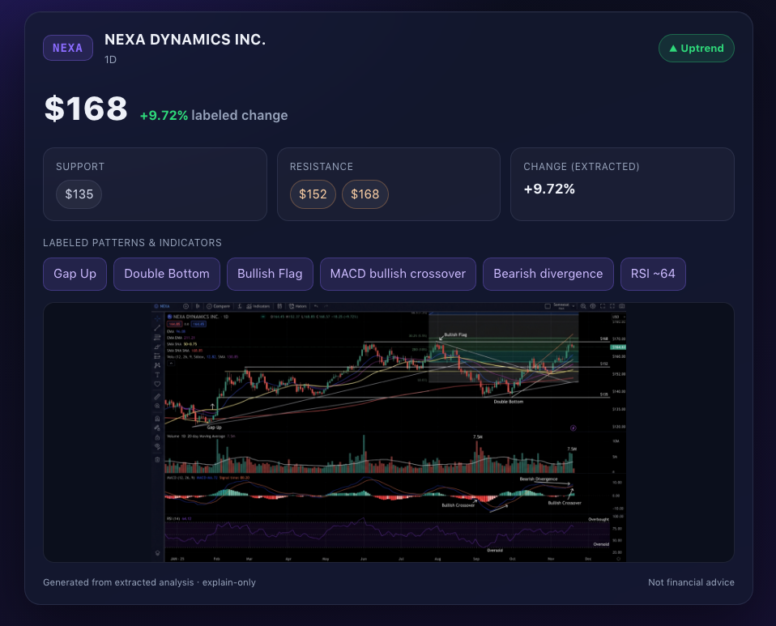
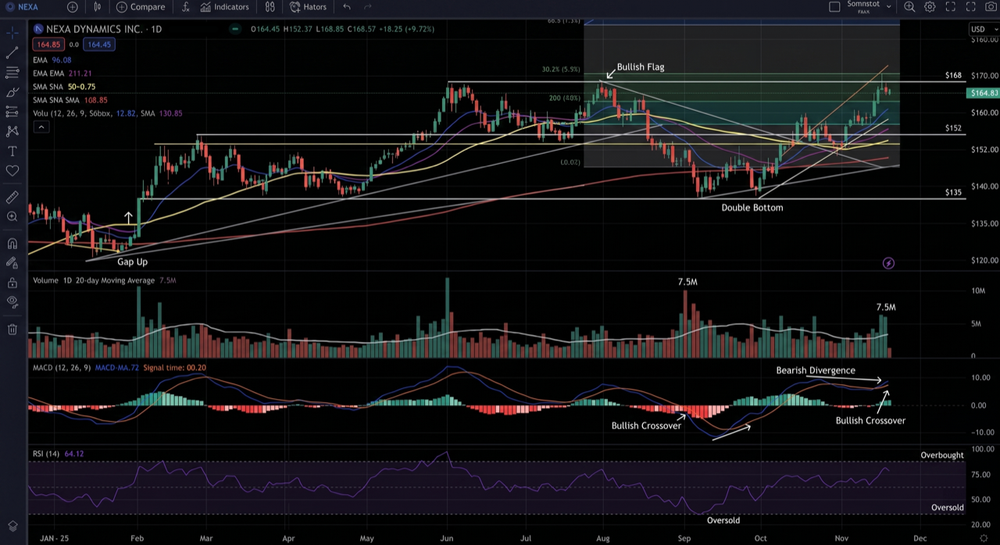

# Chart Explainer: understand any chart

|  |  |
|---|---|
| **Section** | [Use cases](https://dev.meta.ai/docs/getting-started/cookbook#use-cases) |
| **Time to complete** | ~30 min |
| **Model** | `muse-spark-1.1` |
| **Harness** | OpenClaw |
| **Prerequisites** | [series setup](../README.md) |

Send your assistant a screenshot of a chart, ask "help me understand this," and get a grounded explanation plus a visual summary you can act on.

*Screenshots throughout are from an actual run; because the model is non-deterministic, your results may differ.*



Charts are dense, and "what am I even looking at?" is a real question people ask their assistant. This recipe points Muse Spark's image understanding at a chart screenshot: it explains what it sees, extracts the facts as structured data, and renders a clean visual summary, all in OpenClaw.

This recipe ships a sample chart at [`assets/chart.png`](./assets/chart.png): a daily candlestick chart for **NEXA Dynamics Inc.**, a **fictional company**, on an **AI-generated, TradingView-style mock** (not real market data). It is annotated with the kind of markup a friend might forward you (a gap up, a double bottom, a bullish flag, labeled support/resistance, MACD, and RSI). Use it as the input, or swap in your own.

> [!NOTE]
> **Explain, do not advise.** This recipe describes only what is objectively on the chart (instrument, timeframe, trend, levels, % change, volume, visible patterns and indicators). It does **not** predict prices or give buy/sell/financial advice. That keeps the output verifiable and keeps the recipe out of financial-advice territory. The prompts below enforce this, and you should keep it that way.

## What you build



1. A one-shot "understand this chart" turn: chart image in, grounded explanation out.
2. A **structured** analysis (`{instrument, timeframe, trend, keyLevels[], pctChangeVisible, notableEvents[]}`) you can automate against.
3. A verification step that catches the #1 failure mode: models misreading numbers off an axis.
4. A **generated styled summary on OpenClaw's Canvas**: build a polished HTML card from the Step 2 analysis (trend badge, support/resistance pills, pattern chips, embedded chart) and render it in the WebView.
5. An iterative loop: drill in with follow-ups in the same session.

## How it works

The key fact that shapes the whole recipe: **Muse Spark is multimodal in, text out**. Per the [Model API factsheet](https://dev.meta.ai/docs), `muse-spark-1.1` accepts text, image, video, and PDF and returns **text**. It understands the chart; it does not draw one. So the pipeline is:

```
chart image ──► muse-spark-1.1 (image understanding) ──► text + structured JSON ──► a tool renders the visual
                         the model is the brain                              the viz is just presentation
```

Three Model API capabilities chain here, each with its own doc:

- **[Image understanding](https://dev.meta.ai/docs)**: the chart goes in as image content on a `user` message (or via `infer ... --file`). Verified working with `meta/muse-spark-1.1`.
- **[Structured output](https://dev.meta.ai/docs)**: `response_format` with a JSON schema constrains decoding so the response matches the schema. It guarantees the *shape*, not that the model read the chart correctly (see Step 2 and Step 3).
- **Tool calling / the agent loop**: OpenClaw turns the structured analysis into a rendered visual via the `canvas` tool or an `exec` re-render.

Because the model outputs text, the visual is a downstream render of the model's structured analysis. Do not reach for an image-generation model here: it would fabricate the data and defeat the point.

## Step 0: setup

OpenClaw ships built-in support for the **Meta** provider, and `muse-spark-1.1` is vision-capable — confirm the [series foundation](../README.md) is connected (Meta provider selected), then put the bundled sample chart where the recipe expects it:

```bash
export MODEL_API_KEY="your-key-here"

# Dedicated workspace, sample chart, and the HTML generator (run from this recipe directory)
mkdir -p ~/chart-demo/charts ~/chart-demo/summary
cp assets/render-summary.py ~/chart-demo/
cp assets/chart.png ~/chart-demo/charts/chart.png
```

Smoke-test vision on it:

```bash
openclaw infer model run --local --model meta/muse-spark-1.1 \
  --file ~/chart-demo/charts/chart.png \
  --prompt "In one sentence, what does this image show?" --json
```

If it identifies it as a price/stock chart for NEXA, vision is wired correctly. Register the agent (enable the `canvas` tool, which is not in the default `coding` profile) and restart the Gateway:

```json5
// ~/.openclaw/openclaw.json  → add a dedicated agent (agents.list[])
{
  agents: {
    list: [
      {
        id: "chartdemo",
        workspace: "~/chart-demo",
        model: "meta/muse-spark-1.1",
        tools: { alsoAllow: ["canvas"] },
      },
    ],
  },
  gateway: {
    nodes: {
      allowCommands: [
        "canvas.present", "canvas.navigate", "canvas.snapshot",
        "canvas.a2ui.pushJSONL", "canvas.eval", "canvas.hide",
      ],
    },
  },
}
```

```bash
openclaw gateway restart
```

> **Bringing your own chart?** Drop any chart screenshot in as `~/chart-demo/charts/chart.png`. Prefer one without third-party UI chrome or branding so the image stays yours to share.

## Run the full pipeline (one task)

Give the agent a single task and let it drive the tools: analyze, save JSON, run [`render-summary.py`](./assets/render-summary.py), present on Canvas. You do not hand-edit HTML or run the generator yourself.

```bash
NODE=<your-canvas-node-id>   # from: openclaw nodes list

openclaw agent --agent chartdemo --timeout 300 \
  --message "Complete the chart summary pipeline for ~/chart-demo/charts/chart.png. Do everything via tools; no asking me to run commands. Describe only what is on the chart; no advice.

1. Analyze the chart and save structured JSON to ~/chart-demo/analysis.json: instrument, timeframe, trend (up|down|sideways), keyLevels [{type,value}], pctChangeVisible, notableEvents, unreadable.

2. Run ~/chart-demo/render-summary.py with that JSON and the chart image to write ~/chart-demo/summary/generated.html (exec).

3. Copy generated.html and chart.png into your OpenClaw Canvas session folder (a directory under ~/Library/Application Support/OpenClaw/canvas/, e.g. agent_main_main), then canvas navigate to /generated.html on node $NODE and present."
```

The agent reads the chart, writes `analysis.json`, **exec**s `render-summary.py` (deterministic HTML from extracted values), then **canvas** navigate + present. The steps below break the same pipeline into smaller tasks for learning and capture.

## Step 1: understand the chart

Start with the raw probe so you can see the model's reading without tools or session noise. The prompt does the explain-only enforcement:

```bash
openclaw infer model run --local --model meta/muse-spark-1.1 \
  --file ~/chart-demo/charts/chart.png \
  --prompt "Help me understand this chart. Describe ONLY what is visible: instrument, timeframe, overall trend, approximate support and resistance levels, percent change across the visible range, notable volume, and any labeled patterns or indicators. State a value only if you can read it; say 'not readable' otherwise. Do NOT give buy/sell advice or price predictions." \
  --json
```

Representative output (real run against the bundled chart, condensed):

```text
- NEXA DYNAMICS INC. (NEXA), Daily (1D), USD. Trend up, with a mid-year
  peak (~$165-170), a Sep/Oct pullback (~$135-140), then recovery (~$160-168).
- Support ~$135, consolidation ~$150-152, supply zone ~$160-168 (read off
  the axis; approximate).
- Header prints +9.72%; a total change across the visible range is not readable.
- Patterns: "Gap Up", "Bullish Flag", "Double Bottom"; MACD crossovers and a
  bearish divergence; RSI(14) ~64.
```

Wording varies run to run: the model reliably gets the instrument, trend, and labeled patterns, but hedges or marks "not readable" on precise prices, which is the behavior you want.

Then run it as the assistant experience (this is where Canvas/exec tools become available). Mention the image path and OpenClaw attaches it automatically:

```bash
openclaw agent --agent chartdemo --verbose on --timeout 180 \
  --message "Help me understand the chart at ~/chart-demo/charts/chart.png. Describe only what is visible (instrument, timeframe, trend, support/resistance, % change, volume, labeled patterns/indicators). No advice or predictions."
```

> 📸 **Capture**: the chart image plus the text explanation from both the `infer` probe and the agent.

## Step 2: get a structured analysis

Ask for the analysis as JSON so it is automatable and easy to verify field by field.

In the agent, prompt for the schema:

```bash
openclaw agent --agent chartdemo --timeout 180 \
  --message "Analyze ~/chart-demo/charts/chart.png and return ONLY JSON matching: {\"instrument\": string, \"timeframe\": string, \"trend\": \"up\"|\"down\"|\"sideways\", \"keyLevels\": [{\"type\": \"support\"|\"resistance\", \"value\": number|null}], \"pctChangeVisible\": number|null, \"notableEvents\": [string], \"unreadable\": [string]}. Use null and add to 'unreadable' for anything you cannot read. No advice."
```

The agent prompt above *asks* for JSON but can't guarantee it. If you need the response to *strictly* conform to a schema, that's the Model API's [structured output](https://dev.meta.ai/docs) feature (`response_format` with a JSON schema, `strict: true` + `additionalProperties: false`) — it's a Chat Completions capability the OpenClaw CLI does not expose. See the structured-output docs to call the Model API directly when you need that guarantee.

> [!IMPORTANT]
> **A schema guarantees the *shape*, not the *facts*.** In live runs on the bundled chart, `instrument` and `trend` are reliable, but `keyLevels`, `pctChangeVisible`, and `notableEvents` vary across identical calls, and the model often returns `null`/`[]` (or a misread number) even for values printed on the chart, like the `+9.72%` header. A schema can't make the model *read* the chart, which is why [Step 3](#step-3-verify-the-numbers-the-objective-backbone) exists: treat every extracted number as a claim to verify against the image.

> 📸 **Capture**: the structured JSON from the agent, noting any fields the model left empty or misread.

## Step 3: verify the numbers (the objective backbone)

Models misread chart axes, so treat every extracted number as a claim to check against the image. Ask how each value was read, then verify by eye:

```bash
openclaw agent --agent chartdemo --timeout 180 \
  --message "From ~/chart-demo/charts/chart.png, list every price level you reference and HOW you read it (which gridline or label). Mark interpolated values (approx); if you cannot read a value, say so."
```

Drop the same rule into the workspace `AGENTS.md` so every turn obeys it: state a numeric value only if it sits on a readable axis label or gridline, mark interpolated values `(approx)`, say "not readable" instead of guessing, and never give advice. If a value is wrong, re-prompt with the labeled levels and have the model re-read against them.

> 📸 **Capture**: a before/after where the model corrects a misread level after being pointed at the gridlines.

## Step 4: show the summary on Canvas

The model produced structured facts; now **generate** a styled page from them and put it on screen. [Canvas](https://docs.openclaw.ai/platforms/mac/canvas) is OpenClaw's agent-driven panel, a full `WKWebView`, so it renders real **HTML/CSS**, not just stacked text.

The finished card looks like the [preview at the top of this guide](#chart-explainer-understand-any-chart). It is built by [`assets/render-summary.py`](./assets/render-summary.py) from Step 2 JSON, then rendered in the Canvas WebView. **Do not hand-write or edit HTML**: the agent should save analysis JSON and exec the generator so the visual cannot drift from what the model read.

**Prerequisite:** a Canvas-capable node connected (the macOS app, Settings → Allow Canvas). Find its id:

```bash
openclaw nodes list
```

### Task: render and present (recommended)

Ask the agent to run the generator and show the result on Canvas (same as [the full pipeline](#run-the-full-pipeline-one-task), Step 4 only):

```bash
NODE=<your-canvas-node-id>

openclaw agent --agent chartdemo --timeout 240 \
  --message "Using your Step 2 analysis for ~/chart-demo/charts/chart.png, save ~/chart-demo/analysis.json if needed, run ~/chart-demo/render-summary.py to write ~/chart-demo/summary/generated.html, copy generated.html and chart.png into the Canvas session folder, then canvas navigate to /generated.html on node $NODE and present. No advice."
```

Verified: the agent calls `exec` on `render-summary.py`, then `canvas` navigate + present. It does not rewrite the HTML by hand.

### Manual render (debug only)

If you need to inspect the generator outside the agent loop, run it yourself:

```bash
# Paste your Step 2 JSON here, AFTER verifying the numbers in Step 3.
# The values below are the verified/corrected analysis for the bundled chart
# (the raw model output is often sparser - that is the point of Step 3).
cat > /tmp/chart-analysis.json <<'EOF'
{"instrument":"NEXA DYNAMICS INC.","timeframe":"1D","trend":"up","keyLevels":[{"type":"resistance","value":168},{"type":"resistance","value":152},{"type":"support","value":135}],"pctChangeVisible":9.72,"notableEvents":["Gap Up","Double Bottom","Bullish Flag","MACD bullish crossover","RSI ~64"],"unreadable":[]}
EOF

python3 ~/chart-demo/render-summary.py \
  --analysis /tmp/chart-analysis.json \
  --chart ~/chart-demo/charts/chart.png \
  --output ~/chart-demo/summary/generated.html
```

Copy the page into the macOS Canvas session folder and present it (local WebView path; avoids auth-gated gateway URLs):

```bash
NODE=<your-canvas-node-id>
# Canvas keeps one folder per session under .../OpenClaw/canvas/. List them and pick yours:
ls "$HOME/Library/Application Support/OpenClaw/canvas/"
CANVAS="$(ls -dt "$HOME/Library/Application Support/OpenClaw/canvas/"*/ 2>/dev/null | head -1)"   # newest session; adjust if needed
mkdir -p "$CANVAS"
cp ~/chart-demo/summary/generated.html ~/chart-demo/summary/chart.png "$CANVAS/"

openclaw nodes canvas navigate --node "$NODE" "/generated.html"
openclaw nodes canvas present  --node "$NODE"
openclaw nodes canvas snapshot --node "$NODE"   # capture the rendered card
```

The HTML is built entirely from the extracted JSON. If a level is wrong, fix the analysis (Step 3) and re-run the task or generator.

### Plain/quick alternative (A2UI)

If you only need text and no styling, push an [A2UI](https://docs.openclaw.ai/platforms/mac/canvas#a2ui-in-canvas) card instead. It is instant but bland (this is the unstyled look):

```bash
openclaw nodes canvas a2ui push --node "$NODE" \
  --text "NEXA up +9.72% (labeled). Support 135/152, resistance 168. Patterns: gap up, double bottom, bullish flag."
openclaw nodes canvas present --node "$NODE"
```

> **No Canvas surface (no macOS app)?** Fall back to a plotted image: have the agent `exec` a small matplotlib script that draws the extracted levels, then send the PNG back over your channel. It is portable, but Canvas is the on-brand surface for an OpenClaw assistant.

> 📸 **Capture**: the `canvas snapshot` of the rendered summary card next to the original chart.

## Step 5: iterate

This is an assistant conversation, so keep drilling in within the same session:

```bash
openclaw agent --agent chartdemo --timeout 180 \
  --message "What is the nearest support below the current price, and how far is it in %?"

openclaw agent --agent chartdemo --timeout 180 \
  --message "Explain the volume spike on the left of the chart. Re-run render-summary.py from the updated analysis and present the summary card on Canvas again."
```

Session continuity means the model still has the chart and prior analysis in context. Keep feeding the latest chart screenshot when the view changes (OpenClaw prunes image data from older turns, so the most recent image is what it reasons over).

> 📸 **Capture**: a two-turn drill-down and the updated summary.

## Guardrails

- **Explain only, never advise.** Describe what is on the chart. No predictions, no buy/sell, no "is this a good entry." The prompts and `AGENTS.md` rule above enforce this; keep them.
- **Every number is checkable.** The recipe's value is that extracted levels/percentages can be verified against the image. Lean into that.
- **Text out, render separately.** The model never draws the chart; a tool renders its structured output. Avoid image generation for data accuracy.

## What to capture

- [ ] **Chart + explanation**: the input image and the text explanation (Step 1).
- [ ] **Structured analysis**: the JSON from the agent (Step 2), noting any fields the model left empty or misread.
- [ ] **Verification**: a misread value corrected after pointing at the gridlines (Step 3).
- [ ] **Visual**: the `canvas snapshot` of the rendered summary card beside the original chart (Step 4).
- [ ] **Iteration**: a follow-up drill-down in the same session (Step 5).
- [ ] (optional) trajectory export: `openclaw sessions export-trajectory --agent chartdemo --output chart-capture`.

## Gotchas

- **Canvas viewport is short**: the macOS Canvas panel is roughly 520×680px. `render-summary.py` caps chart height (default 320px) and top-aligns the page so snapshots do not clip the header/footer; tune with `--chart-max-height`.
- **Let the agent exec the generator**: if you only say "build a fancy HTML card," the model may hand-write HTML. Task prompts should explicitly say run `~/chart-demo/render-summary.py` after saving `analysis.json`.

## References

- **`muse-spark-1.1`** ([Model API docs](https://dev.meta.ai/docs)): input text/image/video/PDF, **output text**; up to 50 MB inline, ~50 images per request. No image generation — the API does not produce media.
- **Structured output**: `response_format` with `json_schema` (Chat Completions); use `strict: true` + `additionalProperties: false`. `image_url` is fetched server-side, so pass a public URL or inline a `data:` URI.
- **OpenClaw**: [`infer`](https://docs.openclaw.ai/cli/infer), [`agent`](https://docs.openclaw.ai/cli/agent), [Live Canvas](https://docs.openclaw.ai/platforms/mac/canvas), [Model providers](https://docs.openclaw.ai/concepts/model-providers).
