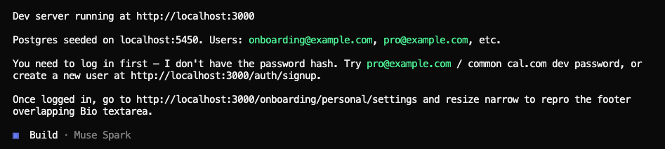
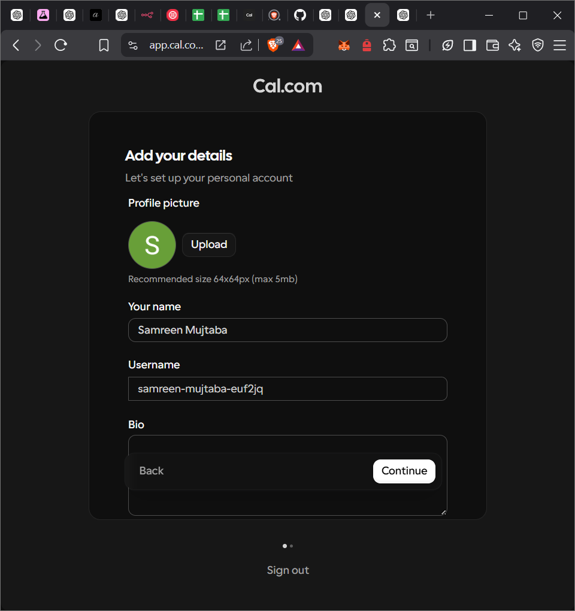
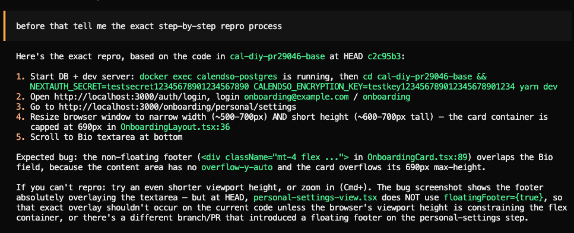
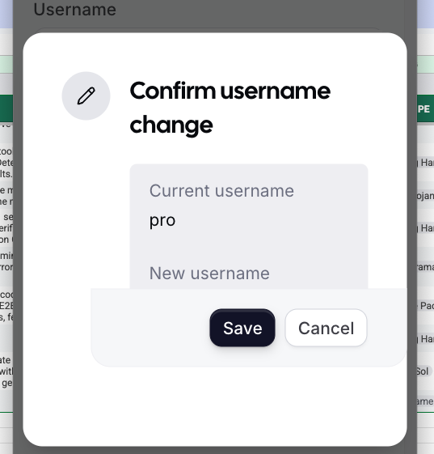
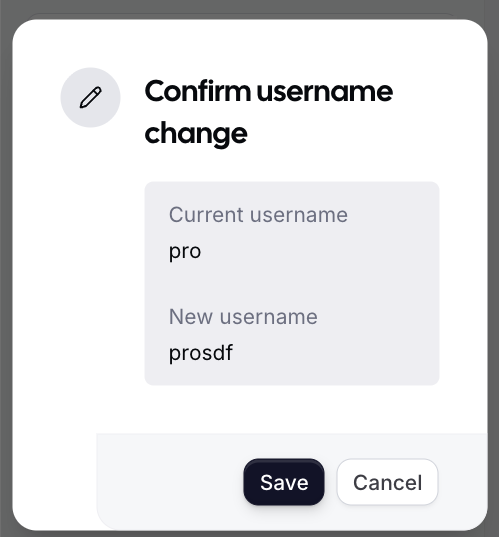

# Reproducing and Fixing Bugs From Screenshots

## Summary

This recipe shows how Muse Spark reads a screenshot of a buggy UI (via the OpenCode CLI), locates the offending component in the code, and ships a fix. The worked task fixes a footer-overlap bug reported against the [cal.com monorepo](https://github.com/calcom/cal.diy/issues); the model helps the developer setup the project, reproduce the reported issue, and ship a fix to resolve the issue.

|  |  |
|---|---|
| **Section** | [Use cases](https://dev.meta.ai/docs/getting-started/cookbook#use-cases) |
| **Time to complete** | under 30 minutes |
| **Model** | `muse-spark-1.1` |
| **Prerequisites** | Python 3.10+, `OpenCode` CLI, and a `MODEL_API_KEY` (create one in the [Model API dashboard](https://dev.meta.ai/)). |

## Configure OpenCode For Muse Spark

Install OpenCode with `curl -fsSL https://opencode.ai/install | bash`.
OpenCode has built-in support for the **Meta** provider.

First, get an API key from the **[Model API dashboard](https://dev.meta.ai)** under **API keys → Create API key**.

Launch OpenCode, then run the connect command:

```
/connect
```

A searchable **"Connect provider"** list appears. Type to filter, select **Meta**, and confirm.
Then paste the key from the dashboard into the **"API key"** prompt.

After connecting the provider, choose **Muse Spark 1.1**. The status bar should read
**Muse Spark 1.1 · Meta**, confirming it's live.

> **Vision is essential here.** Muse Spark 1.1 is a reasoning + vision model — that's what lets it
> actually *read the screenshots* the browser MCP returns. For a game, "does it look right?" is a
> question only vision can answer.


### Verify Image Input Works

Before going further, confirm the image path end to end. Drop any screenshot next to your working
directory and ask the model to describe it:

> what's in ./assets/02-bug-attached.png?

If the model describes the image, image input is wired correctly — continue. If instead you see an
error like *"image not supported"* or the model says it received no image, the screenshot is not
reaching the model.

1. Try reinstalling `opencode` with the latest version.
2. Reference the image **by path in the prompt** so the model calls `read` on it, rather than
   pasting binary into the terminal.

Do not proceed until this smoke test passes — every step below depends on the model seeing pixels.

## Setup the Sample Project

The sample project is the [`calcom/cal.diy`](https://github.com/calcom/cal.diy) monorepo at the commit immediately before the upstream fix PR ([#29046](https://github.com/calcom/cal.diy/pull/29046)) landed.

The fix is not in this commit, so the bug is live. Pin the clone to that commit:

```bash
git clone https://github.com/calcom/cal.diy.git cal-diy-pr29046-base
cd cal-diy-pr29046-base
git checkout c2c95b371a691a5db042db7705f7708dbe62ce96
```

The walkthrough below has six steps. Your goal at each is what matters; the model's exact wording
and turn count will differ from run to run (LLMs are non-deterministic — see the note below):

1. Have the model set the project up and run a local app.
2. Give it the bug report plus a screenshot, and get repro steps.
3. Find a second instance of the same bug class while exploring the app.
4. Hand both screenshots back in one prompt and have the model diagnose the shared root cause.
5. Choose the fix scope (minimal vs. global) when it asks.
6. Let it apply and self-verify the fix.

> [!NOTE]
> **Reproducing this yourself.** The traces below are from one real run — treat them as an
> example of the *shape* of the work, not output to match verbatim. Because the model is
> non-deterministic, yours may take more turns, grep for different files, or fix one surface
> before the other. That is expected: if it patches the onboarding page but not the dialog (or
> vice versa), just point it at what is left ("now do the same for the confirm-username dialog").
> The goal at each step is the outcome, not a specific transcript.

### 1. Set Up The Project Locally

**User Prompt:**

> set up this project locally so i can repro the bug

**Model Responds:**
```text
◇ thought: I'll install dependencies, seed Postgres, start the dev server, and report the URL
           plus the test login so the developer can open the bug.
     → bash(yarn install)
     → bash(docker compose up -d postgres)
     → bash(yarn prisma migrate deploy && yarn db-seed)
     → bash(NEXTAUTH_SECRET=… CALENDSO_ENCRYPTION_KEY=… yarn dev > /tmp/cal-dev.log 2>&1 &)
     → bash(tail -5 /tmp/cal-dev.log)
```

*What to notice:* The model runs the full setup itself — installs dependencies, seeds Postgres through Docker, starts the dev server, and reports back with the URL, the seeded login, and the page to navigate to. It tells the developer what it does not know (the seed user's password hash) instead of guessing.



### 2. Reproduce The Reported Bug

We'll consider this issue to fix: https://github.com/calcom/cal.diy/issues/28931
The developer pastes the bug report text and attaches the screenshot the reporter included:

> Check out this bug report:
>
> **Description.** In the onboarding "Add your details" screen, the "Continue" button overlaps the Bio textarea when the viewport width is reduced (e.g., split screen / half window).
>
> This appears to be a responsive layout issue.
>
> Steps to Reproduce
> Go to onboarding (Add your details)
> Resize browser to ~50% width
> Scroll to Bio section
> Expected Behavior
> The "Continue" button should be placed below the Bio textarea without overlapping.
>
> Actual Behavior
> The button overlaps the textarea, affecting usability and input interaction.



Then the developer asks to reproduce this bug on their local system



The model lays them out — start the DB and dev server, log in, navigate to the onboarding page, narrow the window *and* shorten it so the card overflows, scroll to the Bio field. The mention of *both* narrow width and short height is the part most readers miss; the bug needs the card's flex container to be constrained on the vertical axis.


### 3. Discover A Second Instance

With the dev server running and the repro path in hand, the developer starts exploring other surfaces in the app. While updating their username under `/settings/my-account/profile`, they hit the same kind of footer overlap on a completely different dialog — and paste a screenshot of it straight into the chat.

**Prompt:**

> ok not the same screen but i see this issue here also when i update my username [image attached]

*What to notice:* The developer pastes a clipboard screenshot from a different surface — the "Confirm username change" dialog at `/settings/my-account/profile`. The model reads it and recognizes the same root cause inside the shared `Dialog` component instead of inside the onboarding card:

```text
◇ thought: The screenshot shows the Save/Cancel buttons in the DialogFooter overlapping the
           username content in the "Confirm username change" dialog — similar pattern to the
           onboarding bug (floating footer overlapping content). Looking at packages/ui/components/dialog/Dialog.tsx,
           DialogFooter is sticky bottom-0 with -mx-8 mt-10, and DialogContent defaults to
           overflow-visible (not overflow-y-auto). Same root cause as the onboarding bug, but in
           the Dialog component.
```

The developer saves the clipboard image as `repro.png` and now has two screenshots of the same bug class on two different surfaces — exactly the setup the next prompt needs.



### 4. Read Both Bugs From The Screenshots

**Prompt:**

> i am encountering an issue (see in repro.png) where there is an overlap that is preventing me from seeing the rest of the window. similar issue was reported (see bug.png) for a different menu. both are happening when the viewport is narrow. figure out what needs to change here and come up with a plan

*What to notice:* The developer starts a new session to save context. They switch OpenCode into Plan agent so the model proposes before it edits. The prompt names both screenshots by filename. Muse Spark uses `read` on each PNG before any source file. The first reasoning block ties the two images to "overlapping menus at narrow viewport widths" — diagnosis grounded in pixels, before any code.

**Interleaved trace** (thinking then action):

```text
◇ turn 1 — thought: The issue involves overlapping elements in narrow viewports. I'll start by
                    locating repro.png and bug.png in the project directory to understand the
                    visual overlap before examining the source code.
     → read(/cal)
◇ turn 2 — thought: Screenshots referenced show overlapping menus at narrow viewport widths.
                    I'll examine the images and locate the UI component files in the repository
                    structure.
     → read(/cal/repro.png)   → Image read successfully
     → read(/cal/bug.png)     → Image read successfully
◇ turn 3 — thought: The screenshots show modal dialogs with footer buttons overlapping content
                    fields at narrow viewports. I'll explore the repository structure to locate
                    the Confirm username change and onboarding components.
     → read(/cal/cal-diy-pr29046-base)
```

### 5. Localize The Components

*What to notice:* Each screenshot drives a separate search path. The model uses the dialog title text from `repro.png` to find `confirm_username_change_dialog_title` in the i18n bundle, then traces the key to its caller. For `bug.png` it uses the visible heading "Add your details" the same way. The screenshots replace the missing file paths in the report.

**Interleaved trace:**

```text
◇ turn 4 — thought: Both screenshots show bottom action bars overlapping form content at narrow
                    viewports. I'll search for the confirmation dialog and onboarding wizard
                    components to locate where these sticky footers are defined.
     → grep("Confirm username change")
     → grep("confirm_username_change_dialog_title", include="*.{ts,tsx}")
     → read(apps/web/components/ui/UsernameAvailability/UsernameTextfield.tsx)
◇ turn 8 — thought: The bug screenshots show dialog content overlapping at narrow viewports —
                    one with "Confirm username change" modal being cut off, and another with
                    Back/Continue buttons covering a Bio field during onboarding. I'll examine
                    the Dialog component implementation to understand the layout structure.
     → read(packages/ui/components/dialog/Dialog.tsx)
◇ turn 13 — thought: bug.png shows an onboarding form with "Add your details" and a sticky
                     footer overlapping the Bio textarea.
     → grep("add_your_details", include="*.{ts,tsx}")
     → read(apps/web/modules/onboarding/personal/settings/personal-settings-view.tsx)
     → read(apps/web/modules/onboarding/components/OnboardingCard.tsx)
```

By turn 19 the model has the two call sites and the two layout components. It has also noticed that `personal-calendar-view.tsx` already uses `floatingFooter={true}` with a scrollable container — the pattern that works, applied unevenly across onboarding steps.

### 6. Choose Minimal Vs Global

*What to notice:* Plan agent emits a `question` tool call before it commits to a fix shape. The model has already mapped the blast radius (one default in the dialog component, one in the card component, dozens of un-guarded callers), so the question is real, not a formality.

**Question rendered to the developer:**

> **Fix scope** &mdash; Should I apply minimal targeted fixes, or also make global preventive changes to Dialog and OnboardingCard defaults?

| Option | What it changes | Trade-off |
|---|---|---|
| **Minimal targeted fixes** | The username dialog (`enableOverflow`) and the onboarding personal-settings step (`floatingFooter` + scroll). | Safest. Lowest risk of regressions. Same bug class can still ship on any other dialog or onboarding step. |
| **Global preventive fixes** &nbsp;_(Recommended)_ | The `DialogContent` default overflow to `overflow-y-auto`, and the `OnboardingCard` content to `overflow-y-auto` by default. | Fixes both reported cases and prevents the same bug across all ~70 dialogs and all onboarding steps. Requires explicit opt-out on the one caller that depends on the old default (`CommandDialog`). |

The developer picked **Global preventive fixes**. The model then presented the plan:

> The issue is two overlapping footer patterns, both failing in narrow viewports:
>
> 1. **Username confirm dialog** (`UsernameTextfield.tsx:166`): `DialogContent type="confirmation"` has `max-h-[95vh]` but `overflow-visible` by default (`Dialog.tsx:88`). `DialogFooter` is sticky, but the parent isn't scrollable, so the footer overlaps content when the viewport is narrow.
> 2. **Onboarding personal-settings** (`personal-settings-view.tsx:118`): `OnboardingCard` footer is not floating by default; the card content has `overflow:hidden`. When the viewport narrows, the footer overlaps the Bio textarea.
>
> **Plan (Global preventive fixes):** Flip the `Dialog` default to `enableOverflow={true}` and the `OnboardingCard` default to `floatingFooter={true}`; have `CommandDialog` opt out explicitly to keep its cmdk dropdown working; update the dialog tests.
>
> This prevents the same bug in all ~70 Dialog usages and all onboarding steps, not just the two reported cases.

### 7. Apply The Fix In Build Agent

**Prompt:**

> ok build it

*What to notice:* The developer switches OpenCode from Plan to Build with one phrase. The model lands four edits in order: the dialog default, the opt-out on `CommandDialog`, the onboarding card default, then the failing dialog test. It runs `tsc --noEmit -p packages/ui/tsconfig.json` and `yarn test packages/ui/components/dialog/dialog.test.tsx` itself, and when the original assertion no longer holds it updates the test rather than guessing.

**Resulting diffs:**

```diff
--- a/packages/ui/components/dialog/Dialog.tsx
+++ b/packages/ui/components/dialog/Dialog.tsx
@@
-// enableOverflow:- use this prop whenever content inside DialogContent could overflow and require scrollbar
+// enableOverflow: defaults to true to prevent content overlap in narrow viewports.
+// Set enableOverflow={false} only when content needs to overflow visibly (e.g., dropdowns/popovers).
 export const DialogContent = React.forwardRef<HTMLDivElement, DialogContentProps>(
   (
     {
       children,
       title,
       Icon: icon,
-      enableOverflow,
+      enableOverflow = true,
       forceOverlayWhenNoModal,
```

```diff
--- a/packages/ui/components/command/Command.tsx
+++ b/packages/ui/components/command/Command.tsx
@@
 const CommandDialog = ({ children, ...props }: CommandDialogProps) => {
   return (
     <Dialog {...props}>
-      <DialogContent className="overflow-hidden p-0 shadow-lg">
+      <DialogContent enableOverflow={false} className="overflow-hidden p-0 shadow-lg">
```

```diff
--- a/apps/web/modules/onboarding/components/OnboardingCard.tsx
+++ b/apps/web/modules/onboarding/components/OnboardingCard.tsx
@@
 export const OnboardingCard = ({
   title,
   subtitle,
   children,
   footer,
   isLoading,
-  floatingFooter = false,
+  floatingFooter = true,
 }: OnboardingCardProps) => {
@@
   {/* Content */}
   <div
-    className={`flex h-full min-h-0 w-full flex-1 flex-col gap-4 [container-type:size] ${
-      floatingFooter ? "pb-10" : ""
+    className={`scroll-bar flex h-full min-h-0 w-full flex-1 flex-col gap-4 overflow-y-auto [container-type:size] ${
+      floatingFooter ? "pb-20" : ""
     }`}>
```

```diff
--- a/packages/ui/components/dialog/dialog.test.tsx
+++ b/packages/ui/components/dialog/dialog.test.tsx
@@
   describe("Behavior", () => {
-    it("enables overflow when enableOverflow is true", () => {
-      render(<TestDialog open enableOverflow />);
+    it("enables overflow by default", () => {
+      render(<TestDialog open />);

       const dialogContent = screen.getByRole("dialog");
       expect(dialogContent.className).toContain("overflow-y-auto");
     });
+
+    it("disables overflow when enableOverflow is false", () => {
+      render(<TestDialog open enableOverflow={false} />);
+
+      const dialogContent = screen.getByRole("dialog");
+      expect(dialogContent.className).toContain("overflow-visible");
+    });
   });
```

## Validate Every Edit

The model verified the fix itself before handing off:

| Check | Command | Result |
|---|---|---|
| Dialog test suite | `yarn test packages/ui/components/dialog/dialog.test.tsx` | 9/9 pass |
| UI package types | `npx tsc --noEmit -p packages/ui/tsconfig.json` | 0 errors |
| Web app types | `npx tsc --noEmit -p apps/web/tsconfig.json` | 0 new errors (pre-existing trpc-generated type gaps unchanged) |
| Lint | `yarn biome check --write` (changed files) | 4 auto-fixes, no functional change |

After the developer confirmed the fix in the browser, they asked the model which other surfaces to spot-check. The model re-ran `grep "DialogContent"` and produced a list: every dialog with a sticky `DialogFooter` and potentially tall content is now scrollable by default. High-risk surfaces to verify in a ~360px × 600px viewport:

- Confirm username change (`UsernameTextfield.tsx`)
- Booking actions: no-show, reschedule, cancel, reassign, add guests, report
- Event types: new, duplicate, edit location
- Settings: add email, disable 2FA
- Availability: new schedule
- Bookings filters: save, rename, duplicate segment
- Apps: disconnect

Onboarding cards (all three now share the floating-footer + scroll pattern):

- `/onboarding/getting-started`
- `/onboarding/personal/settings` (the original `bug.png` page)
- `/onboarding/personal/calendar`

Browser confirmation:



## OpenCode profile

Image input is a property of the model and the request shape: the harness only needs to
*successfully forward* an `image_url` part to Muse Spark. Whether a given setup actually sends the
image part is worth confirming — see [Verify Image Input Works](#verify-image-input-works) for the
smoke test.

- **OpenCode** (terminal-native): reference the screenshot by path in the prompt; the model `read`s it. Plan agent is read-only, Build agent applies edits. The focus of this recipe.

## Common Failure Modes

Each mode below shows real output and the recovery.

### The Screenshot Names The Wrong Component

When the screenshot does not include surrounding chrome (URL bar, viewport size, a stable component label), the model can land on a sibling component with the same visible heading. In Cal.com, the i18n key `add_your_details` is unique to the personal-settings onboarding step, so the model traced the heading directly to `personal-settings-view.tsx`. If the heading were generic ("Settings"), the model would have to disambiguate by URL.

**Recovery:** Include enough chrome that the URL or a stable label is visible, or paste the URL in the prompt alongside the screenshot.

### The Model Fixes The Symptom, Not The Root Cause

A single screenshot pushes the model toward a single-file patch. With one screenshot, the model would change `personal-settings-view.tsx` to set `floatingFooter={true}` and stop — correct for that page, but the same anti-pattern would still ship in any future onboarding step and in ~70 unguarded `DialogContent` usages. The second screenshot is what forces the global frame:

```text
◇ thought: The bug screenshots show dialog content overlapping at narrow viewports — one with
           "Confirm username change" modal being cut off, and another with Back/Continue buttons
           covering a Bio field during onboarding.
```

**Recovery:** Attach a second screenshot of a related surface, or ask the model to grep for the same anti-pattern before editing. The Plan agent's `question` tool then makes the scope choice explicit.

### A Default Flip Breaks An Opt-In Caller

Flipping a default (`enableOverflow`, `floatingFooter`) regresses any caller that relied on the old behavior. In this fix, `CommandDialog` needed `overflow-hidden` for its cmdk dropdown — flipping `enableOverflow` to `true` by default would have broken it. The model caught it before shipping:

```text
◇ thought: The Dialog overflow default may break Command palette dropdowns that need visible
           overflow. I'll check those usages first.
     → read(packages/ui/components/command/Command.tsx)
◇ thought: CommandDialog needs enableOverflow={false} since it manages its own scrolling
           internally.
     → edit(Command.tsx)   // add enableOverflow={false}
```

**Recovery:** When flipping a shared default, grep for the existing default's known consumers and have them opt out explicitly. The recipe ships with that one-line opt-out as part of the diff.
