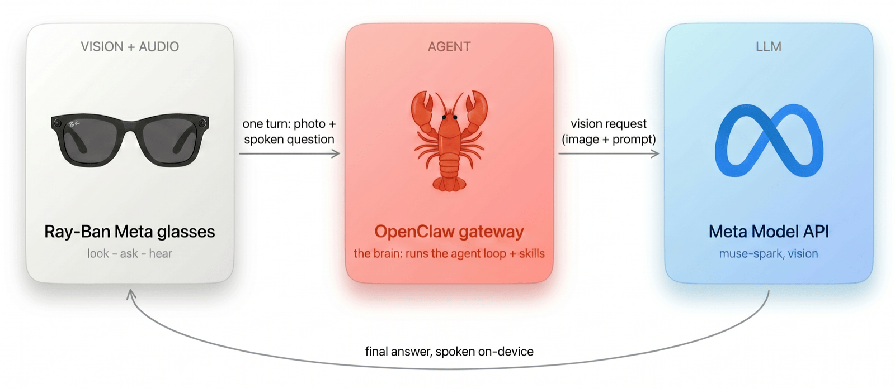
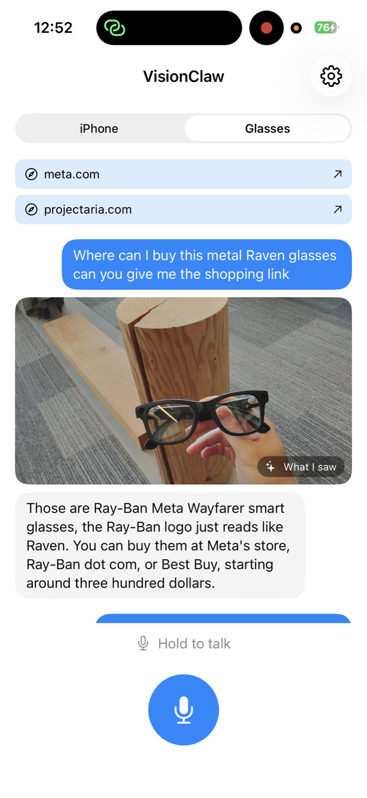
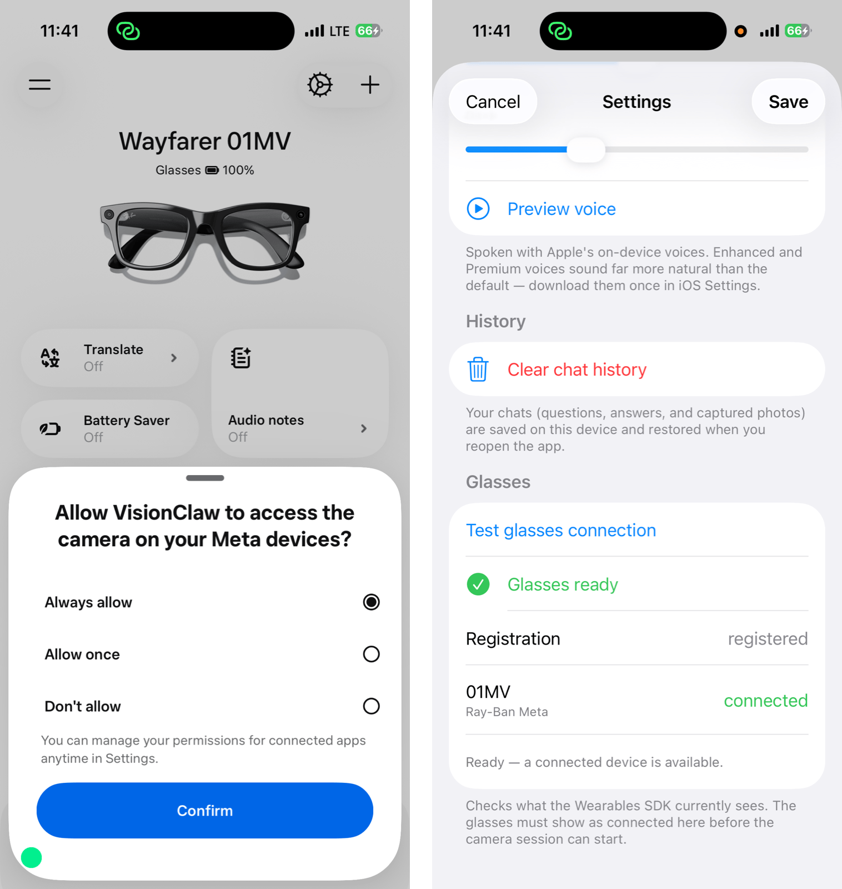

# VisionClaw: hands-free see-and-ask on your glasses

|  |  |
|---|---|
| **Section** | [Use cases](https://dev.meta.ai/docs/getting-started/cookbook#use-cases) |
| **Time to complete** | ~30 min |
| **Model** | `muse-spark-1.1` |
| **Harness** | OpenClaw |
| **Prerequisites** | [series setup](../README.md) |

Look at something, ask out loud, hear the answer — hands-free on Ray-Ban Meta glasses, powered by Meta's Model API.

VisionClaw is a small iOS app that turns your glasses (or just your iPhone) into a see-and-ask assistant. You speak, it grabs one photo, and an [OpenClaw](https://docs.openclaw.ai) gateway running a vision **Meta model** answers — then speaks the reply back. The app is intentionally thin: no model key, no tool code, no model client. It sends one request to your gateway.



## What you can do

Put on your glasses, hold the talk button (or say **"Hey Muse"**), and ask:

- **"What am I looking at?"** — the Meta model sees your photo and describes the scene
- **"Translate this sign."** — read and translate text in front of you
- **"What can I make with these?"** — reason over what's in view
- **…and anything your gateway's skills can do** — the brain lives in OpenClaw, not the app

<p align="center">
  
</p>

_Glasses mode: the user asks for a shopping link for the Ray-Ban Meta glasses in view; the app shows the captured photo ("What I saw") and speaks the answer back. This screenshot is from an actual run; because the model is non-deterministic, your results may differ._

## How it works

1. **Capture** — one high-res JPEG from the glasses (or the iPhone camera).
2. **Listen** — your question is transcribed on-device (`SFSpeechRecognizer`).
3. **Ask** — the app sends *one* chat turn (text + image) to your gateway as `openclaw/default`. No model key, no tools.
4. **Think** — the gateway runs its agent loop against Meta's Model API (`meta/muse-spark-1.1`, vision) plus its skills, and returns final text.
5. **Speak** — the answer is spoken back on-device (`AVSpeechSynthesizer`).

## Quick start

### 1. Point OpenClaw at Muse Spark

OpenClaw ships built-in support for the **Meta** provider, and `Muse Spark 1.1` is vision-capable — so there's no provider block to hand-write. Just make it your agent default and **turn on the OpenAI-compatible endpoint** (it's off by default) so the app can reach it. In `~/.openclaw/openclaw.json`:

```json5
{
  agents: { defaults: { model: { primary: "meta/muse-spark-1.1" } } },
  gateway: {
    mode: "local",
    port: 18789,
    bind: "lan",                      // so the phone can reach your Mac on the LAN
    auth: { mode: "token", token: "${OPENCLAW_GATEWAY_TOKEN}" },
    http: { endpoints: { chatCompletions: { enabled: true } } },
  },
}
```

Provide your Meta API key (from the [Model API dashboard](https://dev.meta.ai) under **API keys → Create API key**) and a gateway token, restart, and smoke-test:

```bash
export MODEL_API_KEY="your-model-api-key"       # the built-in Meta provider reads this
export OPENCLAW_GATEWAY_TOKEN="$(openssl rand -hex 24)"
openclaw gateway restart
curl -s http://localhost:18789/health          # → {"ok":true,"status":"live"}
```

### 2. Build the app

```bash
brew install xcodegen
cd app
cp Secrets.example.xcconfig Secrets.xcconfig   # set gateway host / port / token
xcodegen generate
open VisionClaw.xcodeproj
```

Requires **Xcode 26.6 or later**. Set `GATEWAY_HOST` to your Mac's `.local` name (or LAN IP), `GATEWAY_PORT` to `18789`, and `GATEWAY_TOKEN` to your `OPENCLAW_GATEWAY_TOKEN`. All three are also editable at runtime in the app's **Settings**.

### 3. Try it

- **iPhone mode** *(fastest, no glasses)* — run on a real device, grant camera/mic/speech, point at something, hold the talk button, and ask "What am I looking at?"
- **Glasses mode** — see "Connect your Ray-Ban Meta glasses" below, then ask exactly as above.

## Connect your Ray-Ban Meta glasses

Glasses mode uses the [Meta Wearables Device Access Toolkit](https://github.com/facebook/meta-wearables-dat-ios), which pairs through the **Meta AI** app.

1. **Install the Meta AI app** and pair your Ray-Ban Meta glasses with it (this is what links your phone to the glasses).
2. **Enable Developer Mode** in the Meta AI app: **Settings ▸ App Info**, then tap the **App version** number **5 times**. A **Developer Mode** toggle appears — turn it on. (Re-enable it after any firmware update.)
3. **Grant camera access.** In VisionClaw, open the **Glasses** tab (or tap **Register glasses**). The app hands off to the Meta AI app, which asks *"Allow VisionClaw to access the camera on your Meta devices?"* — choose **Always allow** and tap **Confirm**.
4. **Verify the connection** in VisionClaw's **Settings ▸ Test glasses connection**. You should see **Glasses ready**, **Registration: registered**, and your device (e.g. `Ray-Ban Meta 01MV`) marked **connected**. The glasses must show as connected here before the camera session can start.



_Left: grant camera access in the Meta AI app · Right: confirm the connection in VisionClaw Settings._

## Why the app stays thin

- **`model: "openclaw/default"`** targets an *agent*, not a provider model — the gateway resolves the real model (`meta/muse-spark-1.1`) from its config.
- **No `tools` array is ever sent** — the gateway runs its skills internally and returns finished text.
- **Model choice, skills, and safety** all live in one place you control: the gateway.

## Learn more

- **Source** — the app lives in [`app/`](app/); the one gateway call is in `app/Sources/VisionClaw/Gateway/OpenClawClient.swift`, and on-demand glasses capture is in `app/Sources/VisionClaw/Glasses/GlassesFrameSource.swift`.
- **OpenClaw** — [OpenAI-compatible HTTP API](https://docs.openclaw.ai/gateway/openai-http-api) · [Gateway](https://docs.openclaw.ai/concepts/gateway) · [Agents](https://docs.openclaw.ai/concepts/agent)
- **Meta** — [Model API](https://dev.meta.ai/docs/getting-started/overview) · [image understanding](https://dev.meta.ai/docs/features/image-understanding) · [Wearables Device Access Toolkit (iOS)](https://github.com/facebook/meta-wearables-dat-ios)
