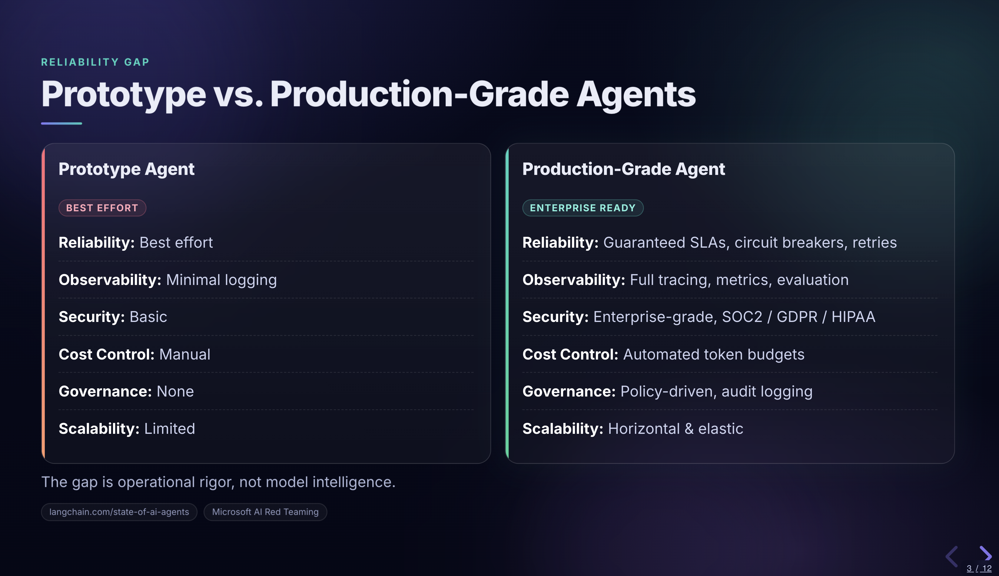

# Research-to-slides generation

|  |  |
|---|---|
| **Section** | [Use cases](https://dev.meta.ai/docs/getting-started/cookbook#use-cases) |
| **Time to complete** | ~20 min |
| **Model** | `muse-spark-1.1` |
| **Language** | Python |

A multimodal agent recipe. Given a topic, the model uses the Model API's built-in web search tool (`tools=[{"type": "web_search"}]`) to research it via the Responses API, synthesizes the findings into a structured outline, and generates a reveal.js slide deck. The model controls both content and design.



## How it works

```
topic -> Model API web search (3-5 queries) -> research brief -> JSON outline -> model-designed HTML
```

1. **Research**: The model uses the Model API's `web_search` tool to search the web from multiple angles. The model autonomously decides what queries to run.
2. **Outline**: The model organizes the research into a structured JSON outline (slide titles, bullet points, code blocks, citations). The outline is normalized to handle key name variance across model outputs.
3. **Design**: The model generates the full HTML presentation - structure, CSS, and content - with creative control over the visual design.

## Setup

```bash
# With uv
uv venv && uv pip install -r requirements.txt

# Without uv
python -m venv .venv
source .venv/bin/activate
pip install -r requirements.txt
```

## Quick start

```bash
export MODEL_API_KEY="your-key"

# Generate slides on any topic
python research_to_slides.py "AI Agents in Production"

# Open the result
open ai_agents_in_production_slides.html
```

The pipeline produces two files:
- `*_slides.html` - the presentation (open in any browser, arrow keys to navigate)
- `*_slides_stats.json` - pipeline metrics: search queries, token usage, timing, sources

See `examples/` for a pre-generated example deck, stats, and slide screenshot.

## Files

| File | Purpose |
|---|---|
| `research_to_slides.py` | Main pipeline: topic -> web search -> outline -> model-designed HTML |
| `requirements.txt` | Python dependencies |
| `examples/` | Pre-generated example deck, stats, and slide screenshot |

## Environment variables

- `MODEL_API_KEY` - required for all pipeline runs
- `META_MODEL` - model name, defaults to `muse-spark-1.1`
- `META_BASE_URL` - API endpoint, defaults to `https://api.meta.ai/v1`
