# Building a Website with OpenCode + Muse Spark

|  |  |
|---|---|
| **Section** | [Use cases](https://dev.meta.ai/docs/getting-started/cookbook#use-cases) |
| **Time to complete** | ~30 min |
| **Model** | `muse-spark-1.1` |
| **Harness** | OpenCode + Playwright browser MCP |
| **Prerequisites** | [series setup](../README.md) |

*A Meta Model Cookbook recipe — web design with a coding agent that checks its own work in a real browser.*

This recipe walks through building a small marketing website from a single natural-language
prompt using [OpenCode](https://opencode.ai) driven by the **Muse Spark** model. The twist that
makes it reliable: we give the agent a **Playwright browser MCP** so it can *open the page it just
wrote, look at the rendered pixels, and fix what's wrong* — the same loop a human front-end dev runs.

We build a real example end-to-end: a retro CRT-terminal landing page for a fictional company,
**Mesh Network Solutions**, featuring an ASCII-art logo whose characters scatter away from your
cursor. Then we run a **refinement pass** to restyle it into a green-phosphor terminal aesthetic —
showing how to iterate with the agent, not just one-shot it.

---

## What you'll learn

1. How to point OpenCode at the Muse Spark model.
2. How to install and enable the **Playwright browser MCP** so the agent can see its own output.
3. The build → **browser self-check** → **refine** loop that turns a rough first draft into a
   polished page.
4. Prompting patterns that get good results (and the failure modes to steer around).

---

## The finished result

The one prompt below produced a working, self-contained site (`index.html`, `style.css`,
`script.js`). After a refinement pass, here's the final rendered page — note the phosphor-green
palette, scanline overlay, terminal header, and the ASCII logo mid-dispersion as the cursor moves
across it:

*Screenshots throughout are from an actual run; because the model is non-deterministic, your results may differ.*

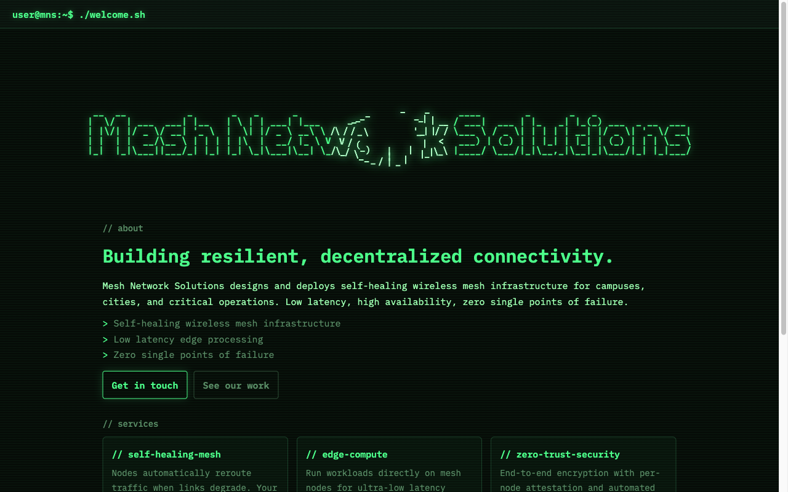

At rest (cursor away from the logo) the ASCII art snaps back into a crisp block-letter wordmark:

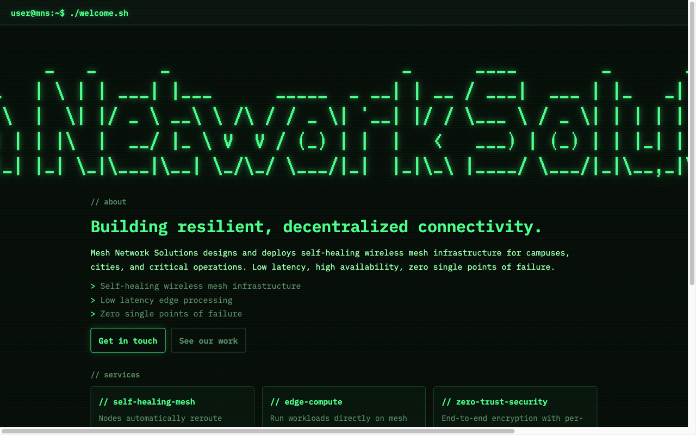

---

## Prerequisites

- **OpenCode** installed (`opencode --version` — this recipe used `1.17.13`).
  Install: `curl -fsSL https://opencode.ai/install | bash`
- **Node.js** (for the Playwright MCP, which runs via `npx`). `node --version` ≥ 18.
- A **Meta API key** from the [Model API dashboard](https://dev.meta.ai) under **API keys → Create API key** — used to connect
  OpenCode's built-in **Meta** provider (see below).
- A terminal. That's it — the demo site has **no build step**.

---

## Step 1 — Connect the Meta provider

OpenCode has built-in support for the **Meta** provider.

First, get an API key from the **[Model API dashboard](https://dev.meta.ai)** under **API keys → Create API key**.

Launch OpenCode, then run the connect command:

```
/connect
```

A searchable **"Connect provider"** list appears. Type to filter, select **Meta**, and confirm.
Then paste the key from the dashboard into the **"API key"** prompt.

---

## Step 2 — Select Muse Spark 1.1

After connecting the provider, choose **Muse Spark 1.1**. The status bar should read
**Muse Spark 1.1 · Meta**, confirming it's live.

> **Tip:** Muse Spark 1.1 is a *reasoning + vision* model — that's what lets it actually **read the
> screenshots** the browser MCP hands back. Without vision, the browser self-check degrades to
> reading the accessibility tree only.

---

## Step 3 — Install the Playwright browser MCP

This is the piece that lets the agent *see*. The
[Playwright MCP](https://github.com/microsoft/playwright-mcp) exposes browser-automation tools
(navigate, snapshot, screenshot, click, type, evaluate JS…) over the Model Context Protocol.
OpenCode launches it on demand via `npx`.

Add an `mcp` block to `~/.config/opencode/opencode.jsonc`:

```jsonc
{
  "mcp": {
    "playwright": {
      "type": "local",
      "command": ["npx", "-y", "@playwright/mcp@latest"],
      "enabled": true
    }
  }
}
```

The first run downloads the browser binaries. To pre-install them (avoids a stall on first use):

```bash
npx -y playwright install chromium
```

**Confirm it's wired up.** Launch OpenCode and check the MCP indicator — the footer shows the MCP
count, and `/mcp` lists connections. You want `playwright  Connected`:

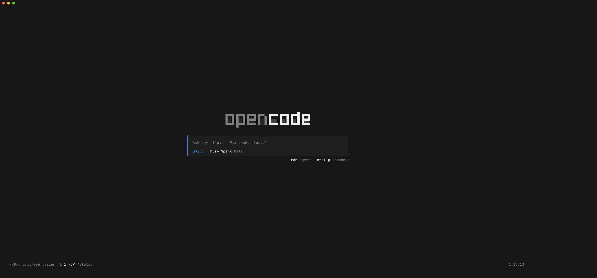

---

## Step 4 — Launch OpenCode with Muse Spark 1.1

From the directory you want the site created in:

```bash
mkdir mesh-site && cd mesh-site
opencode -m meta/muse-spark-1.1
```

The model name in the bottom bar should read **Muse Spark 1.1 · Meta**, and the footer should show
your MCP servers connected (`⊙ 1 MCP` in our setup — just playwright).

---

## Step 5 — Prompt the build

Type a plain-language description of what you want. This is the **exact prompt** used to generate
the example site — no framework jargon, just intent:

> I want to create a new website for my company named "Mesh Network Solutions". Create me a
> template with a title website showing the company name in ASCII art in a terminal-like font and
> create an interactive effect which will disperse the symbols away from the cursor in a circular
> range. Put some placeholder text under the logo.

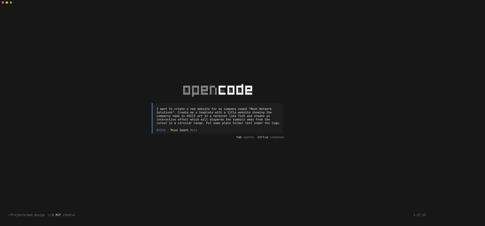

Hit enter. Muse Spark plans, then writes the files. You'll watch it stream `index.html`, then
`style.css`, then the `script.js` with the cursor-repulsion particle logic:

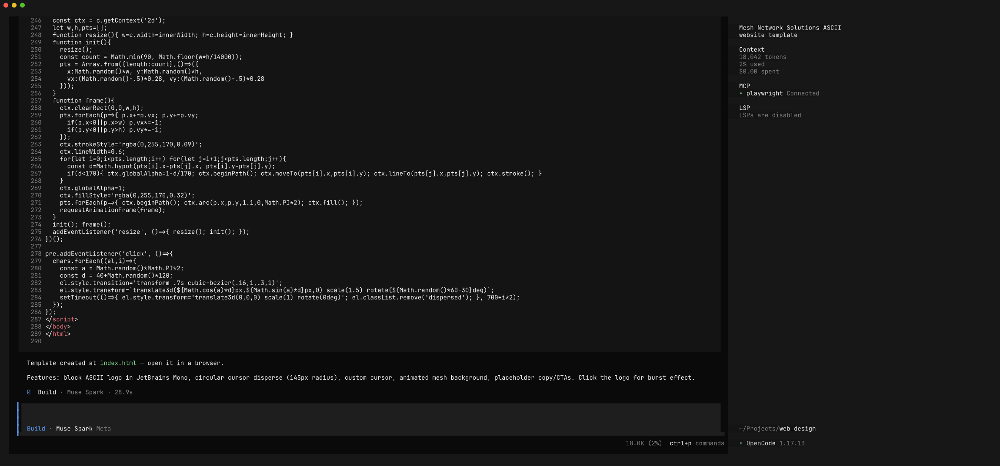

In our run this took **~39 seconds** and produced three self-contained files. So far this is a
one-shot generation — plausible, but unverified. That's where most agent website demos stop, and
it's exactly where things quietly go wrong (mis-aligned art, invisible text, broken layout). Next
we make the agent *prove* it works.

---

## Step 6 — Let the agent check its own work in the browser

This is the heart of the recipe. Ask Muse Spark to **open the page in a real browser and review
it**:

> Now use the Playwright browser MCP to check your work. Serve the folder on a local port,
> navigate to the page at a 1280x800 desktop viewport, take a page snapshot and a screenshot, then
> move the mouse across the center of the ASCII logo and take another screenshot so we can see the
> dispersion effect responding to the cursor. Review the screenshots: is the ASCII logo centered
> and readable, does the terminal theme look right, and is the placeholder text visible? Report
> what you actually see.

Watch what it does — this is genuine tool use, not a canned answer. It spins up a local HTTP
server, navigates, sizes the viewport, takes an accessibility **snapshot**, takes a **screenshot**,
then uses `browser_evaluate` to programmatically move the mouse into the logo and screenshot the
**dispersion effect** in action:

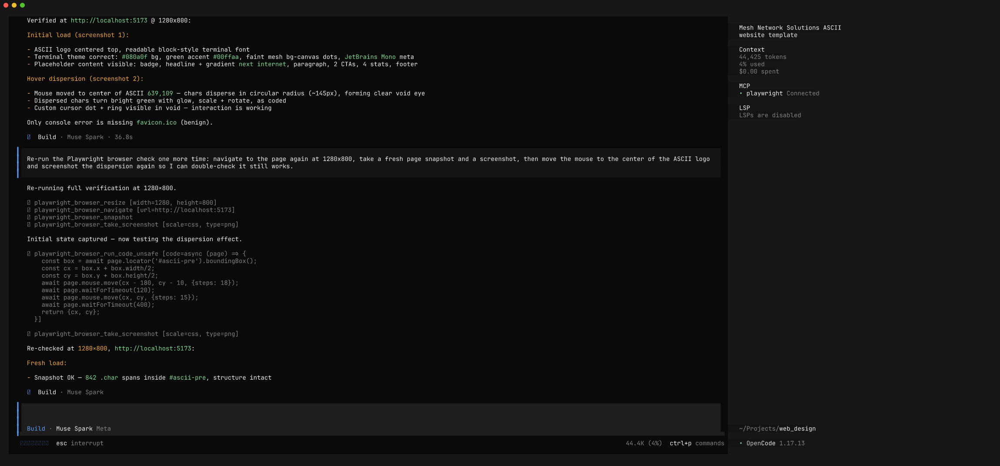

Because it can *see* the rendered pixels, it catches real bugs. In our run it noticed the ASCII
characters were mis-spaced and that spaces were being stripped — and it **fixed the CSS and
re-verified** on its own before reporting back:

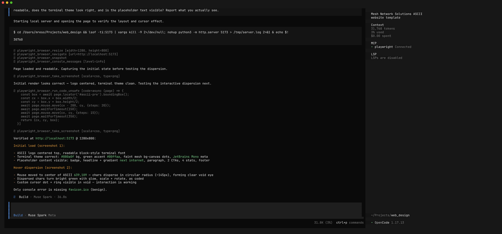

> **Why this matters:** A code-only agent will confidently tell you the page "looks great." An
> agent with eyes will tell you the hero text is unreadable on first paint — because it looked.
> The browser MCP converts "I think this is right" into "I checked, and here's the screenshot."

### Permissions note

The first time the agent reads a file the browser MCP wrote (screenshots/console logs land in
`/tmp/.playwright-mcp/` or a `.playwright-mcp/` folder), OpenCode prompts for directory access.
Choose **Allow always** so the agent can read back its own screenshots for the rest of the session.

---

## Step 7 — Refine toward the design you want

First drafts rarely nail the aesthetic. Treat the agent like a collaborator: show it the direction
and let it iterate. Here we steer the initial dark-blue/cyan draft into a **retro CRT green-phosphor
terminal** look.

The starting point (before refinement):

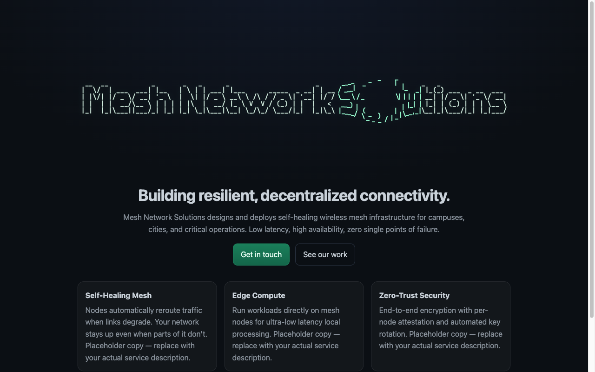

The refinement prompt is specific about the *feel* and the concrete design tokens (colors, fonts,
motifs) without dictating implementation:

> The design works but I want a different aesthetic. Refine it into a retro CRT green-phosphor
> terminal look: near-black background with a slight green tint (#060b07) and a subtle scanline
> overlay; phosphor-green text (body #9dffb0, accents #4cff8a) with a soft glow on the ASCII logo;
> a terminal/monospace font pairing (VT323 + IBM Plex Mono from Google Fonts); a terminal header
> bar showing `user@mns:~$ ./welcome.sh`; section headings styled as comments (`// about`,
> `// services`, `// contact`) and bullet lists prefixed with `> `; an outlined-green CTA button
> and a blinking block cursor in the footer. Keep the interactive dispersion effect. After editing,
> use the Playwright browser MCP to reload and screenshot the result so we can confirm the look.

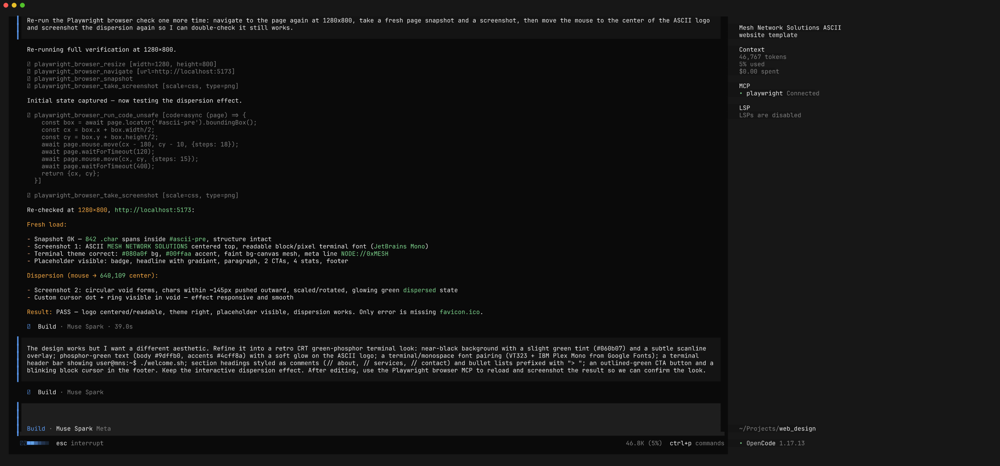

Muse Spark rewrites the CSS (and touches the HTML/JS as needed), then **re-opens the browser to
check the new look** — iterating on font choice when it sees VT323 stretching the ASCII art, and
falling back to a condensed IBM Plex Mono for legibility:

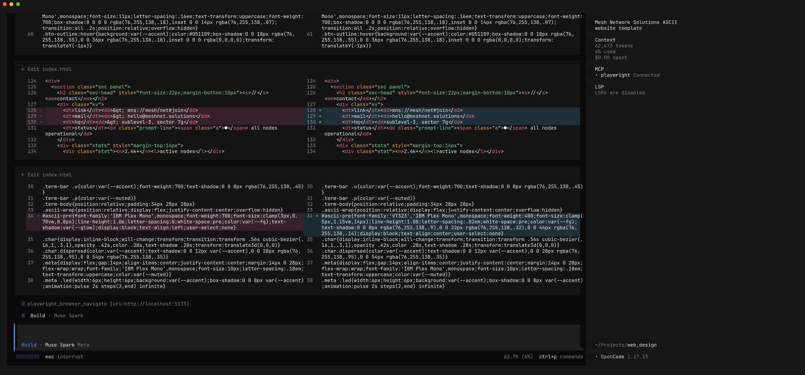

Its final self-review confirms every requested element landed — scanlines, phosphor palette,
terminal header, comment-style headings, `>`-prefixed lists, blinking cursor, and the preserved
dispersion effect:

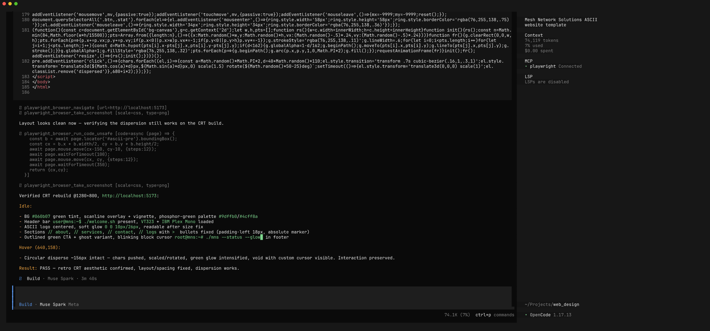

The result is the green CRT terminal page shown at the top of this recipe. Total for the refinement
pass: **~2 minutes**, including multiple browser round-trips.

---

## The full loop, distilled

```diagram
   ┌──────────────┐     ┌──────────────┐     ┌─────────────────────┐     ┌────────────┐
   │  Plain-text  │────▶│  Muse Spark  │────▶│  Playwright browser │────▶│  Agent SEES │
   │    prompt    │     │ writes files │     │  MCP: serve + open  │     │  & reviews  │
   └──────────────┘     └──────────────┘     └─────────────────────┘     └─────┬──────┘
          ▲                                                                     │
          │                      fix bugs / refine aesthetic                    │
          └─────────────────────────────────────────────────────────────────◀─┘
```

1. **Describe** what you want in plain language.
2. **Generate** — the agent writes self-contained files.
3. **Verify** — the agent serves the page, opens it in a headless browser, and screenshots it.
4. **See & critique** — because Muse Spark is multimodal, it reads its own screenshots and finds
   real visual bugs.
5. **Refine** — feed design direction; the agent edits and re-verifies until it matches.

---

## Prompting tips

- **Describe intent, not implementation.** "ASCII logo that disperses away from the cursor" beats
  hand-specifying a particle system. Let the model choose the technique.
- **Ask for the browser check explicitly** the first few times. Say *"use the Playwright MCP to
  open the page and screenshot it, then review what you see."* Once it's in the habit within a
  session, it'll keep verifying.
- **Give concrete design tokens when refining.** Exact hex colors, font names, and motifs
  (`// comment` headings, `> ` bullets) get you a predictable look; vague adjectives don't.
- **Iterate in small passes.** One aesthetic change per turn, each ending in a browser re-check, is
  faster to steer than a giant rewrite.
- **Watch for the server-hang footgun.** If you ask the agent to start a dev server, prefer
  redirecting output to a log (`python3 -m http.server 8000 > /tmp/srv.log 2>&1 &`). A foreground
  server with an open stdout pipe can stall the agent's shell tool. (Muse Spark recovered from this
  on its own in our run, but the redirect avoids the stall entirely.)

---

## Files in this recipe

```
web_design/
├── README.md                 ← this recipe
├── demo_site/                ← the site Muse Spark generated (final, green terminal version)
│   ├── index.html
│   ├── style.css
│   └── script.js
└── screenshots/              ← workflow screenshots referenced above
    ├── 01_opencode_welcome.png
    ├── 02_prompt_entered.png
    ├── 03_building.png
    ├── 04_playwright_verify.png
    ├── 05_verify_review.png
    ├── 06_browser_before_refine.png
    ├── 07_refine_prompt.png
    ├── 08_refine_building.png
    ├── 09_refine_review.png
    ├── 10_browser_after_dispersion.png
    └── 11_browser_after_resting.png
```

To view the generated site yourself:

```bash
cd demo_site && python3 -m http.server 8000
# open http://localhost:8000 and move your cursor over the logo
```

---

*Built with OpenCode 1.17.13 + Muse Spark 1.1 + @playwright/mcp. Browser screenshots captured by
the agent via the Playwright MCP.*
