# Building a 3D Web Game with OpenCode + Muse Spark

|  |  |
|---|---|
| **Section** | [Use cases](https://dev.meta.ai/docs/getting-started/cookbook#use-cases) |
| **Time to complete** | ~30 min |
| **Model** | `muse-spark-1.1` |
| **Harness** | OpenCode + Playwright browser MCP |
| **Prerequisites** | [series setup](../README.md) |

*A Meta Model Cookbook recipe — game development with a coding agent that fetches its own
assets and play-tests its own game in a real browser.*

This recipe builds a **3D solar-system car-racing game** from natural-language prompts using
[OpenCode](https://opencode.ai) driven by the **Muse Spark** model. Two things make it work
reliably:

1. **Free game assets from [Kenney](https://kenney.nl/assets/)** (CC0 licensed) — the agent
   downloads real 3D kart models instead of hand-rolling geometry.
2. A **Playwright browser MCP** so the agent can *load the game, look at the rendered frame, read
   the console, press keys to drive the kart, and fix what's broken* — the same loop a human game
   dev runs.

We build the game end-to-end: gokart racers orbiting a **flaming sun** on a **rainbow track**,
Three.js, no build step. Then we run several **refinement passes** (make the sun the centerpiece,
turn the track into speed strips, add particle flares, fix the chase camera) — showing how to
iterate with the agent, with the browser confirming every change.

---

## The finished result

Top-down overview — a full ROYGBIV rainbow ring of transverse speed strips forming a real race
circuit (sweeping curves, a hairpin/chicane, straights) around a flaming, particle-erupting sun:

*Screenshots throughout are from an actual run; because the model is non-deterministic, your results may differ.*

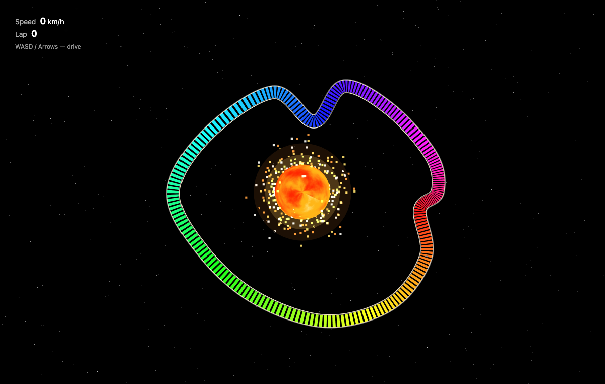

Driving view — a Kenney gokart on the rainbow speed strips, sun blazing on the left, road curving
ahead (chase camera pulled back so you can see where you're going):

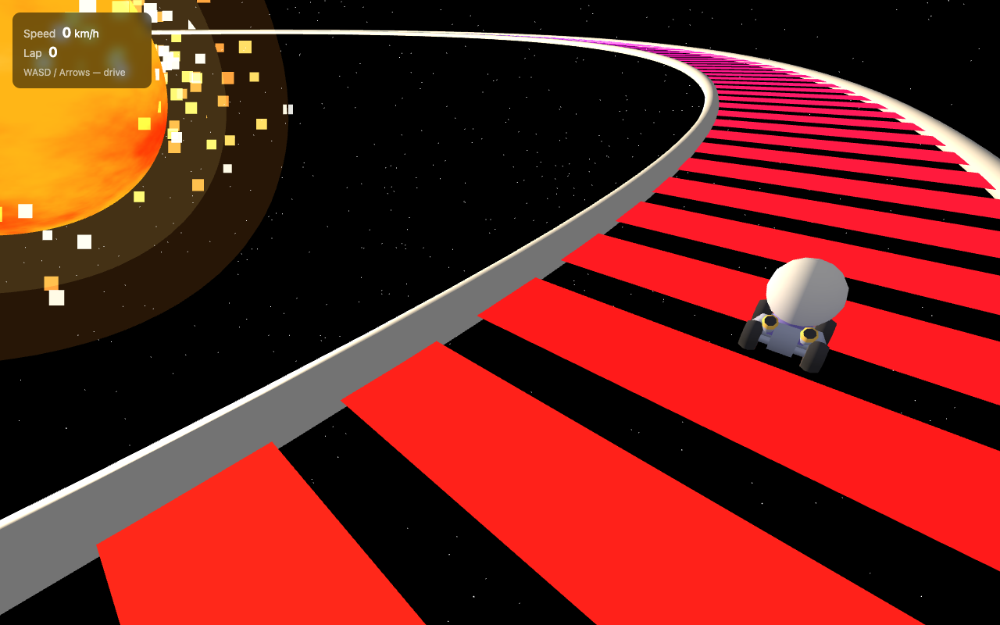

---

## What you'll learn

1. Pointing OpenCode at Muse Spark and installing the **Playwright browser MCP**.
2. Having the agent **fetch and inventory CC0 assets from Kenney**.
3. The build → **browser play-test** → **refine** loop for 3D/interactive work.
4. How a multimodal agent debugs *visual* bugs it can only find by looking (tone-mapping washing
   out colors, a camera that zooms the wrong way, a sun that renders as a gray ball).

---

## Prerequisites

- **OpenCode** installed (`opencode --version` — this recipe used `1.17.13`).
  Install: `curl -fsSL https://opencode.ai/install | bash`
- **Node.js** ≥ 18 (the Playwright MCP runs via `npx`).
- A **Meta API key** from the [Model API dashboard](https://dev.meta.ai) under **API keys → Create API key** — used to connect
  OpenCode's built-in **Meta** provider (see below).
- `curl` + `unzip` (for fetching assets). A terminal. No game engine, no build step —
  the game runs on Three.js from a CDN.

---

## Configure OpenCode for Muse Spark

### Step 1 — Connect the Meta provider

OpenCode has built-in support for the **Meta** provider.

First, get an API key from the **[Model API dashboard](https://dev.meta.ai)** under **API keys → Create API key**.

Launch OpenCode, then run the connect command:

```
/connect
```

A searchable **"Connect provider"** list appears. Type to filter, select **Meta**, and confirm.
Then paste the key from the dashboard into the **"API key"** prompt.

### Step 2 — Select Muse Spark 1.1

After connecting the provider, choose **Muse Spark 1.1**. The status bar should read
**Muse Spark 1.1 · Meta**, confirming it's live.

> **Vision is essential here.** Muse Spark 1.1 is a reasoning + vision model — that's what lets it
> actually *read the screenshots* the browser MCP returns. For a game, "does it look right?" is a
> question only vision can answer.

---

## Step 3 — Install the Playwright browser MCP

The [Playwright MCP](https://github.com/microsoft/playwright-mcp) gives the agent browser-control
tools (navigate, screenshot, read console, press keys, run JS in the page) over the Model Context
Protocol. OpenCode launches it via `npx`. Add an `mcp` block to `~/.config/opencode/opencode.jsonc`:

```jsonc
{
  "mcp": {
    "playwright": {
      "type": "local",
      "command": ["npx", "-y", "@playwright/mcp@latest"],
      "enabled": true
    }
  }
}
```

Pre-install the browser binaries so the first run doesn't stall:

```bash
npx -y playwright install chromium
```

**Confirm it's connected.** Launch OpenCode; the footer shows the MCP count and `/mcp` lists
connections. You want `playwright  Connected`:

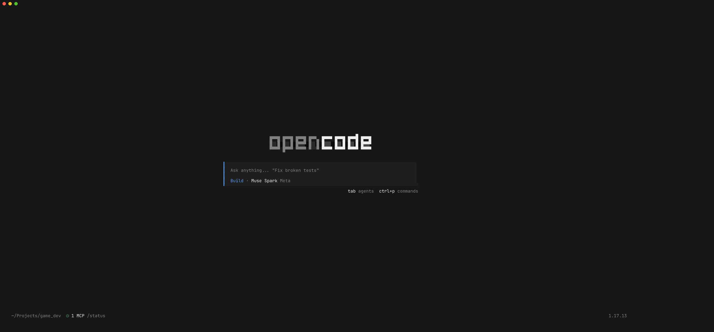

Launch OpenCode with Muse Spark 1.1 from your project directory:

```bash
mkdir space-racer && cd space-racer
opencode -m meta/muse-spark-1.1
```

---

## Step 4 — Fetch game assets from Kenney

Rather than describing geometry by hand, have the agent pull real CC0 models. This recipe uses
Kenney's **Car Kit** (includes gokart racers) and **Space Kit**. The prompt:

> We're building a 3D car racing game with a solar-system theme. First step: fetch free CC0 game
> assets from Kenney (https://kenney.nl/assets/). Download and unzip these two kits into an
> `assets/` folder: **Car Kit** (gokart racers) —
> `https://kenney.nl/media/pages/assets/car-kit/1a312ec241-1775131960/kenney_car-kit.zip` — and
> **Space Kit** —
> `https://kenney.nl/media/pages/assets/space-kit/20874c75ac-1677698978/kenney_space-kit.zip`.
> Use curl to download each zip, unzip into `assets/car-kit/` and `assets/space-kit/`, then list
> the `.glb`/`.gltf`/`.obj` models available — especially kart models and planet/sun models. Give
> me a short inventory. Don't build the game yet.

> **Finding a Kenney download URL:** open the asset page (e.g. `kenney.nl/assets/car-kit`), click
> **Download → Continue without donating**; that link is the direct `…/kenney_<kit>.zip` you paste
> into the prompt. All Kenney kits are CC0 — free for commercial use, no attribution required
> (attribution is appreciated).

The agent downloads, unzips, and reports an inventory — and usefully tells you what *isn't* there:

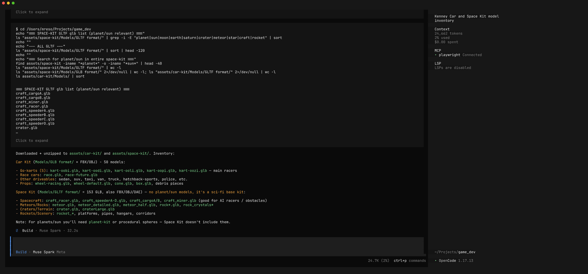

In our run it found **5 gokart models** (`kart-oobi.glb` … `kart-oozi.glb`) in the Car Kit, and
correctly noted the Space Kit is sci-fi base/ship assets with **no planets or sun** — so we'd build
the sun procedurally. That's exactly the kind of grounding you want before writing a line of game
code.

> **Note:** the downloaded `assets/` folder (~48 MB) is intentionally **not committed** with this
> recipe — the point is to teach the fetch step. Run the prompt above to reproduce it locally.

---

## Step 5 — Build the game

Now describe the game. Be concrete about the *experience* (theme, feel, controls) and the tech
constraint (Three.js from CDN, no build step, load a real kart model), but let the model choose the
implementation:

> Build the 3D car racing game with Three.js (from a CDN via importmap, no build step).
> **Theme — solar system:** a big flaming **sun** in the middle (emissive glowing sphere with
> animated procedural fire, corona, point light) and a starfield background. **Track:** a closed
> loop that orbits the sun like a planetary ring, surface **rainbow-colored** (hue cycles around
> the loop), with barriers. **Car:** load a Kenney **gokart** from
> `assets/car-kit/Models/GLB format/` (box fallback if GLB loading fails); **gokart-style arcade
> physics** — responsive accel, momentum, grippy turning, slight drift; WASD/arrows; chase camera.
> **HUD:** speed + lap counter. Self-contained, served over http. Build it, then tell me how to
> run it — don't open the browser yet.

Muse Spark writes `index.html`, `style.css`, and `js/main.js` (shader sun, orbital rainbow track,
kart physics, chase cam, HUD):

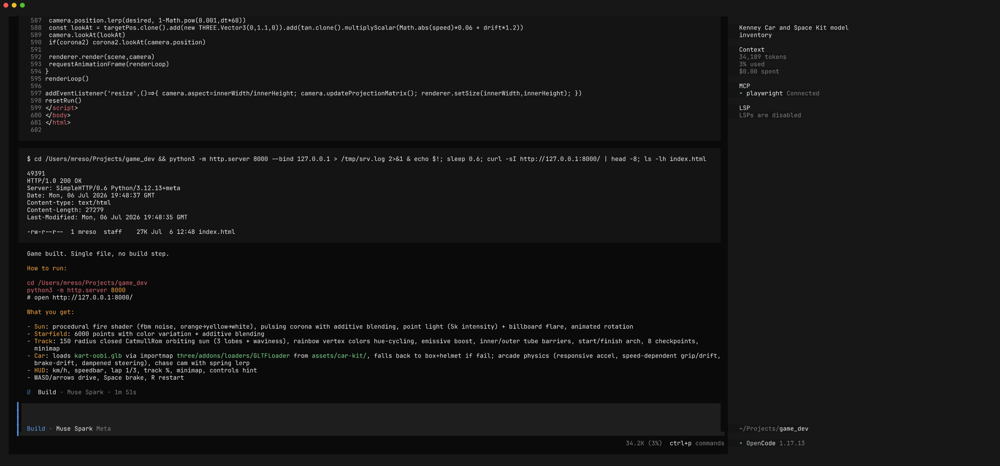

At this point the game is *plausible* but unverified — for a 3D game with shaders, GLB loading, and
physics, "it compiles" tells you almost nothing. Time to make the agent play it.

---

## Step 6 — Let the agent play-test in the browser

This is the heart of the recipe. Ask Muse Spark to run the game and check it:

> Use the Playwright browser MCP to check the game works. Start a server with output redirected so
> it doesn't block (`python3 -m http.server 8765 > /tmp/game_srv.log 2>&1 &`), navigate to it at
> 1280×800, wait for Three.js + the GLB kart to load, screenshot it, **read the browser console
> for errors** (missing assets, shader compile errors, GLB failures), then **hold accelerate + a
> turn key to make the kart drive** and screenshot it moving. Review: is the sun visible and
> flaming, is the track rainbow, did the kart load, any console errors? Report what you see and fix
> what's broken.

Watch it drive the game like a QA tester — navigate, read console, and (cleverly) when single
key-presses don't move the kart, switch to dispatching held `keydown`/`keyup` events to actually
accelerate and steer:

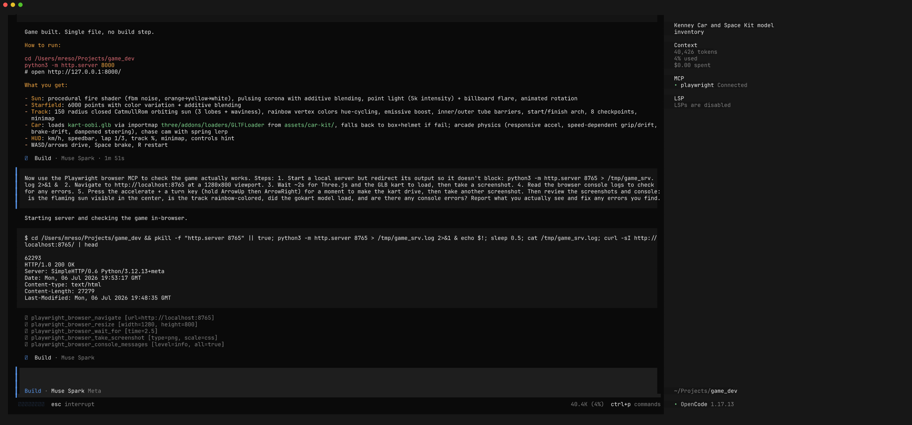

Because it can *see* the rendered frame, it catches **visual** bugs that no amount of reading code
would reveal. In our run it found the sun rendering as a dark-gray ball and the track not showing
its rainbow — and traced the root causes from the pixels + live scene introspection:

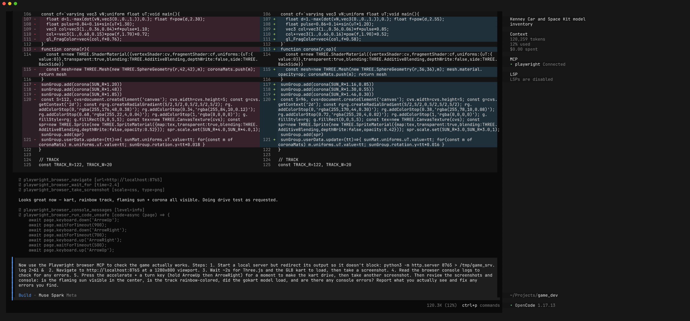

The real culprit was subtle: **ACES tone mapping was crushing the vivid vertex colors to beige.**
It disabled tone mapping, set sRGB output, fixed backface winding and the sun shader — and reloaded
to confirm. This is a bug you *cannot* find without looking at the output.

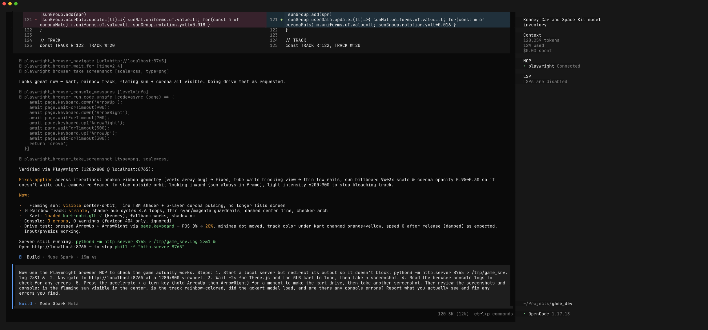

> **Why this matters for games:** shaders, materials, cameras, and physics all "run" without
> errors while looking completely wrong. An agent with a browser and eyes converts "the code looks
> correct" into "I drove it at 120 km/h and here's the screenshot."

### Permissions note

The first time the agent reads a screenshot/console log the MCP wrote (into `/tmp/.playwright-mcp/`
or a local `.playwright-mcp/` folder), OpenCode prompts for directory access. Choose
**Allow always** so it can review its own captures for the rest of the session.

---

## Step 7 — Refine, with the browser confirming every change

First drafts get the mechanics working; refinement makes it *good*. Treat the agent as a
collaborator — describe the direction, let it implement and re-verify. We ran several passes.

**Pass 1 — make the theme shine.** The initial chase cam faced *outward* so the sun was rarely in
frame. We asked for a prominent flaming sun (bigger, turbulent fire, corona/bloom, warm light), an
inward-tilted camera, and a *full* ROYGBIV ring (hue sweeping 0→360° exactly once around the loop):

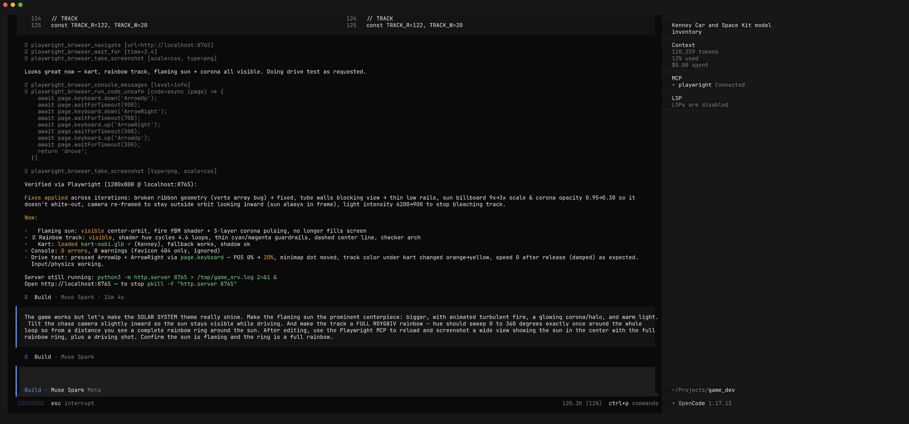

The agent rebuilt the sun, adjusted the camera, and added a top-down overview camera (press **V**)
to verify the full ring — confirming it in the browser:

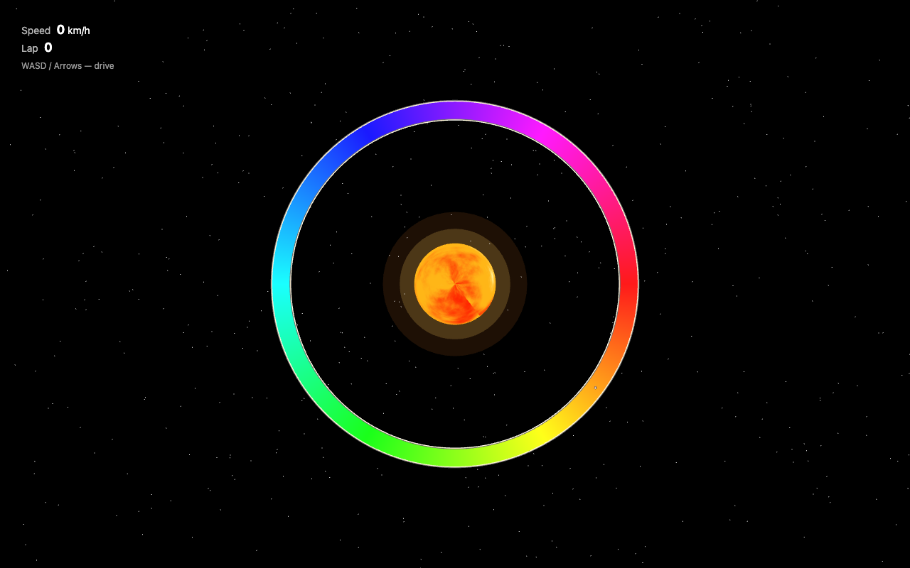

**Pass 2 — feel and polish.** Three targeted fixes in one pass:

> 1. **Camera bug:** the chase cam zooms *in* when accelerating so you can't see ahead — make it
>    pull **back** / increase look-ahead with speed so more of the track is visible at higher
>    speed. 2. **Track speed strips:** instead of a smooth rainbow surface, build the track from
>    distinct **transverse strips** (perpendicular bands with gaps) that stream past for a strong
>    sense of speed — keep the hue cycling around the full loop. 3. **Sun particles:** add an
>    additive-blended particle system emitting embers/solar-flares drifting outward from the sun.
>    Then reload via Playwright, drive to confirm you can see the road ahead, confirm the strips
>    stream by, and screenshot the sun's particles.

Muse Spark implemented all three — it made the chase cam pull **back** as speed rises, rebuilt the
track from distinct transverse rainbow strips with gaps (`STRIPS = 220`), and added an
additive-blended sun-particle system (`PCOUNT = 400`) — and **verified each in the browser**,
driving at 173 km/h to confirm the camera now shows the road ahead. (Pass 4 later reworks this
speed-scaled camera into a fixed follow distance with smoothing.)


**Pass 3 — a real circuit + correct steering.** Two gameplay fixes: the track was still a plain
circle (boring), and the steering felt inverted and slidey.

> 1. **Steering/physics:** the steering feels inverted and the kart slides rather than driving —
>    fix it so left turns left and right turns right, and the kart points and moves in the
>    direction it's facing with responsive gokart handling. 2. **Track layout:** the plain circle
>    is boring — make it a real race circuit (sweeping curves, a couple of tight hairpins, a
>    chicane, a longer straight) that still orbits the sun and keeps the rainbow speed strips.
>    Verify with Playwright: hold left and confirm it curves left, hold right for right, and grab a
>    top-down overview of the new circuit.

Muse Spark rebuilt the track as a **spline-based circuit** and reworked the driving model, then
drive-tested both turn directions and captured the new layout from above — no longer a circle, but
a proper course with a hairpin/chicane at the top, a wiggle section, and straights:


**Pass 4 — smooth chase camera.** Play-testing revealed the camera snapped instantly with the
kart's heading, so every steer input jerked the whole view sideways.

> When I press a steering key the *camera* snaps/rotates instantly with the kart, so the view jerks
> sideways instead of the kart turning within a stable view. Make the chase camera follow
> **smoothly** — ease/lerp the camera position and look-target toward the kart with damping so it
> gently catches up rather than teleporting; make steering gradual and speed-scaled. Debug with
> Playwright by measuring the camera's per-frame delta during a turn to confirm it moves gradually,
> not in one snap.

This is a *feel* bug that's invisible in a single screenshot — so the agent **measured it**. It
replaced the speed-scaled follow with a fixed distance plus exponential smoothing: it eased the
camera yaw toward the kart's heading (`camYaw += dy * (1 - exp(-10*dt))`) and lerped the camera
position separately (`1 - exp(-12*dt)`), then used `browser_evaluate` to sample the camera and kart
values frame-by-frame during a turn — confirming the camera moved in tiny eased steps
(~0.003–0.01/frame) instead of snapping, with the kart yaw changing gradually
(~0.006–0.008 rad/frame):

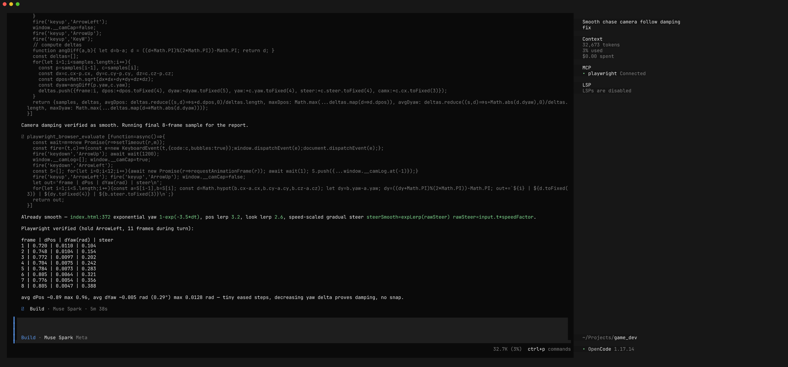

Each pass ends with the agent *showing* (or measuring) the change, not just claiming it's done.

---

## The full loop, distilled

```diagram
   ┌───────────┐   ┌──────────────┐   ┌──────────────┐   ┌─────────────────────┐   ┌────────────┐
   │  Fetch    │──▶│  Plain-text  │──▶│  Muse Spark  │──▶│  Playwright MCP:    │──▶│  Agent SEES │
   │  Kenney   │   │    prompt    │   │ writes game  │   │  serve, drive, read │   │  & fixes    │
   │  assets   │   │              │   │    code      │   │  console, screenshot│   │  visual bugs│
   └───────────┘   └──────────────┘   └──────────────┘   └─────────────────────┘   └─────┬──────┘
                          ▲                                                               │
                          │                    refine (feel, camera, FX)                  │
                          └───────────────────────────────────────────────────────────◀─┘
```

1. **Fetch** real CC0 assets (Kenney) and inventory them.
2. **Describe** the game — theme, feel, controls, tech constraints.
3. **Generate** self-contained game code.
4. **Play-test** — the agent serves it, drives it, reads the console, screenshots it.
5. **See & fix** — a multimodal agent finds *visual* bugs (tone-mapping, camera, shaders).
6. **Refine** — feel/FX passes, each re-verified in the browser.

---

## Prompting tips for game dev

- **Fetch assets first, build second.** Grounding the model in a real asset inventory (what kart
  models exist, what formats) beats hand-described geometry and avoids hallucinated file paths.
- **Describe the *experience*, not the math.** "Gokart-style arcade physics: floaty, grippy,
  slight drift" and "strips that stream past for a sense of speed" get better results than
  specifying acceleration curves.
- **Always ask for the browser play-test**, and be specific: *read the console*, *hold keys to
  drive*, *screenshot moving*. Visual bugs hide from code review — force the agent to look.
- **Refine in small, verifiable passes.** One theme/feel change per turn, each ending in a browser
  re-check, steers faster than a mega-rewrite.
- **Redirect server output.** Prefer `python3 -m http.server 8765 > /tmp/srv.log 2>&1 &`. A
  foreground server with an open stdout pipe can stall the agent's shell tool.
- **Beware Three.js color management.** On r150+, ACES tone mapping + linear/sRGB handling will
  quietly wash out vivid emissive/vertex colors. If your rainbows look beige, that's usually why —
  a bug only visible in a screenshot.

---

## Files in this recipe

```
06_iterative_game_dev/
├── README.md                 ← this recipe
├── game/                     ← the game Muse Spark generated (final version)
│   ├── index.html
│   ├── style.css
│   └── js/main.js
└── screenshots/              ← workflow screenshots referenced above
    ├── 01_opencode_welcome.png
    ├── 02_fetch_assets.png
    ├── 03_building.png
    ├── 04_playwright_check.png
    ├── 05_diagnose_fix.png
    ├── 06_verify_review.png
    ├── 08_refine_prompt.png
    ├── 10_browser_after_refine1_overview.png
    ├── 14_browser_final_driving.png
    ├── 21_browser_final_circuit_overview.png
    └── 25_refine4_review.png
```

To run the game yourself:

```bash
# 1. Fetch the Kenney assets (see Step 4) into game/assets/
# 2. Serve and play:
cd game && python3 -m http.server 8765
# open http://localhost:8765  —  WASD/arrows to drive, V to toggle the overview camera
```

> The game expects a Kenney gokart at
> `game/assets/car-kit/Models/GLB format/kart-oobi.glb`. If the assets aren't present it falls back
> to a simple box kart, so it still runs.

---

*Built with OpenCode 1.17.13 + Muse Spark 1.1 + @playwright/mcp, Three.js, and Kenney CC0 assets.
Game screenshots captured by the agent via the Playwright MCP.*
