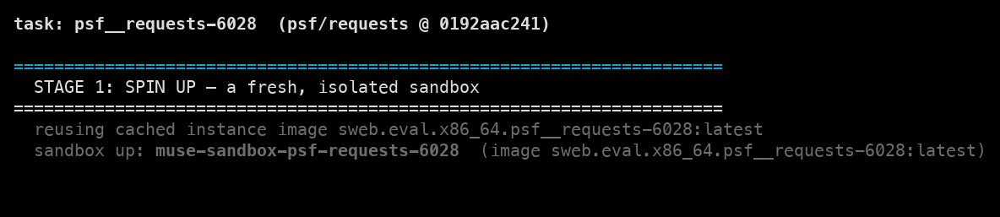
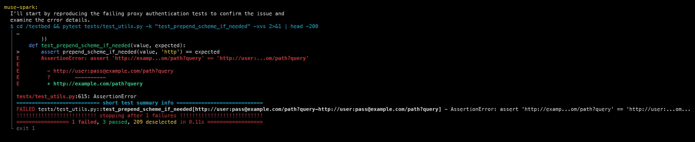
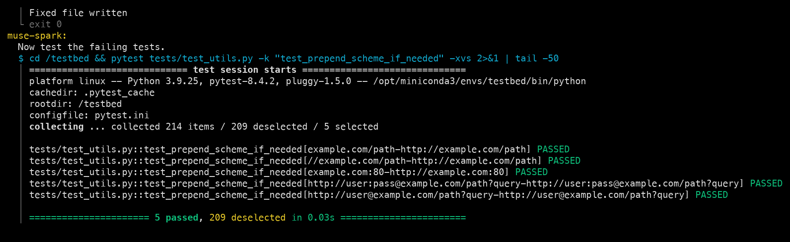
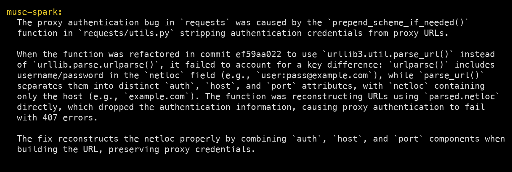
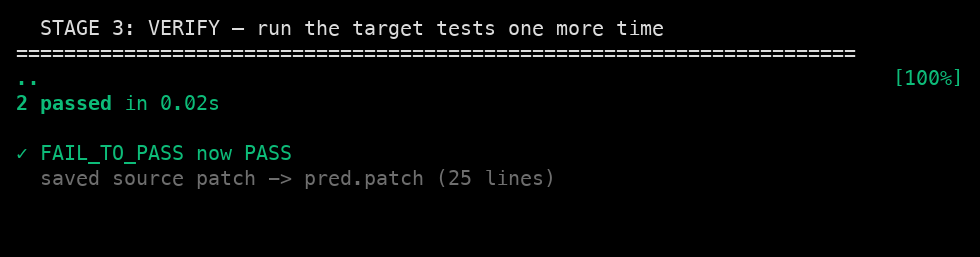
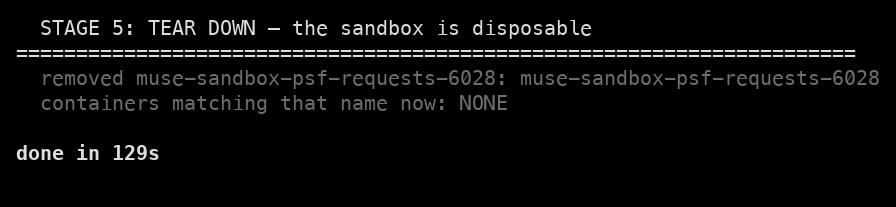
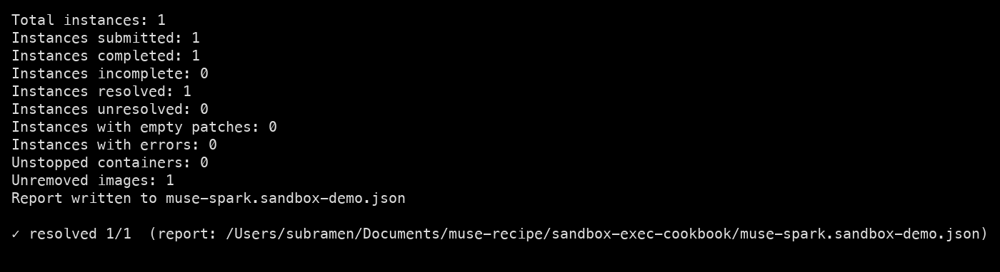

# Running Muse Spark in a Sandboxed Docker Container

This shows how `muse-spark-1.1` can **execute code safely inside a throwaway Docker container**. You hand it a bug to fix; it goes into the container, reproduces the bug, fixes it, and confirms the fix by running the project's tests — all on its own — then the container is deleted. Everything it does streams to your terminal, and nothing it runs ever touches your machine.

Your part is small: **give it an instruction, run one command, and watch.** The rest of this doc shows exactly what you'll see.

## What you need

- **Docker**, running (tested on 29.1.2)
- **Python 3.11+**
- A **muse-spark-1.1 API key**

```bash
export MODEL_API_KEY="<your muse-spark-1.1 key>"
cd 03_use_cases/07_sandbox_execution
python3 -m venv .venv && ./.venv/bin/pip install -r requirements.txt   # installs swebench
```

## Scaffold setup with `sandbox_scaffold.py`

Everything *around* the model is scaffolding that the script [`sandbox_scaffold.py`](sandbox_scaffold.py) provides — muse-spark-1.1 does not set any of this up itself:

- **The sandbox** — the script builds, starts, and (at the end) deletes a Docker container with the buggy project inside it, at `/testbed`.
- **The toolset** — the two tools the model is allowed to call, and nothing else: `run` (run a shell command in the container) and `write_file` (write a file in the container). Both act *only* inside the container; changes land in the container's filesystem, never on your machine. The container is the boundary.
- **The system prompt** — the rules we give the model: you're in a sandbox at `/testbed`, reproduce the bug → fix the source → verify with the tests, and don't edit the tests.
- **The loop** — the script sends the model the running conversation plus the toolset, runs whatever tool calls come back against the container, feeds the output back, and repeats until the model stops.

## What muse-spark-1.1 is doing

**muse-spark-1.1 supplies the reasoning.** Given that scaffolding, *it* decides:
- every command to run,
- how to localize and diagnose the bug,
- what the fix is, and
- when it's done.

In the run below it chose all 48 shell commands on its own — including digging through the project's git history to find the commit that introduced the bug (`ef59aa022`), which nothing told it to do. That autonomous workflow is what you see in the screenshots.

## The instruction you give it

The task comes from **SWE-bench** — a benchmark of real, already-fixed GitHub bugs, each packaged with the project's code and the tests a correct fix must pass. The script reads one such task from [`task.json`](task.json) and builds your instruction from it: the bug report plus the tests that must pass.

```text
Fix this bug in the `psf/requests` repository.

--- issue ---
Proxy authentication bug: when using a proxy on Python 3.8.12 I get a 407 error;
I should get 200.  (requests 2.27.0, urllib3 1.26.7)

--- failing tests (already in the repo; make them pass, do not edit them) ---
  - tests/test_utils.py::test_prepend_scheme_if_needed[...user:pass@example.com...]
  - tests/test_utils.py::test_prepend_scheme_if_needed[...user@example.com...]

Reproduce the failure, fix the source, and verify the tests pass — all inside /testbed.
```

To point muse-spark-1.1 at a **different** bug, edit `task.json`. These are the fields that define what to fix:

```json
{
  "repo": "psf/requests",
  "base_commit": "0192aac2...",
  "problem_statement": "Proxy authentication bug: ... I get a 407 ...",
  "FAIL_TO_PASS": ["tests/test_utils.py::test_prepend_scheme_if_needed[...]"],
  "PASS_TO_PASS": ["... tests that must keep passing ..."]
}
```

It has to be a real SWE-bench instance, so that its Docker image and tests exist.

## Run it

```bash
MODEL_API_KEY="$MODEL_API_KEY" ./run_demo.sh
```

That's the one command. Now watch the terminal — everything below happens automatically, and each screenshot is exactly what scrolls past: muse-spark-1.1's own words, the commands it runs in the sandbox, and the output it gets back.

## Watch it work

### 1. The sandbox starts

The script starts a Docker container with the buggy project checked out inside it. (The first run builds the container image, which takes a few minutes; later runs reuse it and start instantly.)

*Screenshots throughout are from an actual run; because the model is non-deterministic, your results may differ.*



### 2. Muse Spark reproduces the bug

Handed the sandbox, its first move is to run the failing tests — not to guess. In the terminal you see it say what it's about to do, then the red test output it's reading: the URL comes back with the `user:pass@` credentials stripped out. The bug is real and reproduced. **(Red.)**



### 3. Muse Spark fixes it

It reads the source, digs through the git history to find where the regression was introduced, edits the source file *inside the container*, and re-runs the affected tests itself — watching them turn green. **(Green.)**



### 4. Muse Spark reports back

When it's done, muse-spark-1.1 tells you — in plain English — what was wrong and how it fixed it:



### 5. The script verifies independently

muse-spark-1.1 already confirmed its own fix in step 3 — but you shouldn't have to take its word for it. After the model stops, the **script** re-runs the bug's two tests one more time and saves the exact code change to `pred.patch` on your machine. This whole run took 129 seconds.



### 6. The sandbox is deleted

The container is destroyed. muse-spark-1.1 ran shell commands for a couple of minutes, and none of it survives — the only thing left on your machine is `pred.patch`, the fix it wrote.



## Confirm it really worked (optional)

muse-spark-1.1 and the script both checked the fix, but the definitive test is SWE-bench's official grader. It starts a **fresh** container, applies `pred.patch`, and runs the full test suite:

```bash
./.venv/bin/python grade.py
```

`resolved 1/1` means the fix passed all the project's tests in a clean container.



## Good to know

- **Docker must be running** before you start — the sandbox lives there.
- **The first run is slow** (it builds the container image, a few GB); after that it's fast.
- **The fix is proven by running real tests**, not by the model claiming success — that's the whole point of executing in the sandbox.
