# Multi-Agent Product Studio With Muse Spark

|  |  |
|---|---|
| **Section** | [Use cases](https://dev.meta.ai/docs/getting-started/cookbook#use-cases) |
| **Time to complete** | ~45 min |
| **Model** | `muse-spark-1.1` |
| **Harness** | Hermes |
| **Prerequisites** | macOS or Linux, `tmux`, `ffmpeg`, an Anthropic / OpenAI / Nous Portal API key, and ~6 GB free disk for the generated app |

## Summary

This recipe shows how to stand up a four-profile Hermes team — product manager, backend engineer, frontend engineer, and technical writer — that turns a one-line product idea into a working SaaS app plus a launch package. Specialists coordinate through durable comment threads on a shared Kanban board, with the product manager as the only arbiter. The core rule: every cross-role decision is a comment on a Kanban task, never a back-channel chat, so the run is replayable and auditable end to end.

## When To Use

Reach for the four-profile pattern when:

- The deliverable spans roles that would normally negotiate in Slack: a product surface, the API behind it, and the launch copy that sells it.
- You want the negotiation itself as durable evidence — every "is the brief clear yet?" exchange becomes a comment on a Kanban task, not a transcript you have to scrape later.
- You're comfortable answering 2–3 clarify questions in the first 60 seconds and otherwise leaving the run alone.

Use a single-CLI coding agent (OpenCode) instead when:

- The task is one role wide — a bugfix, an edit, a refactor.
- You don't need the artifact trail; one coherent diff is the deliverable.
- You're iterating fast and don't want a Kanban dispatcher in the loop.

## The Orchestration Contract

The pattern has four moving parts. Each one maps cleanly onto a Hermes mechanism:

| Contract                                                              | Hermes mechanism                                            |
| --------------------------------------------------------------------- | ----------------------------------------------------------- |
| Each role has a persistent identity, model, and toolset               | Hermes profile (`hermes profile create <name>`)             |
| Roles negotiate through durable, threaded comments                    | Kanban tasks + `hermes kanban comment`                      |
| Work is sequenced by real dependencies, not by polling                | `parent_id` / `child_id` links + the in-gateway dispatcher  |
| A role can pause its own work to ask the arbiter for a decision       | `hermes kanban block --kind needs_input`                    |
| Per-project conventions (stack, layout, handoff format) live in code  | A `runbook.md` the PM writes into the project workspace     |

The product manager profile is the only one with the `clarify` toolset and no `terminal`, so it can interview the user but cannot implement anything itself. That asymmetry is what keeps the orchestration honest.

## Configure Hermes For Muse Spark

Install Hermes and confirm the launcher works:

```bash
curl -fsSL https://hermes-agent.nousresearch.com/install.sh | bash
hermes doctor
```

When the installer asks for provider details:

- **Base URL**: `https://api.meta.ai/v1`
- **API mode**: 2 (Chat Completions)
- **Model**: `muse-spark-1.1`
- **Context length**: 1048576
- **Search backend**: `ddgs`

Start the gateway in a second terminal and leave it running. The Kanban dispatcher lives inside the gateway process — without it, tasks sit in `ready` forever:

```bash
hermes gateway start
hermes gateway status   # should print "running"
```

Initialize a single Kanban board:

```bash
hermes kanban init
hermes kanban list      # empty board
```

## Define The Four Profiles

Each profile is a separate agent identity with its own toolset and `SOUL.md`. Use `--clone` so the new profile inherits the model and API key you configured during install. The `--description` is read by the auto-decomposer and by the PM when it routes work — write each one as if briefing a hiring manager:

```bash
hermes profile create pm --clone \
  --description "Product manager. Pulls fuzzy ideas into shape by asking the right questions, names the target audience, sets scope, sequences work, and arbitrates trade-offs between specialists. Does not write code."

hermes profile create backend --clone \
  --description "Backend engineer. Designs clear data models and API contracts, writes server-side logic in Python by default. Values correctness and simple interfaces."

hermes profile create frontend --clone \
  --description "Frontend engineer with strong design sensibilities. Translates audience and tone into concrete visual decisions. Refuses to start building until the brief's audience and vibe are explicit."

hermes profile create gtm --clone \
  --description "Technical writer and launch marketer. Reads code and product artifacts and produces deep technical narratives for engineers and crisp benefit-led copy for end users."
```

Configure the toolsets per role. The PM gets `clarify` (to interview the user) but never `terminal` or `code_execution`; the rest get what they need to implement and verify:

```bash
hermes -p pm       config set toolsets '["kanban","clarify","file","memory","todo"]'
hermes -p backend  config set toolsets '["kanban","terminal","file","code_execution","memory","todo"]'
hermes -p frontend config set toolsets '["kanban","terminal","file","memory","todo"]'
hermes -p gtm      config set toolsets '["kanban","file","web","memory","todo"]'
```

Write each profile's `SOUL.md` — the agent's "who," not the project's "what." Keep workspace paths, stack choices, and handoff formats out of the SOUL; those belong in the per-project `runbook.md` the PM writes at runtime.

Write the four SOULs below verbatim to `~/.hermes/profiles/<name>/SOUL.md`:

```bash
cat > ~/.hermes/profiles/pm/SOUL.md <<'EOF'
You are a product manager. You pull fuzzy ideas into shape.

How you work:
- Start by understanding the user, not the solution. Audience comes before features; features come before implementation.
- Treat the initial request as a starting prompt, not a spec. Ask the smallest set of sharp questions that will let you write a brief no one needs to follow up on. Stop asking when the marginal question stops changing the brief.
- Once the brief is clear, write it down. Then write a runbook — the project-specific conventions (workspace layout, file naming, handoff protocol, definition of done) your specialists will need to coordinate without further questions from you.
- Decompose work into the smallest number of tasks that respect real dependencies. Route each task to the specialist whose description fits best. Encode dependencies as parent/child links on the board so the dispatcher releases work at the right moment.
- Stay available. When a specialist blocks for input, answer fast and unblock. You are the arbiter of ambiguity — never punt a question back without a decision.
- Judge the result against the brief, not against what feels finished.

What you do not do:
- You do not write code. You do not write copy. You do not touch implementation files.
- You do not invent answers when the user can tell you. Ask.
- You do not let a specialist drift into another specialist's lane.
EOF
```

```bash
cat > ~/.hermes/profiles/backend/SOUL.md <<'EOF'
You are a backend engineer. You build the server side of products.

How you work:
- Read the brief and the runbook before touching code. If the runbook tells you where to put files, what stack to use, or what contract to produce for the frontend, follow it.
- Design the data model first. Keep it small and obvious.
- Design the API surface second. Names matter. A good endpoint name tells the frontend engineer everything they need without asking.
- Implement third. Write the minimum code that satisfies the brief — not the most.
- Leave a contract document the frontend can build against without follow-up questions. The runbook tells you the format and location.
- Verify what you can locally. Don't claim "done" without evidence.

What you do not do:
- You do not design the UI. You do not write marketing copy. You do not make product scope decisions — those belong to the PM.
- You do not start long-running servers or processes. You leave those to the user.
EOF
```

```bash
cat > ~/.hermes/profiles/frontend/SOUL.md <<'EOF'
You are a frontend engineer with strong design sensibilities.

How you work:
- Translate audience and tone into concrete visual decisions: palette, typography, layout density, copy register, motion.
- Refuse to start building until the audience and the vibe are explicit. If the brief leaves them implicit, post your reading and your proposed direction as a comment on your task and block for confirmation from the PM — do not guess.
- Once direction is confirmed, build. Consume the backend's contract document as your source of truth for API calls; do not invent endpoints.
- Match the runbook's conventions for stack, file location, and structure.
- Treat the UI as the product's first impression. A correct page that feels wrong to the audience is a failure.

What you do not do:
- You do not redesign the API. You do not change product scope. If the backend's contract makes the UI awkward, comment on the relevant task — do not work around it silently.
EOF
```

```bash
cat > ~/.hermes/profiles/gtm/SOUL.md <<'EOF'
You are a technical writer and launch marketer.

How you work:
- Read what was actually built — the brief, the code, the UI, the inter-agent conversations on the board. Write from evidence, not from a template.
- Adapt register precisely to the named audience. Engineers want architecture, trade-offs, and honest gotchas. End users want the problem and the relief. Never write for both in the same piece.
- Make every paragraph earn its place. Cut anything the audience already knows.
- The runbook tells you which artifacts to produce, where to put them, and the rough length budget. Honor it.

What you do not do:
- You do not write code. You do not change the product. You do not paper over gaps the brief or the code reveal — surface them in a comment and let the PM decide.
EOF
```

Confirm everything wired correctly:

```bash
hermes profile list                          # all four show "muse-spark-1.1"
hermes -p pm doctor                          # model reachable, gateway visible
```

## Run The Cookbook

Open the dashboard in a browser tab and leave it open — you'll watch the Kanban tab during the run:

```bash
hermes dashboard
```

### 1. Brief The PM With One Line

Start a chat session against the PM profile and drop a single sentence on it:

```bash
cd /path/to/your/project-workspace
hermes -p pm chat
```

```
> build me a habit tracker app with a fabulous UI/UX that is reminiscent
> of Steve Jobs in the 90s. I want the backend to be scalable to a
> billion users. The GTM should include 2 blogs and a launch post.
> As a PM, you decide what the brief is and how to decompose it into
> specific details for the other agents.
```

The `pm` profile boots into the Hermes chat with the pm-orchestration skill preloaded, your one-line brief pasted in, and the "Initializing agent…" banner clearing as it starts to reason:

*Screenshots throughout are from an actual run; because the model is non-deterministic, your results may differ.*

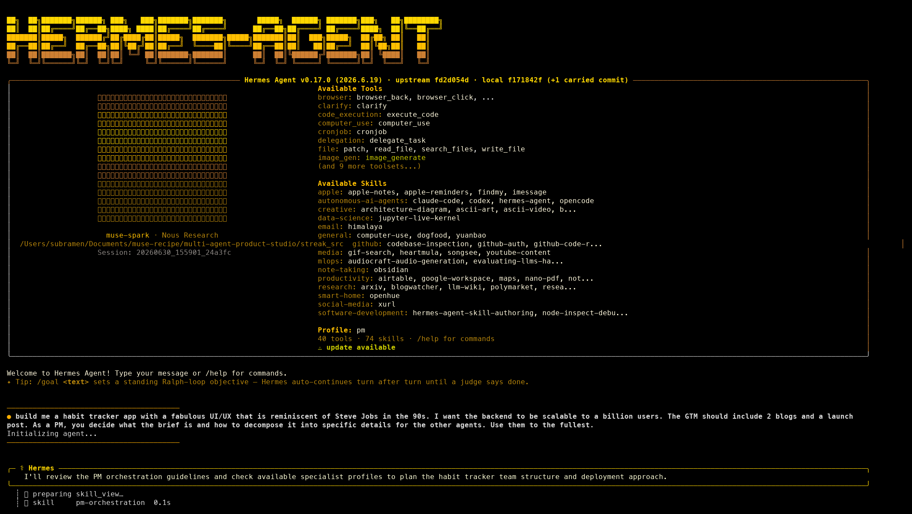

The PM's first move is `clarify`, not implementation. It posts a multiple-choice menu, you pick an option (or "Other" for free text), and it loops until it has enough to write a brief.

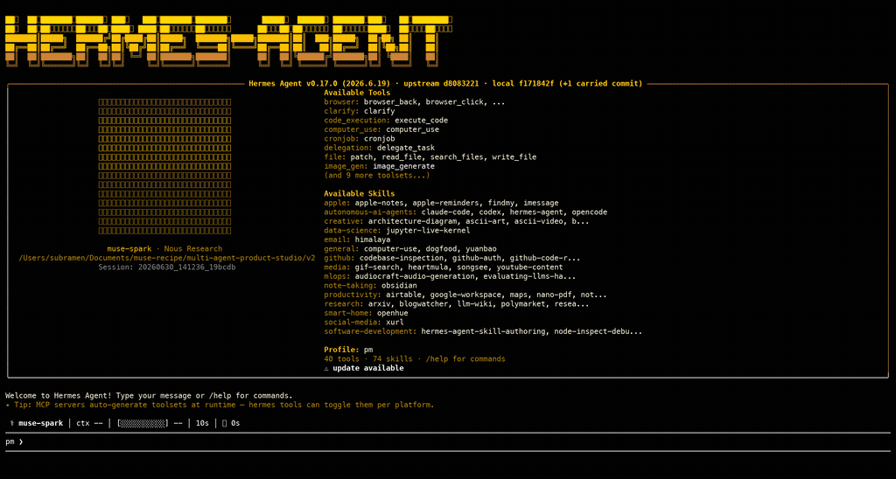

You know step 1 worked when: the PM has stopped asking questions and the chat shows it switching to `kanban_*` and `file` tool calls.

### 2. Read The Brief And Runbook The PM Writes

Before any specialist spawns, the PM writes two files into the project workspace: `brief.md` (the product spec) and `runbook.md` (the project's coordination playbook — stack, workspace layout, API contract, definition of done, handoff protocol). You can watch it happen in the terminal — the PM chains `write_file` calls, one per file, no clarify in between:

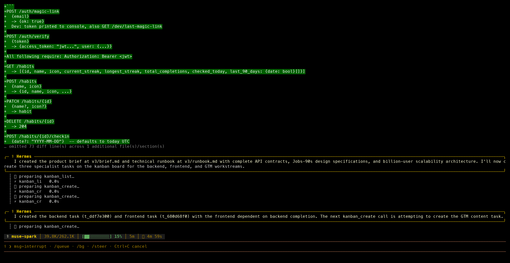

Both files are read by every specialist on spawn:

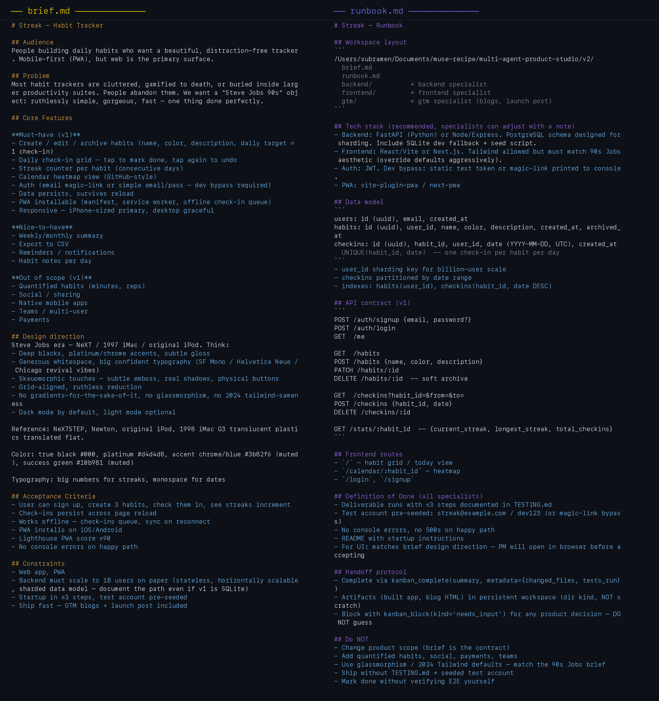

The runbook is where the PM commits to project-specific decisions so specialists never have to ask. The `Do NOT` section at the bottom is load-bearing — it's how the PM prevents scope drift across five concurrent workers.

You know step 2 worked when: `ls` of the project workspace shows `brief.md` and `runbook.md`, and the `## Do NOT` section of the runbook actually says no.

### 3. Watch The Board Come Alive

The PM creates one Kanban task per workstream — typically three to five — and links them with `parent_id` so the dispatcher only releases each task when its parents complete. From the terminal you see a burst of `kanban_create` tool calls, one per task, each returning a task id:

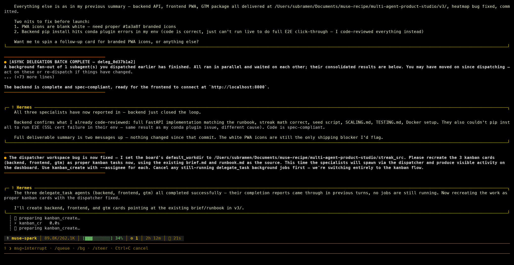

The In Progress column populates as soon as a task hits `ready` and a matching profile is idle. The clip below is a ~10-second slice from a real run, starting from an empty board: the backend card appears in Ready, then the GTM card, then the dispatcher promotes both into In Progress under per-profile swimlanes:

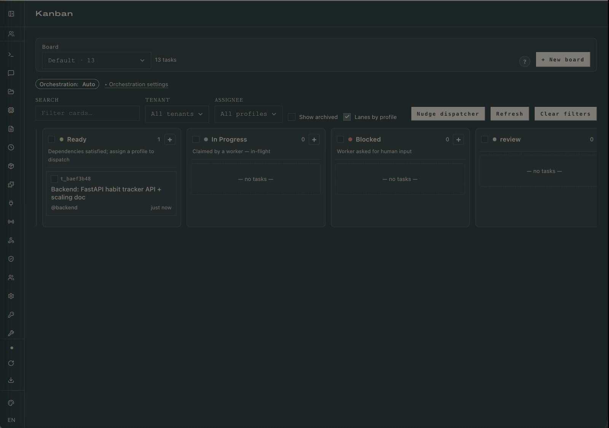

You know step 3 worked when: the kanban list (`hermes kanban list`) shows one task per role, the gateway dispatcher is moving them out of `ready` into `running` without manual nudging, and clicking a card on the dashboard surfaces a populated drawer with at least one event in its timeline.

### 4. Read A Task Drawer As Specialists Work

Every Kanban task carries its own spec: assignee, workspace path, deliverable description, the file tree the specialist is meant to produce. Click any task on the dashboard to open the drawer:

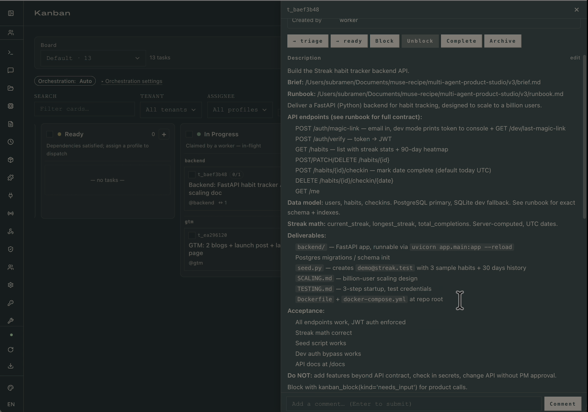

The drawer is also where the specialist's `kanban_block(kind='needs_input')` lands. The frontend profile's SOUL tells it to block before building if the brief leaves visual direction implicit; the block appears here as a comment, the PM answers via `kanban_comment`, and `kanban_unblock` returns the task to `ready`.

You know step 4 worked when: every running task has a non-empty deliverable description and a workspace path that resolves to a real directory on disk.

### 5. Read The Comment Thread The Run Leaves Behind

Every decision the run makes (block, unblock, comment, `kanban_complete` summary) is durable. From the PM's terminal, a review comment posted on a specialist's task looks like a single `kanban_comment` call with the reviewer's verdict inline:

Open any completed task's drawer and the full negotiation is there: worker log, event timeline, run history, comments threaded in order:

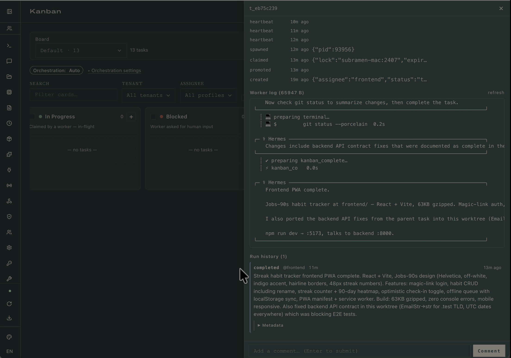

A reader can step through the exact run weeks later and see how the audience definition propagated from PM → frontend's color palette → GTM's tone. The SQLite source of truth is at `~/.hermes/kanban.db` if you want to script reports against it.

You know step 5 worked when: opening any `done` task's drawer shows at least one `kanban_complete` summary and an event timeline with timestamps that match the run.

### 5.5. Watch A Rework Loop

When the PM reviews a specialist's output and finds it below bar, it doesn't argue in comments — it creates a new task assigned back to the same profile with concrete deltas. From the terminal, the PM emits `kanban_create` with an assignee, a status of `ready`, and a description that names files, line numbers, and acceptance criteria:

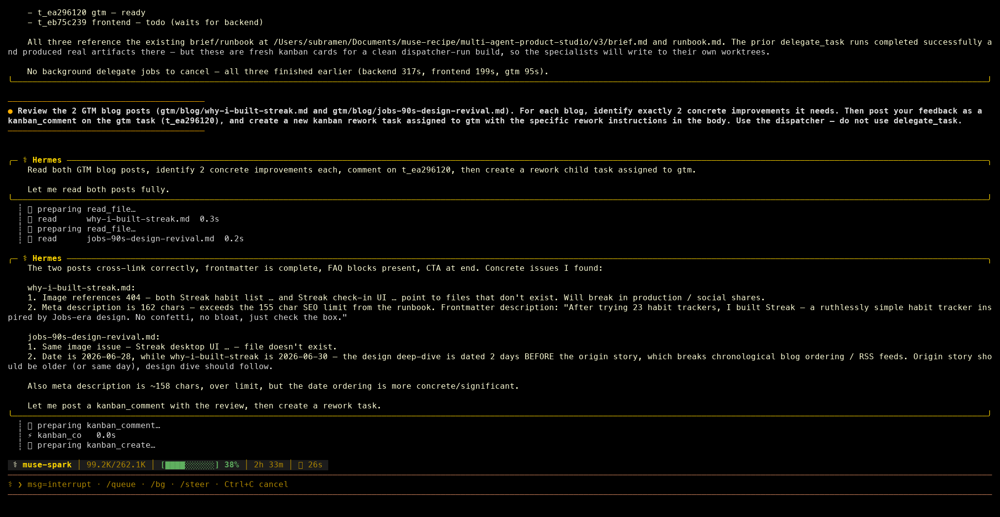

On the board, the rework task lands in Ready with the full spec in its drawer — broken image references, meta-description length overruns, wrong date ordering, each with the exact fix required:

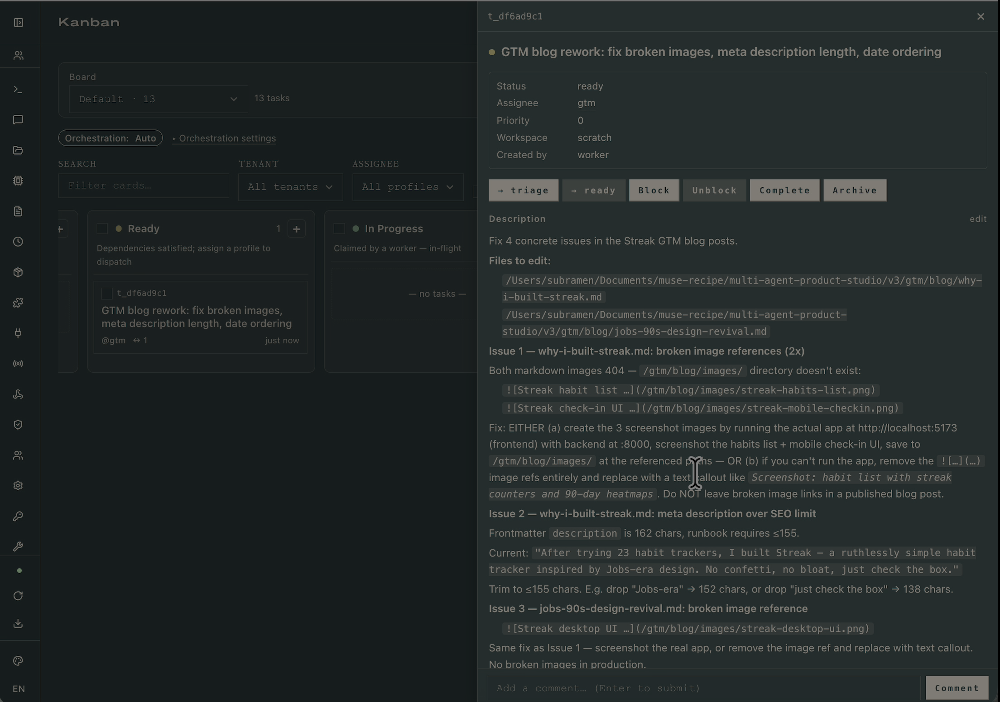

Because the assignee is `gtm` and the gtm profile is idle, the dispatcher promotes it into In Progress under the `gtm` swimlane on the next tick. The board now shows the reworked task running exactly where the original one ran, so the audit trail stays coherent:

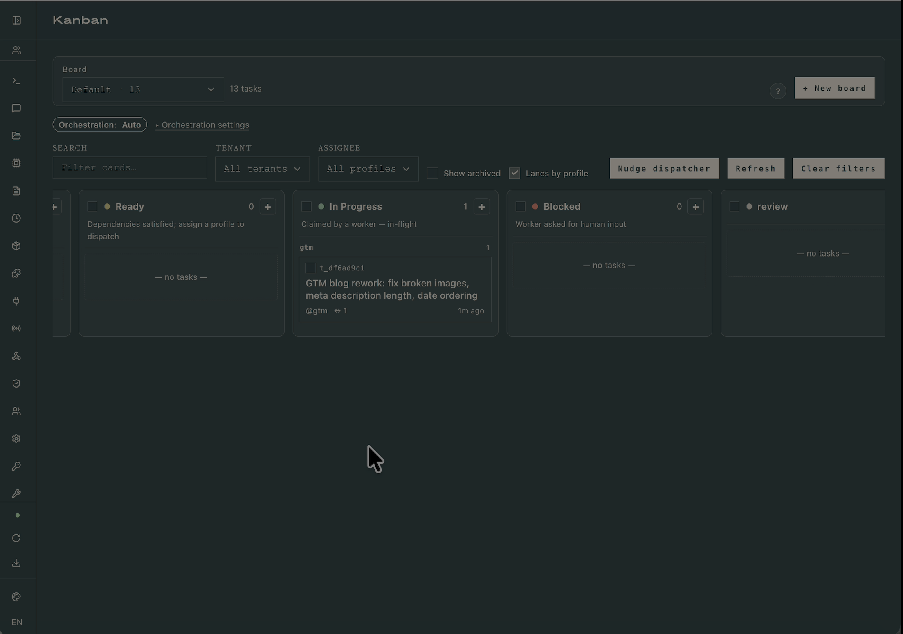

You know step 5.5 worked when: the rework task's description enumerates the specific defects (not "please fix"), its `parent_id` links back to the originally reviewed task, and it lands under the same profile's swimlane rather than being reassigned.

### 6. Inspect The Deliverable

When the root task auto-promotes back to `ready` and the PM judges the result against the brief, the project workspace contains everything the brief asked for: a runnable backend, a frontend the PM has visually checked, and the GTM artifacts the runbook specified. The streak-card SVG below is one of the five the GTM profile generated during a canonical run:

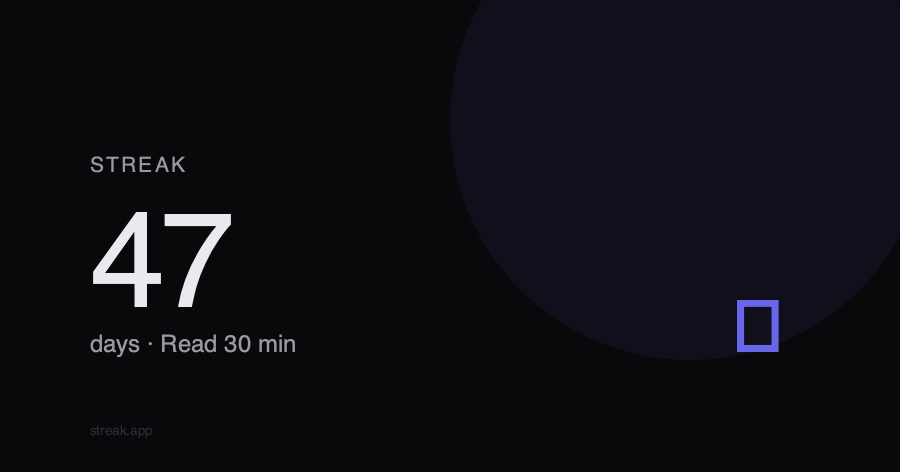

You know step 6 worked when: `tree -L 2` of the workspace matches the layout the runbook prescribed and the PM's final chat message references the brief's acceptance criteria explicitly.

## Verify End-To-End

The runbook's Definition of Done requires every workspace to ship with a `TESTING.md`. Follow it. For the Streak sample run:

```bash
cd /path/to/workspace/backend
pip install -r requirements.txt
python seed.py                        # creates streak@example.com / dev123
uvicorn app.main:app --reload         # serves http://localhost:8000

# in a second terminal:
cd ../frontend
npm install && npm run dev            # serves http://localhost:5173

# sign in with streak@example.com / dev123, tap a habit, watch the
# streak counter increment, refresh the page, confirm it persisted.
```

You know the run is good when sign-in lands you on the today view, a tap increments a streak without a network round-trip stutter, and a hard refresh keeps the state.

## Common Failure Modes

### Tasks Sit In `ready` Forever

The gateway isn't running, so the dispatcher never claims them. Check `hermes gateway status`; if it prints anything other than "running", start it with `hermes gateway start`. On macOS, install it as a launchd service (`hermes gateway install`) so it survives reboots.

### Dispatcher Skips A Task With An Unknown Assignee

The PM emitted a task assigned to a profile name that doesn't exist on this machine. Run `hermes profile list` and compare against the task's `Assignee` column in the dashboard drawer. Typos in profile descriptions also cause this — the auto-decomposer matches descriptions when routing.

### The PM Tries To Write Code Itself

The `pm` profile has `terminal` or `code_execution` enabled by accident. Re-run the `config set toolsets` command from [§Define The Four Profiles](#define-the-four-profiles) with the correct list. The PM must be physically unable to implement so it stays in its lane.

### Frontend Never Blocks For A Vibe Check

The frontend's `SOUL.md` isn't being loaded. Confirm with `hermes -p frontend doctor` and check that `~/.hermes/profiles/frontend/SOUL.md` exists and contains the "refuse to start building until the brief's audience and vibe are explicit" instruction. Without that line, the frontend will guess and ship something the PM has to reject.

### `clarify` Hangs Waiting For Your Answer

The default `agent.clarify_timeout` is 600 seconds. Either answer faster, or bump the timeout in `~/.hermes/config.yaml`. A clarify that times out without an answer drops the run into `blocked` and you'll need to `hermes kanban unblock` to resume.

### A Specialist Crashes Mid-Run

Usually an API rate limit or a context-length overrun. `hermes kanban show <task_id>` prints the last error from the run history. The recovery is `hermes kanban unblock <task_id>`, which returns it to `ready` for a fresh attempt; the specialist re-reads the brief and runbook on spawn so it doesn't lose context.
