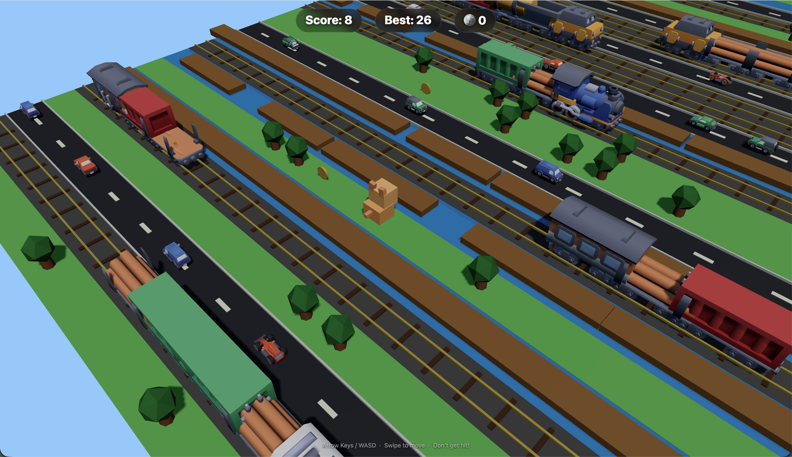
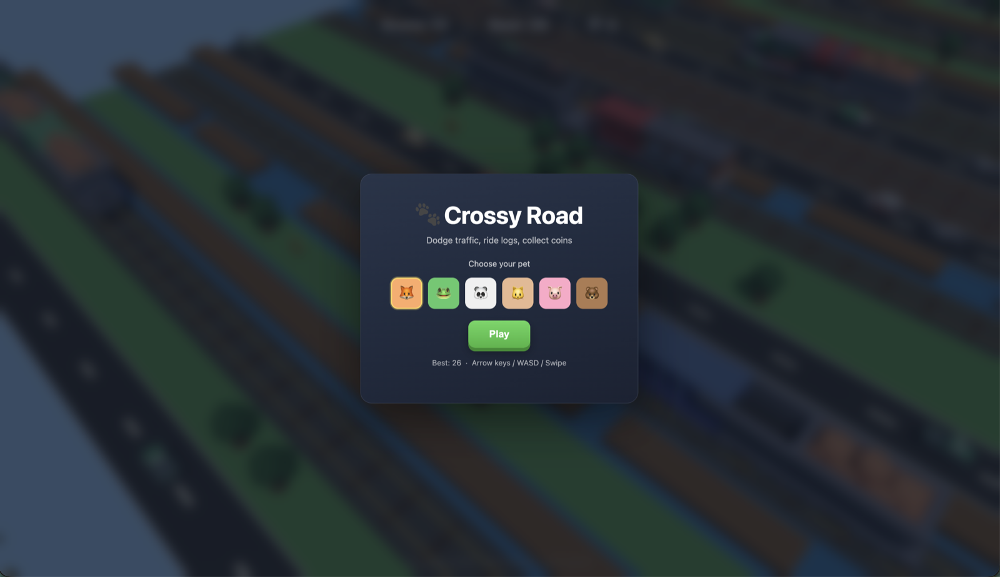

# One-shot game dev: build a 3D game from a single prompt

|  |  |
|---|---|
| **Section** | [Use cases](https://dev.meta.ai/docs/getting-started/cookbook#use-cases) |
| **Time to complete** | ~20 min |
| **Model** | `muse-spark-1.1` |
| **Harness** | OpenCode |
| **Prerequisites** | [series setup](../README.md) |

Ground Muse Spark with an `AGENTS.md` and one structured prompt, and it builds a complete, polished 3D Crossy Road game in a single pass — no build-and-fix loop, no eval harness.

*The screenshots below are from an actual run; because the model is non-deterministic, your results may differ.*



_One-shot output: a cube-pet riding a river log, dodging cars and Kenney trains across procedurally generated road, water, and rail lanes._

Most of what a first pass gets wrong isn't the model's coding ability — it's *unstated constraints*: which way is forward, whether collision is checked by grid row or world position, whether logs snap or drift. Put those on the page first and a strong reasoning model can satisfy them all at once.

This recipe leans into that: point [OpenCode](https://opencode.ai/) at Muse Spark, give it an `AGENTS.md` with the handful of rules that prevent invisible bugs, and hand it one structured prompt. At maximum reasoning effort (`high`, or the equivalent `xhigh`), Muse Spark holds the whole spec in a single generation and writes a self-contained, playable game. The screenshots here are from exactly that — one prompt, one file, no iteration.

> **Note:** Results will differ across runs. The prompt is intentionally open-ended — you'll get a playable game each time, but the specific implementation, visuals, and behavior will vary. This is expected: the recipe teaches the workflow, not a deterministic script.

## What you build



_Start screen from the same one-shot build: six selectable cube-pet characters, best-score persistence, keyboard/touch controls._

1. An OpenCode setup pointed at `muse-spark-1.1` with `reasoning_effort=xhigh`.
2. An **`AGENTS.md`** that captures the load-bearing constraints (coordinate system, position-based collision, log drift, train spawn ordering).
3. A **single structured one-shot prompt** — experience + tech constraints + acceptance criteria.
4. A complete single-file Three.js game (`index.html`), served over HTTP and playable.

## How it works

Muse Spark is a reasoning model. At higher `reasoning_effort` it works through more of the problem internally before emitting a token, which is exactly what a many-constraint task needs. The quality lever isn't an outer loop that re-runs the model — it's **what the model knows before it starts**:

- **`AGENTS.md` removes the guesswork.** OpenCode loads it automatically every turn, so the model never has to *infer* the coordinate convention or the collision model — the two things a Crossy Road clone most often gets subtly wrong.
- **The prompt describes the *experience*, not the implementation.** You constrain the tech (Three.js, single file, no build step) and the acceptance criteria, and let the model choose how.
- **Maximum reasoning effort does the "iteration" internally.** Instead of you running fix passes, the model reasons through the interactions (log riding vs. grid snap, train culling) in one shot.

## Step 0: setup

Confirm the [series foundation](../README.md). **OpenCode has built-in support for the Meta provider** — connect it and select the model from inside OpenCode.

**Connect the Meta provider.** Grab an API key from the [Model API dashboard](https://dev.meta.ai) under **API keys → Create API key**, launch OpenCode, and run:

```
/connect
```

A searchable **"Connect provider"** list appears — type to filter, select **Meta**, confirm, and paste your key into the **"API key"** prompt.

**Select Muse Spark.** Choose **Muse Spark**; the status bar should read **Muse Spark · Meta**, confirming it's live. Then set the model's **reasoning effort to its maximum (`high`, or the equivalent `xhigh`)** for the build.

> `reasoning_effort` runs `minimal < low < medium < high`, and `xhigh` maps to the same reasoning strength as `high` (the effective maximum); higher effort spends more reasoning tokens for a better first pass on hard problems. For a one-shot build of a many-constraint game, max out the reasoning (`high`, or the equivalent `xhigh`). See the [reasoning recipe](../../01_api_fundamentals/06_reasoning_tokens.ipynb).

## Step 1: get the assets

Do this first, before you generate — the agent lists these folders to wire up the real
models. The recipe uses three free **[Kenney](https://kenney.nl)** asset packs; download
each directly from Kenney and unzip the GLB models into the project's `assets/` folder:

| Pack | Used for | Download |
|------|----------|----------|
| Cube Pets | player characters | <https://kenney.nl/assets/cube-pets> |
| Car Kit | road-lane vehicles | <https://kenney.nl/assets/car-kit> |
| Train Kit | rail-lane trains | <https://kenney.nl/assets/train-kit> |

All Kenney packs are released under the [**Creative Commons CC0 1.0 Universal**](https://creativecommons.org/publicdomain/zero/1.0/)
public-domain dedication: free to use in personal and commercial projects, with no
permission or attribution required (crediting Kenney is appreciated, not obligatory).
This cookbook does **not** bundle or redistribute the assets — download them from the
links above and place the GLB models under `assets/` (for example
`assets/kenney_car-kit/Models/GLB format/`), matching the paths in your `AGENTS.md`.

## Step 2: write the AGENTS.md

This is where the quality comes from. Put the rules that prevent *invisible* bugs on the page so the model starts from ground truth instead of guessing — then stop. A tight page of principles beats an exhaustive spec: over-specifying every function signals the model needs hand-holding and can actually hurt results.

```md
# AGENTS.md — Crossy Road

Forward = negative Z (W/Up decreases the row; score = -row); the character faces +Z,
so a forward move faces rotation.y = PI. Camera sits behind the player, looking forward.

Collision is by mesh world position (both X and Z), never by grid row — row-only
checks kill the player from adjacent lanes.

Water is deadly unless on a log: drift with the log, don't snap the player's X back to
the grid, drown if they slide off.

Trains flash a warning, then cross fast; spawn the train rear-first (locomotive leading
inward) or it gets culled off-screen immediately.

Load the real Kenney GLBs — list each folder for exact filenames, then load/cache/clone
(box only as a per-file fallback): player = cube-pet animals from kenney_cube-pets,
cars from kenney_car-kit, trains from kenney_train-kit (re-center off-origin models).
```

Each line maps to a bug you'd otherwise spend an iteration discovering by hand — and that's *all* it needs. This whole file is the [`AGENTS.md`](./AGENTS.md) that ships with the recipe; drop it at your project root (where you run OpenCode) and let the model fill in everything the principles don't pin down.

## Step 3: the one-shot prompt

With the constraints grounded in `AGENTS.md`, the prompt can stay about the *experience* and the deliverable. A prompt that lands first-try follows a fixed shape — role, tech stack, assets, mechanics, deliverable, acceptance criteria:

```
Build a Crossy Road game as a single self-contained index.html. See AGENTS.md
for the coordinate system, collision model, log riding, train spawning, and
Kenney asset pipeline — follow it exactly.

Tech: Three.js r160 via importmap (no build step, no npm). Runs with
`python3 -m http.server 8080`. Desktop + mobile.

Player: a cube-pet from the Kenney Cube Pets pack (blocky animal). 6 selectable
variants (fox/cat/panda/pig/koala/polar). Grid movement with a squash/stretch hop.

Assets: load the REAL Kenney GLB models — first list the three GLB folders
(kenney_cube-pets_1.0, kenney_car-kit, kenney_train-kit, each under
`assets/<pack>/Models/GLB format/`) to get exact filenames, then load/cache/clone them
(see AGENTS.md). Use a colored box only as a per-file fallback, not the default.

World: infinite forward-scrolling grid of lanes — grass (tree obstacles),
road (cars), water (rideable logs, drown if you miss), rail (trains with a
warning flash + horn). Difficulty scales with score. Coins on grass lanes.

Feel: isometric follow camera with smooth lerp; WebAudio SFX for hop/coin/
crash/splash; particle bursts; camera shake on death; touch swipe + on-screen
D-pad for mobile.

UI: Score / Best / Coins HUD; start screen with character select; game-over
with restart; high score in localStorage.

Acceptance criteria:
- WASD/arrows move the cube-pet on the grid with a hop.
- Cars kill only on real overlap (position-based collision, per AGENTS.md).
- Logs are rideable; falling in the water drowns you.
- Trains warn, then cross fast; real Kenney GLB pets, cars, and trains render (boxes only if a file fails).
- Runs via python3 -m http.server, single index.html, no build step.

Build the complete game now.
```

Describe the *what* and the *feel*; let the model own the *how*. The acceptance criteria double as the model's own definition of done.

## Step 4: run and play

Serve the game over HTTP:

```bash
python3 -m http.server 8080
# open http://localhost:8080  —  arrow keys / WASD / swipe to move
```

If the GLB assets aren't present the game falls back to procedural box meshes and still plays, so you can verify the mechanics before wiring up art.

## Prompting tips for one-shot game dev

- **Lead with the constraints, in `AGENTS.md`.** The invisible-bug rules (forward direction, position-based collision, log drift) are the difference between a one-shot that lands and one that needs three fix passes.
- **Describe the experience, not the math.** "Rideable logs, drown if you miss" beats spelling out drift equations — the model fills those in.
- **Make acceptance criteria explicit.** They give the model a checklist to self-satisfy in the same pass.
- **Turn reasoning up for the build.** Maximum reasoning (`high`, or the equivalent `xhigh`) is where a many-constraint one-shot holds together; drop to `medium` only for small cosmetic follow-ups.
- **Constrain the tech, free the implementation.** "Three.js via importmap, single file, no build step" keeps the model from reaching for React/Vite on a game-jam-scale project.

## References

- **`muse-spark-1.1`** ([Model API docs](https://dev.meta.ai/docs)): OpenAI-compatible; point any OpenAI client at `https://api.meta.ai/v1`.
- **OpenCode** — [docs](https://opencode.ai) · [config schema](https://opencode.ai/config.json).
- **Assets** — [Kenney](https://kenney.nl) Cube Pets, Car Kit, and Train Kit, all under [CC0 1.0 Universal](https://creativecommons.org/publicdomain/zero/1.0/) (public domain; no attribution required, appreciated). Download them from Kenney; this recipe does not redistribute them.
