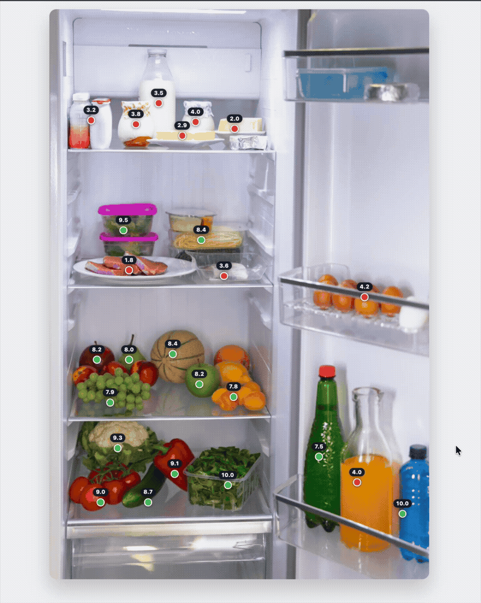

# Perception Grounding

|  |  |
|---|---|
| **Section** | [Use cases](https://dev.meta.ai/docs/getting-started/cookbook#use-cases) |
| **Time to complete** | ~10 min |
| **Model** | `muse-spark-1.1` |
| **Language** | Python |

Ever wondered what in your fridge is actually good for you? This recipe takes a photo of your fridge, sends it to Muse Spark in a single API call, and gets back an interactive HTML page with color-coded dots on each food item. Green means "eat up," red means "maybe skip this one." Hover over any dot for the full story - why it's recommended (or not), a health score, and a nutrition breakdown.

This is **perception grounding** in action - the model doesn't just recognize what's in the image, it knows _where_ each item is and generates a pixel-accurate interactive overlay. One API call, one image in, one interactive HTML file out.

*Screenshots throughout are from an actual run; because the model is non-deterministic, your results may differ.*

## What you get



The model generates a self-contained HTML file where:

- Each food item gets a **colored dot** placed right on top of it
- **Green dots** for recommended foods, **red dots** for foods to avoid
- A **health score** (out of 10) floats above each dot, always visible
- **Hover** over any dot to see: item name, personalized justification, calories, carbs, protein, and fat
- Tooltips are smart about positioning - they stay within the image frame even for items near the edges

## How it works

```
fridge photo + dietary prompt --> Muse Spark vision API (single call) --> interactive HTML overlay
```

The script sends your image to Muse Spark via the Responses API with vision. The model does everything in one shot: identifies food items, estimates their pixel locations, classifies them based on your dietary needs, and generates the complete HTML with interactive overlays. No external models, no multi-step pipelines - just one API call.

## Setup

```bash
# With uv
uv venv && uv pip install -r requirements.txt

# Without uv
python -m venv .venv
source .venv/bin/activate
pip install -r requirements.txt
```

## Quick start

```bash
export MODEL_API_KEY="your-key"

# Run on the included fridge photo
python perception_grounding.py examples/food_in_fridge.jpeg

# Open the result in your browser
open food_in_fridge_grounded.html
```

You'll see streaming dots in the terminal as the model generates the HTML, then a summary with token count and file size.

### Try a different dietary context

The prompt is fully customizable. Some ideas:

```bash
# Vegan athlete
python perception_grounding.py examples/food_in_fridge.jpeg \
  --prompt "I'm vegan and training for a marathon. Green dots on high-protein plant foods, red on animal products. Show nutrition info on hover."

# Keto diet
python perception_grounding.py examples/food_in_fridge.jpeg \
  --prompt "I'm on a keto diet. Green dots on low-carb foods, red on high-carb foods. Show carb count prominently."

# Food allergies
python perception_grounding.py examples/food_in_fridge.jpeg \
  --prompt "I have a nut allergy and am lactose intolerant. Red dots on anything containing nuts or dairy. Green on safe foods."
```

## The default prompt

```
I am pescatarian with high cholesterol. Put green dots on recommended food
and red dots on not recommended food. Don't duplicate dots and make sure
the dots are localized properly. When hovering over the dot, show personalized
justification and "health score" out of 10, along with calories and carbs,
protein, and fat. Health score numbers should appear right above the dot
without hovering. The description that shows when hovering should go above
all other dots.
```

## Sample output

The `examples/` folder includes a pre-generated HTML file you can open right away without running anything:

```bash
open examples/food_in_fridge_grounded.html
```


## Files

| File | Purpose |
|---|---|
| `perception_grounding.py` | Main script: image + prompt -> interactive HTML overlay (single API call) |
| `requirements.txt` | Python dependencies |
| `examples/food_in_fridge.jpeg` | Sample fridge photo |
| `examples/food_in_fridge_grounded.html` | Pre-generated HTML overlay you can open in any browser |
| `examples/food_in_fridge_grounded.gif` | Demo of the interactive HTML overlay |

## Environment variables

- `MODEL_API_KEY` - required
- `MODEL_NAME` - model name, defaults to `muse-spark-1.1`
- `MODEL_BASE_URL` - API endpoint, defaults to `https://api.meta.ai/v1`
