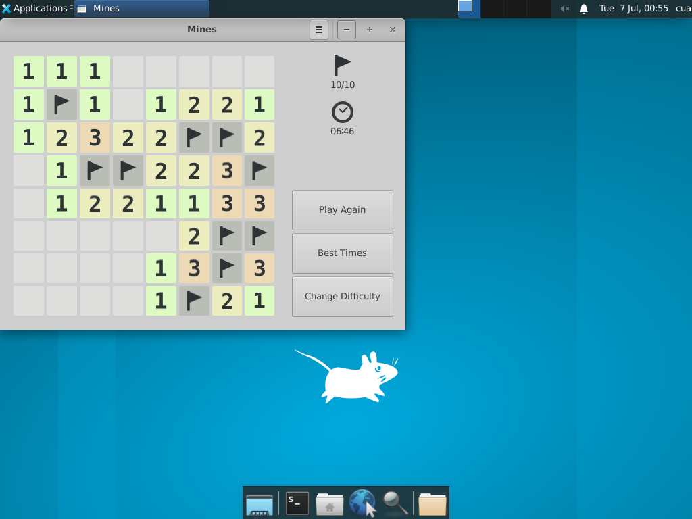
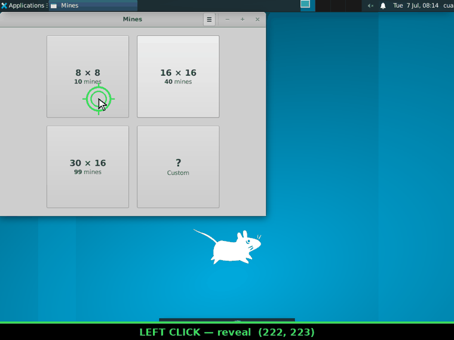
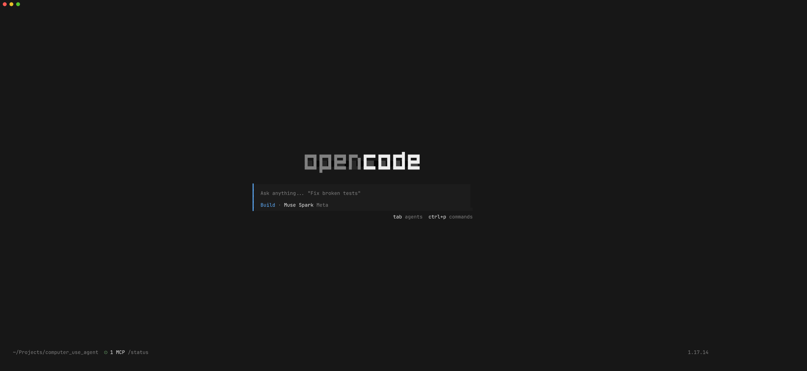
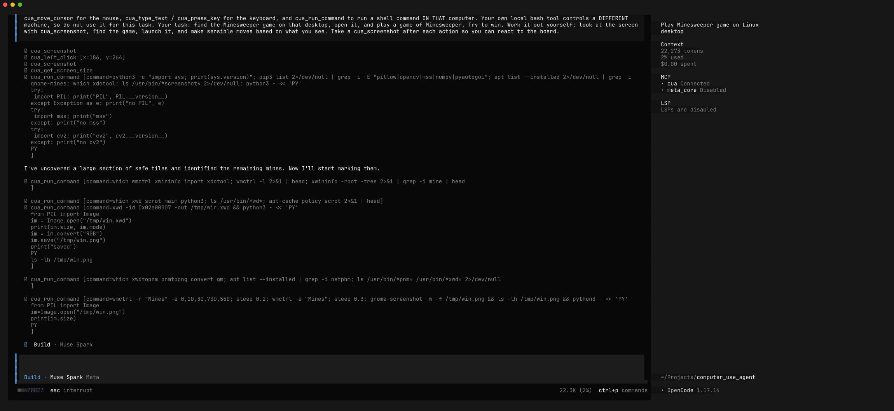
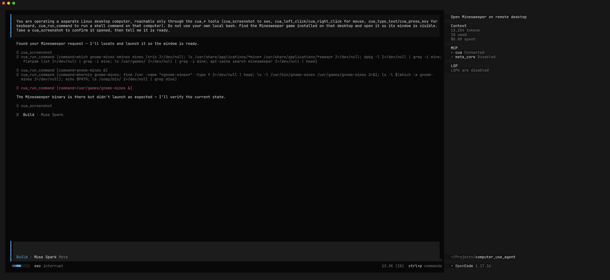
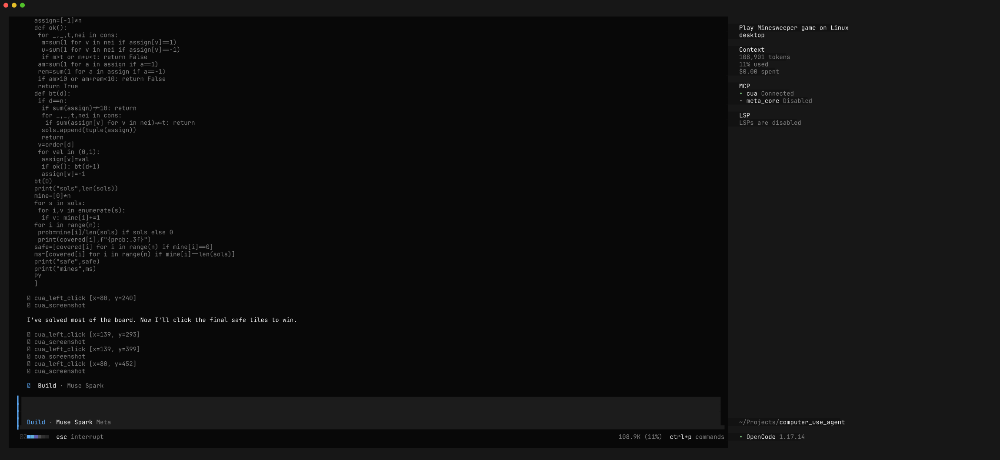
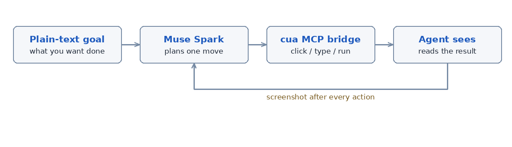

# Driving a Desktop with OpenCode + Muse Spark

|  |  |
|---|---|
| **Section** | [Use cases](https://dev.meta.ai/docs/getting-started/cookbook#use-cases) |
| **Time to complete** | ~20 min |
| **Model** | `muse-spark-1.1` |
| **Harness** | OpenCode + Cua computer-use MCP |
| **Prerequisites** | [series setup](../README.md) |

*A Meta Model Cookbook recipe — computer use with an agent that sees the screen, moves the mouse, and works out a GUI app on its own.*

This recipe points [OpenCode](https://opencode.ai) driven by the **Muse Spark** model at a real
Linux desktop and gives it a single goal: *find the Minesweeper game, open it, and play.* The agent
takes a screenshot, reasons about the pixels, moves the mouse or types, and screenshots again — the
same loop a person runs. The desktop lives in a throwaway [**Cua**](https://github.com/trycua/cua)
sandbox, and a small **MCP bridge** hands the agent screenshot / click / type / shell tools that act
on that sandbox.

Unlike the sibling [macOS computer use recipe](../13_macos_cua/), which drives your real Mac with
native events, this recipe keeps everything inside a disposable container — the model never touches
your machine. It sees PNG screenshots from the container and sends back mouse and keyboard actions.

---

## What you'll learn

1. How to stand up a real Linux desktop locally with **Cua** and Docker.
2. How to bridge OpenCode to that desktop with a small **MCP server** so Muse Spark gets mouse,
   keyboard, and screen tools.
3. The **look-act-look loop** that makes computer use reliable, and how little prompting it takes
   to trigger it.
4. How a multimodal agent reasons over pixels: finding an app it was never told the location of,
   launching it, and reading a game board to plan its moves.

---

## The finished result

From the single instruction *"find the Minesweeper game and play it,"* Muse Spark located the
game, launched it, and cleared an 8x8 board:



Here's the whole game as an animation. Every frame is a screenshot the model actually received,
and every marker is a real click it made through the MCP bridge. The overlays are added afterward:

- **Green ring** — a `cua_left_click` revealing a tile the model deduced is safe.
- **Red ring** — a `cua_right_click` flagging a tile it deduced is a mine.
- **Label** — the action and its screen coordinates.

To play a full board without exceeding the model API's 50-images-per-request limit, the model
**delegated to sub-agents**: an orchestrator launched the game once, then handed the board to a
series of short-lived sub-agents (via OpenCode's `task` tool), each of which took a fresh batch of
screenshots, made ~12 clicks, and reported the board state back in text before exiting. Every move
is a genuine `cua_*` click driven purely by reasoning on the screenshot images:



Everything below is how it got there.

---

## Prerequisites

- **OpenCode** installed (`opencode --version` — this recipe used `1.17.14`).
  Install: `curl -fsSL https://opencode.ai/install | bash`
- A **Meta API key** from the [Model API dashboard](https://dev.meta.ai) under **API keys → Create API key** — used to connect
  OpenCode's built-in **Meta** provider (see below).
- **Docker** running (Cua uses it to launch the desktop container). `docker info` should succeed.
- **Python 3.11+** with a virtual environment (for the Cua SDK and the MCP bridge).

---

## Step 1 — Connect the Meta provider

OpenCode has built-in support for the **Meta** provider.

First, get an API key from the **[Model API dashboard](https://dev.meta.ai)** under **API keys → Create API key**.

Launch OpenCode, then run the connect command:

```
/connect
```

A searchable **"Connect provider"** list appears. Type to filter, select **Meta**, and confirm.
Then paste the key from the dashboard into the **"API key"** prompt.

---

## Step 2 — Select Muse Spark 1.1

After connecting the provider, choose **Muse Spark 1.1**. The status bar should read
**Muse Spark 1.1 · Meta**, confirming it's live.

> **Vision is essential here.** Muse Spark 1.1 is a reasoning + vision model — that's what lets it
> actually *read the screenshots* the desktop hands back. For computer use, "what's on the screen
> right now?" is a question only vision can answer.

---

## Step 3 — Launch a desktop sandbox with Cua

[Cua](https://github.com/trycua/cua) runs a full Linux desktop in a Docker container and exposes a
`computer-server` that accepts commands such as `screenshot`, `left_click`, and `type_text`.
Install the SDK plus the `mcp` and `requests` packages the bridge needs:

```bash
python -m venv .venv && source .venv/bin/activate
pip install cua cua-cli mcp requests
```

Confirm the local Linux platform is ready, then launch a named sandbox:

```bash
cua platform
# linux-docker   Linux GUI container   ready

cua sandbox launch --local ubuntu:24.04 --name game-demo
```

The container exposes its `computer-server` on port 8000. Docker maps that to a host port; read the
mapping so you know where the bridge should connect:

```bash
docker port game-demo 8000
# 0.0.0.0:35993
```

The demo desktop is a lightweight XFCE image. For a game to discover, install GNOME Mines inside
the sandbox. The container name matches the sandbox name, so install straight through Docker:

```bash
docker exec game-demo sudo apt-get update -qq
docker exec game-demo sudo DEBIAN_FRONTEND=noninteractive apt-get install -y gnome-mines
```

---

## Step 4 — Bridge OpenCode to the desktop

Cua's built-in `cua serve-mcp` resolves *cloud* sandboxes only. For a local container, this recipe
ships a small stdio MCP server, [`cua_local_mcp.py`](cua_local_mcp.py), that forwards each tool
call straight to the container's `computer-server`. It exposes `screenshot`, `left_click`,
`right_click`, `type_text`, `press_key`, `run_command`, and a few more.

Register it as an MCP server in `~/.config/opencode/opencode.jsonc`, pointing `CUA_CMD_URL` at the
host port from Step 3 and using absolute paths to your venv Python and the script:

```jsonc
{
  "mcp": {
    "cua": {
      "type": "local",
      "command": ["/abs/path/.venv/bin/python", "/abs/path/cua_local_mcp.py"],
      "environment": { "CUA_CMD_URL": "http://127.0.0.1:35993/cmd" },
      "enabled": true
    }
  }
}
```

**Confirm it's connected.** Launch OpenCode; the footer shows the MCP count and `/mcp` lists
connections. You want `cua  Connected`:



Launch OpenCode with Muse Spark from your project directory:

```bash
mkdir mines-demo && cd mines-demo
opencode -m meta/muse-spark-1.1
```

---

## Step 5 — Give it the goal

The bottom bar should read **Muse Spark 1.1** with `⊙ 1 MCP`. Now hand it a goal. This
is the **exact prompt** used for this recipe:

> You are operating a separate Linux desktop computer. The ONLY way to interact with it is through
> the cua_* tools: cua_screenshot to see the screen, cua_left_click / cua_right_click /
> cua_move_cursor for the mouse, cua_type_text / cua_press_key for the keyboard, and
> cua_run_command to run a shell command ON THAT computer. Your own local bash tool controls a
> DIFFERENT machine, so do not use it for this task. Your task: find the Minesweeper game on that
> desktop, open it, and play a game of Minesweeper. Try to win. Work it out yourself: look at the
> screen with cua_screenshot, find the game, launch it, and make sensible moves based on what you
> see. Take a cua_screenshot after each action so you can react to the board.



> **Why the "do not use your local bash" line?** OpenCode has its own built-in `bash` tool that
> runs on *your* machine. Without the nudge, the agent reaches for it, runs `which gnome-mines` on
> the host, finds nothing, and gets confused. Telling it the desktop is reachable *only* through
> the `cua_*` tools keeps every action pointed at the sandbox.

---

## Step 6 — Watch it find and open the app

With only a goal, the agent improvises. It takes a screenshot, then probes for the game with
`cua_run_command` (`which gnome-mines`, `ls /usr/games`, a search across `/usr`), finds the binary,
and launches it — recovering on its own when the first launch attempt doesn't surface a window:



---

## Step 7 — Watch it play

Once the board is up, Muse Spark reads it. A first click opens a region of numbered tiles, and from
there it reasons — purely from the screenshot — about which squares are safe and which are mines,
clicking each move through the bridge:



Because it can *see* each screenshot, it reacts to the real board state after every click instead
of running blind. That's the whole loop: look, act, look again — and in our run it carried the
board all the way to a win: 10 mines flagged, every safe tile cleared, the game's own
"Congratulations" end screen confirming it.

---

## The full loop, distilled



1. **Describe** the goal in plain language.
2. **See** — the agent takes a screenshot of the desktop.
3. **Act** — it clicks, types, or runs one shell command on the sandbox.
4. **Look again** — it screenshots the new state and reacts.
5. **Repeat** until the goal is met.

---

## Prompting tips

- **Give a goal, not a script.** "Find Minesweeper and play it" surfaces real problem-solving.
- **Ask for a screenshot after every action.** Drop it and the agent stacks blind clicks on a
  stale picture of the screen.
- **Scope the tools explicitly.** Tell the agent the desktop is reachable *only* through the
  `cua_*` tools so it doesn't confuse OpenCode's built-in host `bash` with the sandbox shell.
- **Point it at any app.** The same loop drives a calculator, a browser, or a text editor — swap
  the goal, keep the rhythm.

---

## Files in this recipe

```
12_computer_use/
├── README.md                 ← this recipe
├── cua_local_mcp.py          ← the MCP bridge: sandbox mouse/keyboard/screen as MCP tools
└── screenshots/              ← workflow screenshots referenced above
    ├── 01_opencode_welcome.png
    ├── 02_prompt_entered.png
    ├── 03_discovering.png
    ├── 04_playing.png
    ├── 05_game_board.png
    ├── loop_diagram.png       ← the computer-use loop figure
    └── gameplay.gif           ← annotated replay of the full winning game
```

When you're done, delete the sandbox so it stops holding a container:

```bash
cua sandbox delete game-demo
```
