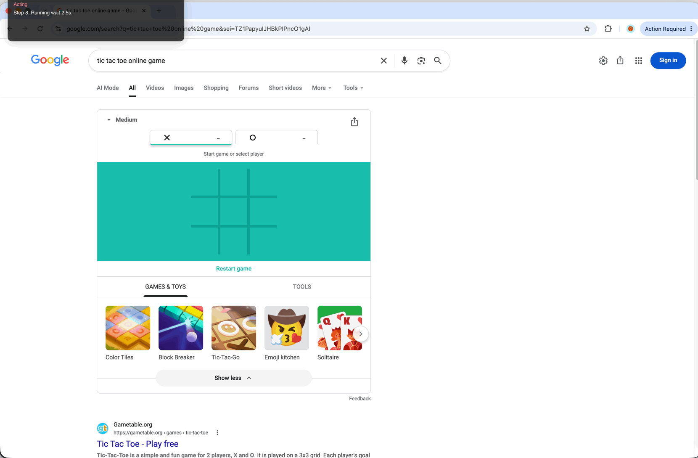

# Computer Use on macOS with Muse Spark

|  |  |
|---|---|
| **Section** | [Use cases](https://dev.meta.ai/docs/getting-started/cookbook#use-cases) |
| **Time to complete** | ~15 min |
| **Model** | `muse-spark-1.1` |
| **Harness** | `metacua` — a native macOS computer-use CLI (Swift and Python implementations) |
| **Prerequisites** | macOS 12+, a Meta API key, and either Swift 5.9+ or Python 3.9+; [series setup](../README.md) |

*A Meta Model Cookbook recipe — computer use with an agent that sees your screen, moves the mouse, and works out a native macOS app on its own.*

`metacua` is a hackable command-line agent that lets **Muse Spark** operate a Mac through its GUI. You
give it a goal; it captures the screen, sends the image plus GUI tool definitions to the model,
executes the returned tool calls with native macOS mouse and keyboard events, then screenshots again
and repeats until the task is done — the same look-act-look loop a person runs.

Unlike the sibling [computer use recipe](../12_computer_use/), which drives a throwaway Linux desktop
in a Cua sandbox, `metacua` drives **your actual machine**. That makes it a faithful example of
native computer use, and it makes the safety notes below non-negotiable.



> [!CAUTION]
> **Run at your own risk.** `metacua` is an autonomous agent that takes real control of your Mac —
> it moves the mouse, types, clicks, and runs whatever the model decides, without asking for
> confirmation, including **irreversible actions**. There is no sandbox between the agent and the rest
> of your system. Prefer a spare machine or a dedicated, low-privilege macOS account; keep sensitive
> accounts, credentials, and documents out of reach; supervise every run and stay ready to stop it.

---

## What you'll learn

1. How to build a **look-act-look** computer-use loop against `POST {base}/responses`.
2. How to expose a CUA-guide-aligned `computer.computer` tool plus a terminal `computer.stop` tool
   through OpenAI-style function calling.
3. How coordinate conventions differ: **normalized 0-1000** tool coordinates vs. real display pixels
   vs. fixed 1920x1080 OSWorld pixels.
4. How the same agent is built twice — once in **Swift** (SwiftPM) and once in **Python** — against
   the identical Muse Spark contract.

---

## How it works

1. **Describe** the goal in plain language.
2. **See** — the agent captures a screenshot of the primary display.
3. **Send** — the screenshot and tool definitions go to Muse Spark at `POST {base}/responses`.
4. **Act** — the model returns a `computer.computer` tool call; the agent executes it with native
   macOS events (Quartz / AppKit / Accessibility).
5. **Look again** — it screenshots the new state and reacts.
6. **Repeat** until the model calls `computer.stop` with a final answer, or the step cap is hit.

The model never runs code on your machine on its own. It sees PNG screenshots and returns mouse and
keyboard actions, which the agent translates into synthetic events.

---

## Canonical configuration

This recipe uses the same setup as every other cookbook recipe:

| Setting | Value |
|---------|-------|
| Base URL | `https://api.meta.ai/v1` |
| Model | `muse-spark-1.1` |
| API key env var | `MODEL_API_KEY` (format `LLM\|{numeric_id}\|{secret}`) |

The agent posts to `{base}/responses` (the Responses API) with `parallel_tool_calls: false` and
`store: false`, so computer actions stay serial and stateful.

> [!NOTE]
> Never commit an API key. Read it from `MODEL_API_KEY` (or pass `--api-key` per run). Traces are
> written under `~/.metacua/traces/`; screenshots are stripped to size placeholders, but goal and
> message text are kept — treat that directory as sensitive.

---

## Tools

`metacua` advertises two model-facing tools, using the same dotted names as the Muse Spark reference
agent. Tool calls run one at a time.

| Tool | Description |
|------|-------------|
| `computer.computer` | Perform GUI action(s) via synthetic mouse, keyboard, and screen events, then return a fresh screenshot. Coordinates are normalized integers in `0...1000`, origin top-left. |
| `computer.stop` | End the session and submit a final `answer` describing what was accomplished, or why it could not proceed safely. |
| `bash` | **Python only, opt-in** (`--allow-bash`) — run bounded shell commands on the Mac. Leave off unless you are isolated. |

`computer.computer` mirrors Anthropic's `computer_20251124` interface (clicks, drag, `mouse_move`,
`scroll`, `key`, `type`, `hold_key`/`release_key`, `wait`, `screenshot`), except coordinates are
normalized to `0...1000` and mapped to primary-display pixels before execution. Pass
`--batched-actions` to advertise an `actions` array instead; the batch is validated up front,
executed in order, and returns a single screenshot at the end.

The Python implementation additionally supports an **OSWorld `pyautogui` mode** (`--syntax pyautogui`):
the model returns `pyautogui` calls as text, which `metacua` parses with `ast` and **never `exec`s**.

---

## Run it

Both implementations read the same config (flags → environment → `~/.metacua/config.json` →
defaults) and require macOS **Accessibility** and **Screen Recording** permissions for the terminal
that launches them.

### Swift

```sh
cd 13_macos_cua
make permissions ARGS="--prompt"          # grant Accessibility + Screen Recording
make configure ARGS="--api-key $MODEL_API_KEY"
make run                                   # interactive metacua > shell
```

Or run a single goal:

```sh
swift run -c release metacua agent --goal "Open Safari and search for the weather in Tokyo"
```

Full build, flags, and interactive commands are in [`metacua.md`](metacua.md).

### Python

```sh
cd 13_macos_cua/python
python3 -m venv .venv && source .venv/bin/activate
pip install -e .
metacua permissions --prompt
metacua configure --api-key "$MODEL_API_KEY"
metacua agent --goal "Open Notes and write today's date"
```

Full options, OSWorld mode, and the API request shape are in [`python/README.md`](python/README.md).

---

## Coordinate conventions

Agent mode defaults to Muse Spark's **normalized 0-1000** convention: `(0, 0)` is the top-left of the
primary display and `(1000, 1000)` is the bottom-right. The agent converts to primary-display pixels
before executing. Screenshots may be downscaled (`--screenshot-scale`), but the action coordinate
space always uses the display's full logical size. Scroll direction is normalized from the user's
point of view: `down` reveals lower content regardless of the macOS natural-scrolling preference.

> [!WARNING]
> `metacua` drives the **primary display only**. Coordinates outside its bounds are clamped to the
> screen edge, so move the target window to the main display before running a goal.

---

## Files in this recipe

```
13_macos_cua/
├── README.md          ← this recipe
├── metacua.md         ← full Swift build/run reference (make targets, flags, commands)
├── assets/            ← images referenced above (tic_tac_toe.gif)
├── Makefile           ← build-and-run targets for the Swift CLI
├── Package.swift      ← SwiftPM manifest
├── src/metacua/       ← Swift implementation
├── python/
│   ├── README.md      ← full Python reference (install, OSWorld mode, API shape)
│   ├── metacua/       ← Python implementation
│   ├── tests/         ← pytest suite
│   └── tools/         ← trace_to_html.py
└── ...
```

---

## Prompting tips

- **Give a goal, not a script.** A concrete objective surfaces real problem-solving.
- **Let it screenshot after every action.** The loop reacts to the real screen state instead of
  stacking blind clicks on a stale picture.
- **Keep goals narrow and reversible**, especially while you are getting a feel for it.
- **The `type` action does not submit** — follow it with a `key` action (`Return`) when needed.
