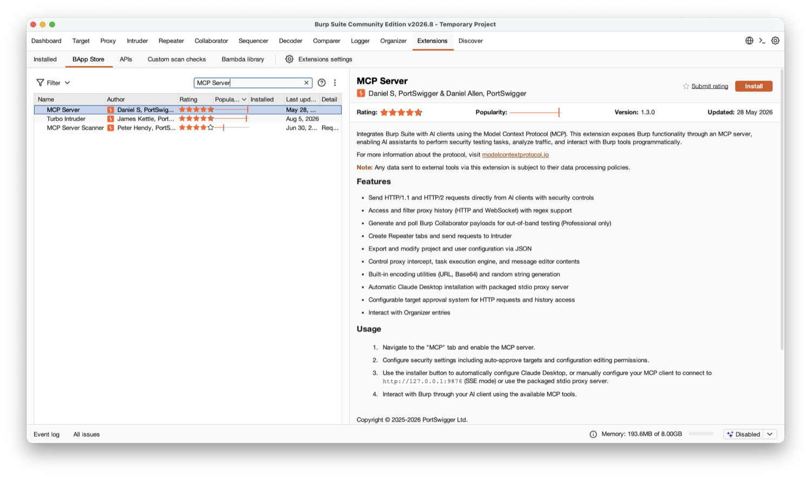
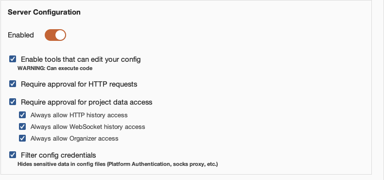
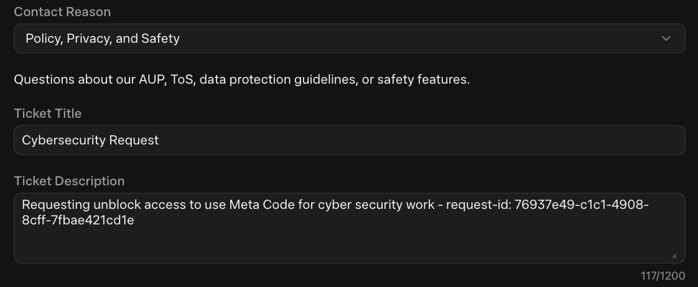

# Security research over MCP

*Wiring Burp Suite, headless Ghidra and LLDB into Meta's terminal coding agent over MCP, then pointing it at a real vulnerable web server and a real CVE buried in a stripped binary.*

|  |  |
|---|---|
| **Section** | [Muse Code](https://dev.meta.ai/docs/cookbook#building-with-muse-code) |
| **Time to complete** | ~20 min read, ~90 min to complete |
| **Model** | `muse-spark-1.3-contributor` |
| **Harness** | Muse Code 1.1.1 (the `muse` CLI) |

## Summary

Muse Code is Meta’s terminal coding agent. It reads code, edits files, and runs shell commands inside an OS sandbox. It does not know how to drive a web proxy, decompile a binary, or debug a process - that is where the Model Context Protocol comes in.

An MCP server exposes a set of named, typed tools. Wiring Burp in does not give the model a shell inside Burp, it gives it twenty-four functions, for example `get_proxy_http_history` and `send_http1_request`.

This recipe wires three security tools into Muse Code as MCP servers, then runs each against a target with known bugs.

- [Part one](#part-one---web-endpoints), Burp Suite. The agent reads proxy history, replays requests against PortSwigger’s vulnerable demo site, and builds proof for the vulnerability it discovers. Everything works on Burp Community.
- [Part two](#part-two---native-binaries), Ghidra and LLDB. The agent gets a stripped binary and a crashing input, and works back to the root cause of a real CVE in a JPEG 2000 decoder. The upstream patch is public, so you can check its work.

Neither bug is new. The work is in correlation, proof, and write-up – the time-consuming parts of security work. All steps were run, not transcribed from documentation.

## Setting Up Muse Code

### Install

One shell installer for MacOS and Linux puts a native binary on your path:

```
curl -fsSL https://dev.meta.ai/install.sh | sh
```

Confirm it landed:

```
$ muse --version
Muse Code 1.1.1 (1.1.1-R2514.1)
```

The installer puts the binary in `~/.local/bin` by default, make sure that is on your `PATH`.

### Authenticate

You need a Muse Code account, sign-up and pricing are on the [product page](https://developer.meta.com/ai/products/muse-code/).

Run `muse` in any project directory. First entry asks whether to trust the workspace, then offers browser sign-in or an API key.

```
cd /path/to/your/project
muse
```

For anything scripted, headless, or CI-bound, skip the browser and use an environment key:

```
export META_API_KEY="<your-key>"
```

Or store it once with `muse auth set`. Precedence is `META_API_KEY`, then a stored key, then a stored browser session. Reopen sign-in mid-session with `/login`. Clear stored credentials with `muse logout` – this does not unset an exported `META_API_KEY`.

### The Settings File

User settings live at `~/.config/muse/settings.json`. This file holds model defaults, TUI preferences, hooks, the `runtime_capabilities` map, telemetry options, and MCP servers.

A minimal starting point:

```json
{
  "schema_version": 1,
  "model": "muse-spark-1.3-contributor"
}
```

### How Muse Code Loads MCP Servers

Servers are declared in the `mcp_servers` block of `settings.json`, and MCP configuration lives in this file and only this file.

Each server takes a `transport`, which is one of two values:

| Transport         | Fields                                       | Use it for                                                  |
|-------------------|----------------------------------------------|-------------------------------------------------------------|
| `stdio`           | `command`, `args`, `env`, optional `framing` | Local processes: a Python bridge, a proxy jar, a `uvx` tool |
| `streamable_http` | `url`, `headers`                             | A server already listening on a port                        |

Every server also accepts `enabled`, a boolean toggle to park a server without deleting its config, and `mode`, which defaults to `"required"`. If a required server fails to start, the run aborts:

```
agent loop failed: model failed: invalid run configuration:
Required MCP server `burp` failed during startup: initialization failed.
```

Two notes before you add a security tool:

- Set `mode: "optional"` on every tool-backed server. Burp is a GUI app you start by hand. On the default `required`, a missing Burp stops Muse Code in that project. `optional` degrades to a warning.
- Servers load at startup. Edit `settings.json`, then start a new session (there is no reload).

## Part One - Web Endpoints

The agent gets a proxy, an endpoint it’s allowed to query, and must prove the existence of a bug.

### Wiring Up Burp Suite

Tested on MacOS with Burp Suite Community 2026.8.0 and Muse Code 1.1.1.

Commands use Homebrew, `/opt/homebrew`, and `/Applications`. On Linux, install Burp and a JDK through your package manager. The extension jar lands under `~/.BurpSuite/bapps/`.

#### Installing Burp

```
brew install --cask burp-suite     # Community Edition, free
```

The cask sets a quarantine attribute on the bundle. Launch the app once from Finder and clear the Gatekeeper prompt before using the command line. Skip this and later steps fail.

#### Installing the Extension

The MCP server is an official BApp. It installs in Community Edition, no Professional licence needed. Go to Extensions → BApp Store, search for MCP Server, click Install.



Burp drops the extension here, needed later:

```
~/.BurpSuite/bapps/9952290f04ed4f628e624d0aa9dccebc/burp-mcp-all.jar
```

Then open the new MCP tab and tick Enabled. Confirm the server is up:

```
$ lsof -nP -iTCP:9876 -sTCP:LISTEN
COMMAND     PID USER   FD   TYPE  DEVICE SIZE/OFF NODE NAME
JavaAppli 31887 meow   88u  IPv6  0x3d6a…      0t0  TCP 127.0.0.1:9876 (LISTEN)
```

#### Configuring the Approval Layer

Muse Code’s sandbox does not contain MCP tools. The Burp extension ships its own approval layer, on by default on a fresh install. Set this up before your first run.

Fresh install defaults:


*The default state. Approval is required for outbound requests and project data; the three always-allow toggles are off; the target allowlist is empty.*

In that state, the first `get_proxy_http_history` call pops a dialog in Burp and blocks the run. That works when you are at the GUI, not for scripted runs. This is a second approval layer, separate from Muse Code’s own. `--disable-approval` does nothing for it.

For this walkthrough, switch the page on:



*Everything enabled.*

Expect dialogs still. The always-allow toggles cover reads. Outbound requests are governed separately by *Require approval for HTTP requests*, which stays on. To stop prompting on every `send_http1_request`, add the target host to **Auto-Approved HTTP Targets**. On a demo target you can answer dialogs manually.

#### Bridging SSE to stdio

Burp speaks SSE. Muse Code speaks `stdio` and `streamable_http`. SSE is neither. The extension ships a translator, `mcp-proxy-all.jar`. Setup is two processes:

```
Muse Code --stdio--> proxy (mcp-proxy-all.jar) --SSE 127.0.0.1:9876--> Burp Suite --> target

Burp Suite : launched by you, runs on its bundled JRE
proxy      : launched by Muse (the "command" in the config below), needs a standalone JDK
```

The proxy is bundled inside the BApp. Pull it out:

```
mkdir -p ~/.local/share/burp-mcp
unzip -p \
  "$HOME/.BurpSuite/bapps/9952290f04ed4f628e624d0aa9dccebc/burp-mcp-all.jar" \
  mcp-proxy-all.jar > "$HOME/.local/share/burp-mcp/mcp-proxy-all.jar"
```

Point the proxy at a standalone JDK (`brew install openjdk`); Burp’s bundled JRE can’t be invoked from the CLI on MacOS.

#### Wiring It Into Muse Code

Complete `settings.json`. `command` points at the standalone JDK, not Burp’s bundled JRE:

```json
{
  "schema_version": 1,
  "model": "muse-spark-1.3-contributor",
  "mcp_servers": {
    "burp": {
      "transport": "stdio",
      "command": "/opt/homebrew/opt/openjdk/bin/java",
      "args": [
        "-jar",
        "/Users/you/.local/share/burp-mcp/mcp-proxy-all.jar",
        "--sse-url",
        "http://127.0.0.1:9876"
      ],
      "mode": "optional"
    }
  }
}
```

### Verifying It End to End

Start a session and run the `/mcp` slash command which will reveal the current state of all configured MCPs. You should only see the single Burp MCP connected at this point.

Prompt the agent to list all available mcps tools as well to confirm the available tools.

> **Prompt**
>
> List every MCP tool you have available, grouped by which server provides it. Do not call any of them.

A healthy stack answers with the servers grouped and the tools namespaced `mcp__<server>.<tool>`:

```
Available MCP tools (1 server, 24 tools, not called):

**Server: `burp` (`mcp__burp.*`)**

- `mcp__burp.get_proxy_http_history`
- `mcp__burp.send_http1_request`
…
```

That prompt catches common failures: a server that did not start shows as a startup warning with a missing group, a typo’d `transport` fails validation before the TUI, and a down `required` server aborts the run.

Prove a call round-trips. `url_encode` touches no network and no state. Ask in the same session:

> **Prompt**
>
> Call the burp MCP tool url_encode on the exact string: a b&c=<d> Then report the raw value it returned, nothing else.

```
a+b%26c%3D%3Cd%3E
```

Run interactively, not through `muse exec`. Tool calls go through the approval layer, and a headless run has no UI to answer, so it will sit there.

> [!CAUTION]
> **Policy enforcement and account blocks**
>
> This is security research, so the prompts and tool calls here can trigger policy enforcement and temporarily block your Muse Code account.
>
> If your account is blocked, you’ll receive a request ID in the session. To get unblocked:
>
> 1. Go to https://dev.meta.ai/support
> 2. Submit a ticket using the **“Policy, Privacy, and Safety”** contact reason
> 3. Include the term **cybersecurity** in the title
> 4. Include the **request ID** you received in your session
>
> Example:
>
> 
>
> *Example support ticket. Use “Policy, Privacy, and Safety”, put “cybersecurity” in the title, and include your session request ID.*

### Pointing It at a Real Target

> [!WARNING]
> **Authorized targets only**
>
> The target here is [ginandjuice.shop](https://ginandjuice.shop), PortSwigger’s vulnerable demo site, published for this purpose. Do not point any of this at a host you are not authorized to test.

#### Seeding the Proxy History

The agent reads Burp’s history. It does not generate traffic. Browsing in Burp’s built-in browser works, but driving `curl` through Burp’s proxy is faster and reproducible.

Burp’s proxy listens on `127.0.0.1:8080` by default:

```
for u in \
  "https://ginandjuice.shop/catalog" \
  "https://ginandjuice.shop/catalog?searchTerm=gin" \
  "https://ginandjuice.shop/catalog?searchTerm=rum" \
  "https://ginandjuice.shop/catalog/product?productId=1" \
  "https://ginandjuice.shop/catalog/product?productId=2" \
  "https://ginandjuice.shop/blog" \
  "https://ginandjuice.shop/blog?searchTerm=cocktail" \
  "https://ginandjuice.shop/login" \
  "https://ginandjuice.shop/my-account" ; do
  code=$(curl -s -x http://127.0.0.1:8080 -k -o /dev/null -w "%{http_code}" -m 20 "$u")
  echo "$code  $u"
done
```

Nine requests and one redirect, that is our initial corpus.

`-k` skips certificate validation because Burp presents its own CA. For scripted seeding this is fine. To browse through Burp in a normal browser, install Burp’s CA from `http://burp/cert` first.

#### Hand It the Goal, Not the Method

The map step is scaffolding. The test is whether the agent can pick a lead and prove it. The prompt names no endpoint, parameter, or technique:

```
Use the burp MCP tools. I am authorized to test ginandjuice.shop.

There is proxy history for this host already. Start there: work out what the
application's attack surface actually is, pick the single lead you think is most
likely to be a real server-side vulnerability, and confirm or kill it using
send_http1_request.

Rules:
- Discover the parameters yourself. Do not assume the history shows all of them.
- Before you claim anything, prove it: a baseline, a request that breaks it, and
  a request that repairs it. A single anomalous response is not a finding.
- Report what you could NOT determine with these tools, and why.
- Do not extract data. Demonstrate the flaw, don't exploit it.
```

Gin & Juice publishes its bug list, so the finding is not the point. Watch which endpoints it picks, which leads it kills, and whether the claim includes baseline, break, and repair.

The run behind this recipe picked one lead, confirmed it with three requests, and discarded two others with reasons. Yours will differ – the model is non-deterministic. Grade it against the site’s [/vulnerabilities](https://ginandjuice.shop/vulnerabilities) page.

## Part Two - Native Binaries

Part two goes a layer down: targets a stripped binary, uses a crashing file, and (in theory) provides no source code. Two more MCP servers – Ghidra for structure, LLDB for runtime values – pointed at a real CVE in a media decoder.

This half needs `cmake` and a C toolchain, `uv` for both MCP servers, and Rosetta to run x86_64 on Apple Silicon. On MacOS: `brew install cmake uv`, `xcode-select --install`, `softwareupdate --install-rosetta`.

### Wiring Up Ghidra, Headless

For headless work, use [`pyghidra-mcp`](https://github.com/clearbluejar/pyghidra-mcp). It drives Ghidra through PyGhidra and JPype, and speaks `streamable-http`. Install Ghidra first:

```
brew install ghidra          # 12.1.3, ~800 MB
```

Homebrew’s `openjdk` is keg-only and `/usr/bin/java` is a MacOS stub. Set both explicitly. The Ghidra formula installs its runtime under `libexec`, not the formula root:

```
export JAVA_HOME=/opt/homebrew/opt/openjdk
export GHIDRA_INSTALL_DIR=/opt/homebrew/opt/ghidra/libexec
```

Then add it to the `mcp_servers` block:

```
"ghidra": {
  "transport": "streamable_http",
  "url": "http://127.0.0.1:8000/mcp",
  "mode": "optional"
}
```

### Wiring Up LLDB

[`stass/lldb-mcp`](https://github.com/stass/lldb-mcp) spawns and manages its own LLDB sessions over a pty, and exposes 28 typed tools. It needs a modern Python and the `lldb` that’s already on your `PATH`.

```
git clone https://github.com/stass/lldb-mcp.git
uv venv --python 3.13 ~/lldb-mcp-venv
VIRTUAL_ENV=~/lldb-mcp-venv uv pip install "mcp<2"
```

Then add it to the `mcp_servers` block:

```
"lldb": {
  "transport": "stdio",
  "command": "/Users/you/lldb-mcp-venv/bin/python",
  "args": ["/Users/you/lldb-mcp/lldb_mcp.py"],
  "mode": "optional"
}
```

### Building the Target

The target here is CVE-2016-10506 in [OpenJPEG](https://github.com/uclouvain/openjpeg), the reference JPEG 2000 decoder. It’s a SIGFPE in the packet iterator, found by Ke Liu of Tencent’s Xuanwu Lab, and the original 436-byte proof-of-concept is still attached to the [public issue](https://github.com/uclouvain/openjpeg/issues/732).

You need that file to crash the decoder. Here it is inline. Run from your build directory; it writes `sample_crash_001.jp2`:

```
base64 -d > sample_crash_001.jp2 <<'EOF'
AAAADGpQICANCocKAAAAFGZ0eXBqcDIgAAAAAGpwMiAAAAAtanAyaAAAABZpaGRyAAAAIAAAACAA
AweHAAAAAAAPY29scgEAAAAAABAAAAFnanAyY/9P/1EALwAAAAAAAQAAACAAAAAAAAAAAIAAACAA
AAAgAAAAAAAAAAAAAwcCAQcBAYoBAf9SAAwABAABAREEBIAB/1wABEBA/2QAJQABQ3JlYXRlZCBi
eSBPcGVuSlBFRyB2ZXJzaWZ0eXAuMS4w/5AACgAAAAAA7wAB/5PfB1YANB/WzgwnT0scoB/vuZfg
c1PvCOOcZjXu94sFdFbBplUpDNQKo/J/xlMus9LPf6OB3S2g7cWVduNF1Jaz7rIDsiUuZP97i6v6
AKLEZkELDIYYc/9zmmka8yiifaZFEnVtgpHmcWvWIj909OzjqMTdl/xjGiEA30lKlsnQgHvkAAAA
DCQlU8IGCRzPVltBDquXVV1SKEgCZ6AAAL//MDWwLWWTjY66dD2zcDL4QNwgyHZAed8ygGb/NYsD
EkIdgqz2vhAr2q6hLHANUHiJLHTG3LUbzHETySr/f/9//3//2Q==
EOF
```

Result should be 436 bytes, `sha256 4a20941ada8ebf356abcd1b498d044cf2585a1c1c03e390c2638281e0967b2b1`. Header fields that drive the crash: `Scod=0`, `COD prog=4`, `levels=17`, `SIZ Csiz=3`, `XRsiz=2`.

Check out an unpatched commit, build, reproduce. Two details matter.

#### Building for x86_64 on Apple Silicon

Apple Silicon has no divide-by-zero trap. arm64 returns 0 and continues, so a divide-by-zero will not crash natively. Build for `x86_64` and run under Rosetta. Ghidra then shows x86_64 disassembly.

#### Checking Out a Commit Contemporaneous With the PoC

The fix is `d27ccf01` (July 2017). Its parent still contains the bug, but an unrelated hardening commit from May 2016 rejects the 2016 PoC at parse time, so we’ll check out a commit from before that:

```
git clone https://github.com/uclouvain/openjpeg.git && cd openjpeg
git rev-list -1 --before=2016-03-29 master    # 0069a2bd
```

#### The Build

```
git checkout 0069a2bd                                  # 2016-01-30, unpatched

cmake -S . -B build -DCMAKE_POLICY_VERSION_MINIMUM=3.5 \
  -DCMAKE_OSX_ARCHITECTURES=x86_64 -DCMAKE_BUILD_TYPE=Release \
  -DCMAKE_C_FLAGS="-O2" -DBUILD_CODEC=ON \
  -DCMAKE_DISABLE_FIND_PACKAGE_PNG=ON \
  -DCMAKE_DISABLE_FIND_PACKAGE_TIFF=ON \
  -DCMAKE_DISABLE_FIND_PACKAGE_LCMS2=ON
cmake --build build -j8
strip build/bin/opj_decompress -o decoder
```

The three `CMAKE_DISABLE_FIND_PACKAGE_*` flags switch off optional PNG, TIFF and LCMS2 support. None is on the JP2 decode path. Leaving them enabled makes this 2016 tree configure against newer system libraries.

```
$ ./decoder -i sample_crash_001.jp2 -o /tmp/out.pgm
$ echo $?
136
```

Now we see that the binary was stripped for a reason. With `-g` and sources on disk, LLDB gives `pi.c:526` on the first backtrace – no reverse engineering needed. Stripped and optimized, symbol count drops from 736 to 55, and the fault reports as:

```
frame #0: 0x0000000100030f06 decoder`___lldb_unnamed_symbol_100030230 + 3286
```

With no symbol name, line number, or source, the agent must work it out from the binary.

### Verifying Both Servers

With `decoder` built, start the Ghidra bridge and leave it running. First launch pays for import and auto-analysis. Later calls reuse the project:

```
uvx pyghidra-mcp -t streamable-http --project-path /tmp/pyghidra ./decoder
# INFO: Uvicorn running on http://127.0.0.1:8000
```

Same check as the web half, now with three servers. Complete `settings.json`:

```json
{
  "schema_version": 1,
  "model": "muse-spark-1.3-contributor",
  "mcp_servers": {
    "burp": {
      "transport": "stdio",
      "command": "/opt/homebrew/opt/openjdk/bin/java",
      "args": ["-jar", "/Users/you/.local/share/burp-mcp/mcp-proxy-all.jar", "--sse-url", "http://127.0.0.1:9876"],
      "mode": "optional"
    },
    "ghidra": {
      "transport": "streamable_http",
      "url": "http://127.0.0.1:8000/mcp",
      "mode": "optional"
    },
    "lldb": {
      "transport": "stdio",
      "command": "/Users/you/lldb-mcp-venv/bin/python",
      "args": ["/Users/you/lldb-mcp/lldb_mcp.py"],
      "mode": "optional"
    }
  }
}
```

Start a new session and run the tool-listing prompt from [Verifying It End to End](#verifying-it-end-to-end) or the `/mcp` slash command. Look for three groups: `mcp__ghidra.*`, `mcp__lldb.*`, and `mcp__burp.*`. A dead Ghidra bridge will show up here.

### Pointing It at the Binary

The prompt names no function, file format field, or bug class. `SIGFPE` is observable, so no point hiding it. The rest is the agent’s job.

```
Use the ghidra and lldb MCP tools. This is my own build of an open-source media
decoder, running on a machine I own — analysis is authorized.

Binary (stripped: no source, no debug symbols, already imported into the Ghidra
project): /path/to/decoder
Input that makes it crash: /path/to/sample_crash_001.jp2
Run it as: decoder -i /path/to/sample_crash_001.jp2 -o /tmp/out.pgm

Work out the root cause and tell me:
1. What the fault is at instruction level, and the exact operand values that produce it.
2. Which function it happens in. Symbols are stripped, so recover its purpose from the
   decompilation and give it a name that reflects what it does.
3. Why a malformed input file can reach that state — what the attacker actually controls.
4. The single check that would prevent it.

Rules:
- Prove every claim with tool output. Read the operand values, don't infer them.
- Ghidra for structure, lldb for runtime values. State which tool gave you each fact.
- If you rename functions or add comments in Ghidra, say what you renamed and why.
- Report what you could NOT determine, and why.
```

Watch how it moves between Ghidra and LLDB, whether it reads runtime values from the debugger, and what it reports it could not determine.

The run behind this recipe set a breakpoint before the faulting shift, stepped one instruction, and read the register again. It recovered the stripped function’s purpose from decompilation, traced the fault to fields in the 436-byte input, and proposed the same guard as the upstream patch. It stopped at denial of service. Yours will differ. Grade it against the fix in [d27ccf01](https://github.com/uclouvain/openjpeg/commit/d27ccf01c68a31ad62b33d2dc1ba2bb1eeaafe7b).

## Next Steps

- Put a `PreToolUse` [hook](https://dev.meta.ai/docs/muse-code/extending#hooks) in front of MCP tools to enforce scope. Match `mcp__burp.send_http1_request` and reject out-of-scope hosts, or `mcp__ghidra.rename_function` to keep a run read-only.
- Package a recurring investigation as a [skill](https://dev.meta.ai/docs/muse-code/extending#skills). “Map this app’s attack surface” or “triage this crash” becomes one invocation.
- Split a large audit across parallel [subagents](https://dev.meta.ai/docs/muse-code/extending#multi-agent), one endpoint or binary each.
- Run triage in CI with [`muse exec`](https://dev.meta.ai/docs/muse-code/extending#headless). Exit code reports how the run ended, not whether the finding is real. Gate on your own checks.

## License

This recipe is part of the Meta Model API Cookbook and is released under the repository's
[LICENSE](../../LICENSE).
