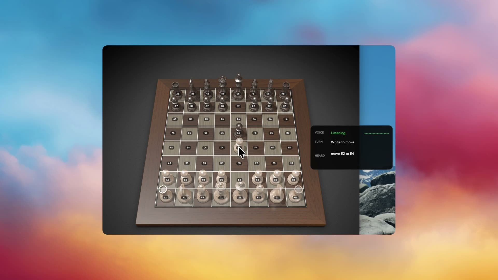

# Control Apple Chess with Voice

|  |  |
|---|---|
| **Section** | [Muse Voice Transcribe](../) |
| **Time to complete** | ~10 min |
| **Model** | `muse-voice-transcribe-1.0` |
| **Language** | Python |
| **Platform** | macOS with Apple Chess |

[](assets/voice-cua-chess.mp4)

**[Watch the 50-second Voice Chess demo](assets/voice-cua-chess.mp4)**


Voice Chess turns a completed Muse Voice Transcribe utterance such as `Move E2 to E4` into a narrowly scoped Apple Chess action. A deterministic local parser accepts only the exact move grammar. A purpose-built macOS computer-use layer then validates Apple Chess through the Accessibility API, performs only the approved source-and-destination clicks through Quartz/CoreGraphics, and confirms that the requested move occurred before reporting success.

Muse Voice Transcribe provides vocabulary biasing, speech-turn detection, and partial transcripts for a responsive voice experience. After a current `speechComplete` event, parsing is entirely local: there is no second model request and no transcript cleanup, prompt, tool call, response schema, or conversation history.

> [!IMPORTANT]
> Execution is automatic and there is no wake phrase. Start with `--dry-run`, use headphones in a quiet environment, and keep one Apple Chess game window visible. Every invocation automatically finds and activates the exact `com.apple.Chess` process. An already-running Chess window and current game are reused, and Chess is launched only when absent.

## Setup

Create a Meta Model API key at [dev.meta.ai/api-keys](https://dev.meta.ai/api-keys/), then run:

```bash
cd 06_muse_voice/02_voice_chess_cua
python3.12 -m venv .venv
source .venv/bin/activate
pip install -e .
export MODEL_API_KEY="<your Meta Model API key>"
```

`MODEL_API_KEY` is the only credential source. Request the three required macOS permissions before starting Voice Chess:

```bash
voice-chess --request-permissions
```

Allow the terminal or Python host under **System Settings > Privacy & Security > Microphone**, **Accessibility**, and **Screen Recording**. If macOS asks you to restart the host after granting Screen Recording, close and reopen that terminal before running Voice Chess.

The recipe uses the fixed public Muse Voice Transcribe contract `muse-voice-transcribe-1.0` at `wss://api.meta.ai/v1/asr/realtime`. Realtime transcription access may be limited during rollout.

If the ASR startup event reports `classification="tls_verification_failed"` on macOS, point Python at the system certificate bundle for that invocation:

```bash
SSL_CERT_FILE=/etc/ssl/cert.pem voice-chess --dry-run
```

Confirm that `/etc/ssl/cert.pem` exists first. This override is not needed when the selected Python installation already has a working CA trust store.

## Run

Voice starts after the exact `com.apple.Chess` process is bound. If Chess is already running, Voice Chess activates and reuses it. Otherwise, Voice Chess launches and activates it. Stopping Voice Chess never quits Chess.

First validate commands and the board without posting native input:

```bash
voice-chess --dry-run
```

The overlay is always enabled. Its HUD reports `VOICE`, `TURN`, and `HEARD` as soon as startup reaches the display stage, even while board detection is still searching. When the bound Chess process exposes a supported board, the same passive overlay draws the labeled grid. The overlay is observational and does not broaden what the executor may click.

If visual tracking cannot validate the board, the terminal reports one bounded warning such as `screen_capture_permission`, `window_discovery_timeout`, `capture_timeout`, `window_unavailable`, `window_ambiguous`, `unsupported_aspect`, `unsupported_orientation`, or `layout_mismatch`. Repeated detection attempts do not repeat the same warning. Keep a single visible, non-minimized, White-at-bottom Apple Chess game window in the standard layout; for `screen_capture_permission`, grant Screen Recording to the terminal or Python host and restart that host.

Then enable automatic validated execution:

```bash
voice-chess
```

Quitting or restarting Chess while Voice Chess is running requires restarting Voice Chess; a replacement process is never adopted automatically. Stop Voice Chess with `Control-C`.

## Exact Command Grammar

Say one completed utterance in exactly this form:

```text
Move A1 to B2
```

The parser performs a case-insensitive ASCII full match. One trailing period is optional. Files must be `A` through `H`, ranks must be `1` through `8`, and source and destination must differ. Accepted squares are normalized to uppercase before local validation.

Everything else is rejected. The parser does not strip leading or trailing whitespace, collapse spaces, accept tabs or newlines, convert spoken ranks such as `E two`, accept extra punctuation, or extract a move from surrounding words. A rejected transcript executes nothing.

## Runtime Pipeline

| Stage | Input | Output and authority |
|---|---|---|
| **Voice API: `muse-voice-transcribe-1.0`** | A long-lived `ENDPOINTING` WebSocket starts with authentication, `PCM_24KHZ`, cumulative partials, and chess keyword hints; subsequent binary messages contain 24 kHz mono PCM16 microphone frames. | `speechStart` opens a `turnId`; `transcript` events are display-only; `speechComplete` carries the completed turn text. Parsing accepts only a current, nonempty, command-eligible completion. A partial or keyword match never authorizes execution. |
| **Local exact parser** | One eligible final transcript, unchanged from the Voice API. | The ASCII full match returns either one move with uppercase, distinct `A1`-`H8` squares or a rejection. No second model request is made. |
| **Local CUA handoff** | Only an accepted move may enter the Apple Chess executor. | Apple Chess inspection, validation, coordinates, input, and confirmation remain local. Rejected text or failed local validation executes nothing. |

The parsed move is a proposal, not permission to click. The local executor must still validate Apple Chess before input and confirm the requested board change afterward.

## Supported Layout

The coordinate calibration is derived from a `979x768` Apple Chess window with White at the bottom. Voice Chess validates the window geometry and semantic Accessibility landmarks before using that calibration.

Voice Chess rejects Black-at-bottom boards, auto-rotating Human-vs-Human boards, and any unsupported or ambiguous layout. Use one visible, non-minimized Apple Chess game window and keep its standard board layout.

## Safety and Data

- Only the exact `com.apple.Chess` process may be acquired. Its PID is immutable for the run, native input requires it to be active, and stopping Voice Chess never sends Chess a quit or terminate request.
- The bound process must expose exactly one visible, non-minimized game window with a complete, stable, geometry-validated 64-square Accessibility snapshot.
- The app revalidates the bound window, board, PID, focus, source, and destination before input and confirms that both source and destination changed afterward. Failed checks execute nothing, and native input is never retried automatically.
- Partial, stale, duplicate, superseded, and busy-overlapping transcription events cannot authorize a move. Microphone frames observed during a move are dropped until a local quiet boundary rearms capture.
- Dry run performs the same binding and board validation but posts no native input. The always-on HUD remains visible while the board is being acquired, and the passive overlay ignores mouse events.
- Transcripts are sent only to Muse Voice Transcribe. Screenshots are processed locally and are never uploaded. Accessibility state, window data, coordinates, overlay state, and native input events also remain local.

## Safety Smoke Tests

The public recipe includes a focused safety suite covering exact parsing, dry-run behavior, native adapter shutdown, overlay lifecycle, structured redaction, and prepared-move execution:

```bash
pip install -e ".[test]"
python -m pytest
ruff check .
ruff format --check .
```

## License

This recipe is part of the Meta Model API Cookbook and is covered by the repository [LICENSE](../../LICENSE).
